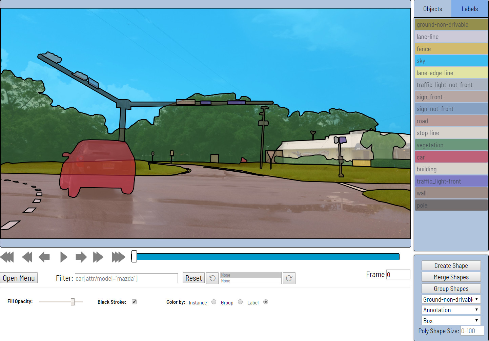

# Computer Vision Annotation Tool (CVAT)

CVAT is free, online, interactive video and image annotation tool for computer vision. It is being used by our team to annotate million of objects with different properties. Many UI and UX decisions are based on feedbacks from professional data annotation team.

## Documentation

- [Installation guide](cvat/apps/documentation/installation.md)
- [User's guide](cvat/apps/documentation/user_guide.md)
- [Django REST API documentation](#rest-api)
- [Datumaro dataset framework](datumaro/README.md)
- [Command line interface](utils/cli/)
- [XML annotation format](cvat/apps/documentation/xml_format.md)
- [AWS Deployment Guide](cvat/apps/documentation/AWS-Deployment-Guide.md)
- [Questions](#questions)

## Screencasts

- [Introduction](https://youtu.be/L9_IvUIHGwM)
- [Annotation mode](https://youtu.be/6h7HxGL6Ct4)
- [Interpolation mode](https://youtu.be/U3MYDhESHo4)
- [Attribute mode](https://youtu.be/UPNfWl8Egd8)
- [Segmentation mode](https://youtu.be/Fh8oKuSUIPs)
- [Tutorial for polygons](https://www.youtube.com/watch?v=XTwfXDh4clI)
- [Semi-automatic segmentation](https://www.youtube.com/watch?v=vnqXZ-Z-VTQ)

## Supported annotation formats

Format selection is possible after clicking on the Upload annotation / Dump annotation button.
[Datumaro](datumaro/README.md) dataset framework allows additional dataset transformations
via its command line tool.

| Annotation format                                                                          | Dumper | Loader |
| ------------------------------------------------------------------------------------------ | ------ | ------ |
| [CVAT XML v1.1 for images](cvat/apps/documentation/xml_format.md#annotation)               | X      | X      |
| [CVAT XML v1.1 for a video](cvat/apps/documentation/xml_format.md#interpolation)           | X      | X      |
| [Pascal VOC](http://host.robots.ox.ac.uk/pascal/VOC/)                                      | X      | X      |
| [YOLO](https://pjreddie.com/darknet/yolo/)                                                 | X      | X      |
| [MS COCO Object Detection](http://cocodataset.org/#format-data)                            | X      | X      |
| PNG class mask + instance mask as in [Pascal VOC](http://host.robots.ox.ac.uk/pascal/VOC/) | X      | X      |
| [TFrecord](https://www.tensorflow.org/tutorials/load_data/tf_records)                      | X      | X      |
| [MOT](https://motchallenge.net/)                                                           | X      | X      |
| [LabelMe](http://labelme.csail.mit.edu/Release3.0)                                         | X      | X      |

## Links
- [Intel AI blog: New Computer Vision Tool Accelerates Annotation of Digital Images and Video](https://www.intel.ai/introducing-cvat)
- [Intel Software: Computer Vision Annotation Tool: A Universal Approach to Data Annotation](https://software.intel.com/en-us/articles/computer-vision-annotation-tool-a-universal-approach-to-data-annotation)
- [VentureBeat: Intel open-sources CVAT, a toolkit for data labeling](https://venturebeat.com/2019/03/05/intel-open-sources-cvat-a-toolkit-for-data-labeling/)

## Online Demo

[Onepanel](https://www.onepanel.io/) has added CVAT as an environment into their platform and a running demo of CVAT can be accessed at [CVAT Public Demo](https://c.onepanel.io/onepanel-demo/projects/cvat-public-demo/workspaces?utm_source=cvat).

If you have any questions, please contact Onepanel directly at support@onepanel.io. If you are in the Onepanel application, you can also use the chat icon in the bottom right corner.

## REST API

Automatically generated Swagger documentation for Django REST API is
available on ``<cvat_origin>/api/swagger`` (default: ``localhost:8080/api/swagger``).

## LICENSE

Code released under the [MIT License](https://opensource.org/licenses/MIT).

## Questions

CVAT usage related questions or unclear concepts can be posted in our
[Gitter chat](https://gitter.im/opencv-cvat) for **quick replies** from
contributors and other users.

However, if you have a feature request or a bug report that can reproduced,
feel free to open an issue (with steps to reproduce the bug if it's a bug
report) on [GitHub* issues](https://github.com/opencv/cvat/issues).

If you are not sure or just want to browse other users common questions,
[Gitter chat](https://gitter.im/opencv-cvat) is the way to go.

Other ways to ask questions and get our support:
* [\#cvat](https://stackoverflow.com/search?q=%23cvat) tag on StackOverflow*
* [Forum on Intel Developer Zone](https://software.intel.com/en-us/forums/computer-vision)
