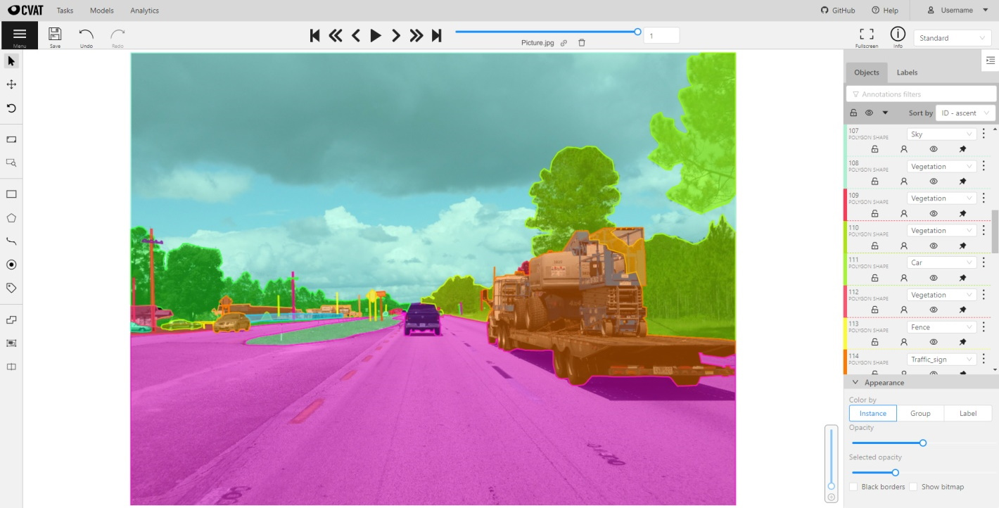

# Computer Vision Annotation Tool (CVAT)

[![CI][ci-img]][ci-url]
[![Gitter chat][gitter-img]][gitter-url]
[![Coverage Status][coverage-img]][coverage-url]
[![server pulls][docker-server-pulls-img]][docker-server-image-url]
[![ui pulls][docker-ui-pulls-img]][docker-ui-image-url]
[![DOI][doi-img]][doi-url]

CVAT is free, online, interactive video and image annotation
tool for computer vision. It is being used by our team to
annotate million of objects with different properties. Many UI
and UX decisions are based on feedbacks from professional data
annotation team. Try it online [cvat.org](https://cvat.org).

## Documentation

- [Contributing](https://openvinotoolkit.github.io/cvat/docs/contributing/)
- [Installation guide](https://openvinotoolkit.github.io/cvat/docs/administration/basics/installation/)
- [Manual](https://openvinotoolkit.github.io/cvat/docs/manual/)
- [Django REST API documentation](https://openvinotoolkit.github.io/cvat/docs/administration/basics/rest_api_guide/)
- [Datumaro dataset framework](https://github.com/openvinotoolkit/datumaro/blob/develop/README.md)
- [Command line interface](https://openvinotoolkit.github.io/cvat/docs/manual/advanced/cli/)
- [XML annotation format](https://openvinotoolkit.github.io/cvat/docs/manual/advanced/xml_format/)
- [AWS Deployment Guide](https://openvinotoolkit.github.io/cvat/docs/administration/basics/aws-deployment-guide/)
- [Frequently asked questions](https://openvinotoolkit.github.io/cvat/docs/faq/)
- [Questions](#questions)

## Screencasts

- [Introduction](https://youtu.be/JERohTFp-NI)
- [Annotation mode](https://youtu.be/vH_639N67HI)
- [Interpolation of bounding boxes](https://youtu.be/Hc3oudNuDsY)
- [Interpolation of polygons](https://youtu.be/K4nis9lk92s)
- [Tag annotation video](https://youtu.be/62bI4mF-Xfk)
- [Attribute mode](https://youtu.be/iIkJsOkDzVA)
- [Segmentation mode](https://youtu.be/9Fe_GzMLo3E)
- [Tutorial for polygons](https://youtu.be/C7-r9lZbjBw)
- [Semi-automatic segmentation](https://youtu.be/9HszWP_qsRQ)

## Supported annotation formats

Format selection is possible after clicking on the Upload annotation and Dump
annotation buttons. [Datumaro](https://github.com/openvinotoolkit/datumaro)
dataset framework allows additional dataset transformations via its command
line tool and Python library.

For more information about supported formats look at the
[documentation](https://openvinotoolkit.github.io/cvat/docs/manual/advanced/formats/).

<!--lint disable maximum-line-length-->

| Annotation format                                                                                         | Import | Export |
| --------------------------------------------------------------------------------------------------------- | ------ | ------ |
| [CVAT for images](https://openvinotoolkit.github.io/cvat/docs/manual/advanced/xml_format/#annotation)     | X      | X      |
| [CVAT for a video](https://openvinotoolkit.github.io/cvat/docs/manual/advanced/xml_format/#interpolation) | X      | X      |
| [Datumaro](https://github.com/openvinotoolkit/datumaro)                                                   |        | X      |
| [PASCAL VOC](http://host.robots.ox.ac.uk/pascal/VOC/)                                                     | X      | X      |
| Segmentation masks from [PASCAL VOC](http://host.robots.ox.ac.uk/pascal/VOC/)                             | X      | X      |
| [YOLO](https://pjreddie.com/darknet/yolo/)                                                                | X      | X      |
| [MS COCO Object Detection](http://cocodataset.org/#format-data)                                           | X      | X      |
| [TFrecord](https://www.tensorflow.org/tutorials/load_data/tfrecord)                                       | X      | X      |
| [MOT](https://motchallenge.net/)                                                                          | X      | X      |
| [LabelMe 3.0](http://labelme.csail.mit.edu/Release3.0)                                                    | X      | X      |
| [ImageNet](http://www.image-net.org)                                                                      | X      | X      |
| [CamVid](http://mi.eng.cam.ac.uk/research/projects/VideoRec/CamVid/)                                      | X      | X      |
| [WIDER Face](http://shuoyang1213.me/WIDERFACE/)                                                           | X      | X      |
| [VGGFace2](https://github.com/ox-vgg/vgg_face2)                                                           | X      | X      |
| [Market-1501](https://www.aitribune.com/dataset/2018051063)                                               | X      | X      |
| [ICDAR13/15](https://rrc.cvc.uab.es/?ch=2)                                                                | X      | X      |
| [Open Images V6](https://storage.googleapis.com/openimages/web/index.html)                                | X      | X      |
| [Cityscapes](https://www.cityscapes-dataset.com/login/)                                                   | X      | X      |
| [KITTI](http://www.cvlibs.net/datasets/kitti/)                                                            | X      | X      |
| [LFW](http://vis-www.cs.umass.edu/lfw/)                                                                   | X      | X      |

<!--lint enable maximum-line-length-->

## Deep learning serverless functions for automatic labeling

<!--lint disable maximum-line-length-->

| Name                                                                                                    | Type       | Framework  | CPU | GPU |
| ------------------------------------------------------------------------------------------------------- | ---------- | ---------- | --- | --- |
| [Deep Extreme Cut](/serverless/openvino/dextr/nuclio)                                                   | interactor | OpenVINO   | X   |     |
| [Faster RCNN](/serverless/openvino/omz/public/faster_rcnn_inception_v2_coco/nuclio)                     | detector   | OpenVINO   | X   |     |
| [Mask RCNN](/serverless/openvino/omz/public/mask_rcnn_inception_resnet_v2_atrous_coco/nuclio)           | detector   | OpenVINO   | X   |     |
| [YOLO v3](/serverless/openvino/omz/public/yolo-v3-tf/nuclio)                                            | detector   | OpenVINO   | X   |     |
| [Object reidentification](/serverless/openvino/omz/intel/person-reidentification-retail-300/nuclio)     | reid       | OpenVINO   | X   |     |
| [Semantic segmentation for ADAS](/serverless/openvino/omz/intel/semantic-segmentation-adas-0001/nuclio) | detector   | OpenVINO   | X   |     |
| [Text detection v4](/serverless/openvino/omz/intel/text-detection-0004/nuclio)                          | detector   | OpenVINO   | X   |     |
| [YOLO v5](/serverless/pytorch/ultralytics/yolov5/nuclio)                                                | detector   | PyTorch    | X   |     |
| [SiamMask](/serverless/pytorch/foolwood/siammask/nuclio)                                                | tracker    | PyTorch    | X   | X   |
| [f-BRS](/serverless/pytorch/saic-vul/fbrs/nuclio)                                                       | interactor | PyTorch    | X   |     |
| [HRNet](/serverless/pytorch/saic-vul/hrnet/nuclio)                                                      | interactor | PyTorch    |     | X   |
| [Inside-Outside Guidance](/serverless/pytorch/shiyinzhang/iog/nuclio)                                   | interactor | PyTorch    | X   |     |
| [Faster RCNN](/serverless/tensorflow/faster_rcnn_inception_v2_coco/nuclio)                              | detector   | TensorFlow | X   | X   |
| [Mask RCNN](/serverless/tensorflow/matterport/mask_rcnn/nuclio)                                         | detector   | TensorFlow | X   | X   |
| [RetinaNet](serverless/pytorch/facebookresearch/detectron2/retinanet/nuclio)                            | detector   | PyTorch    | X   | X   |
| [Face Detection](/serverless/openvino/omz/intel/face-detection-0205/nuclio)                             | detector   | OpenVINO   | X   |     |

<!--lint enable maximum-line-length-->

## Online demo: [cvat.org](https://cvat.org)

This is an online demo with the latest version of the annotation tool.
Try it online without local installation. Only own or assigned tasks
are visible to users.

Disabled features:

- [Analytics: management and monitoring of data annotation team](https://openvinotoolkit.github.io/cvat/docs/administration/advanced/analytics/)

Limitations:

- No more than 10 tasks per user
- Uploaded data is limited to 500Mb

## Prebuilt Docker images

Prebuilt docker images for CVAT releases are available on Docker Hub:

- [cvat_server](https://hub.docker.com/r/openvino/cvat_server)
- [cvat_ui](https://hub.docker.com/r/openvino/cvat_ui)

## REST API
The current REST API version is `2.0-alpha`. We focus on its improvement and therefore
REST API may be changed in the next release.

## LICENSE

Code released under the [MIT License](https://opensource.org/licenses/MIT).

This software uses LGPL licensed libraries from the [FFmpeg](https://www.ffmpeg.org) project.
The exact steps on how FFmpeg was configured and compiled can be found in the [Dockerfile](Dockerfile).

FFmpeg is an open source framework licensed under LGPL and GPL.
See [https://www.ffmpeg.org/legal.html](https://www.ffmpeg.org/legal.html). You are solely responsible
for determining if your use of FFmpeg requires any
additional licenses. Intel is not responsible for obtaining any
such licenses, nor liable for any licensing fees due in
connection with your use of FFmpeg.

## Partners

- [ATLANTIS](https://github.com/smhassanerfani/atlantis) is an open-source dataset for semantic segmentation 
  of waterbody images, depevoped by [iWERS](http://ce.sc.edu/iwers/) group in the 
  Department of Civil and Environmental Engineering at University of South Carolina, using CVAT.
  For developing a semantic segmentation dataset using CVAT, please check
  [ATLANTIS published article](https://www.sciencedirect.com/science/article/pii/S1364815222000391),
  [ATLANTIS Development Kit](https://github.com/smhassanerfani/atlantis/tree/master/adk) 
  and [annotation tutorial videos](https://www.youtube.com/playlist?list=PLIfLGY-zZChS5trt7Lc3MfNhab7OWl2BR).
- [Onepanel](https://github.com/onepanelio/core) is an open source
  vision AI platform that fully integrates CVAT with scalable data processing
  and parallelized training pipelines.
- [DataIsKey](https://dataiskey.eu/annotation-tool/) uses CVAT as their prime data labeling tool
  to offer annotation services for projects of any size.
- [Human Protocol](https://hmt.ai) uses CVAT as a way of adding annotation service to the human protocol.
- [Cogito Tech LLC](https://bit.ly/3klT0h6), a Human-in-the-Loop Workforce Solutions Provider, used CVAT
  in annotation of about 5,000 images for a brand operating in the fashion segment.
- [FiftyOne](https://fiftyone.ai) is an open-source dataset curation and model analysis
tool for visualizing, exploring, and improving computer vision datasets and models that is
[tightly integrated](https://voxel51.com/docs/fiftyone/integrations/cvat.html) with CVAT
for annotation and label refinement.

## Questions

CVAT usage related questions or unclear concepts can be posted in our
[Gitter chat](https://gitter.im/opencv-cvat) for **quick replies** from
contributors and other users.

However, if you have a feature request or a bug report that can reproduced,
feel free to open an issue (with steps to reproduce the bug if it's a bug
report) on [GitHub\* issues](https://github.com/opencv/cvat/issues).

If you are not sure or just want to browse other users common questions,
[Gitter chat](https://gitter.im/opencv-cvat) is the way to go.

Other ways to ask questions and get our support:

- [\#cvat](https://stackoverflow.com/search?q=%23cvat) tag on StackOverflow\*
- [Forum on Intel Developer Zone](https://software.intel.com/en-us/forums/computer-vision)

## Links

- [Intel AI blog: New Computer Vision Tool Accelerates Annotation of Digital Images and Video](https://www.intel.ai/introducing-cvat)
- [Intel Software: Computer Vision Annotation Tool: A Universal Approach to Data Annotation](https://software.intel.com/en-us/articles/computer-vision-annotation-tool-a-universal-approach-to-data-annotation)
- [VentureBeat: Intel open-sources CVAT, a toolkit for data labeling](https://venturebeat.com/2019/03/05/intel-open-sources-cvat-a-toolkit-for-data-labeling/)

  <!-- prettier-ignore-start -->
  <!-- Badges -->

[docker-server-pulls-img]: https://img.shields.io/docker/pulls/openvino/cvat_server.svg?style=flat-square&label=server%20pulls
[docker-server-image-url]: https://hub.docker.com/r/openvino/cvat_server
[docker-ui-pulls-img]: https://img.shields.io/docker/pulls/openvino/cvat_ui.svg?style=flat-square&label=UI%20pulls
[docker-ui-image-url]: https://hub.docker.com/r/openvino/cvat_ui
[ci-img]: https://github.com/openvinotoolkit/cvat/workflows/CI/badge.svg?branch=develop
[ci-url]: https://github.com/openvinotoolkit/cvat/actions
[gitter-img]: https://badges.gitter.im/opencv-cvat/gitter.png
[gitter-url]: https://gitter.im/opencv-cvat
[coverage-img]: https://coveralls.io/repos/github/openvinotoolkit/cvat/badge.svg?branch=develop
[coverage-url]: https://coveralls.io/github/openvinotoolkit/cvat?branch=develop
[doi-img]: https://zenodo.org/badge/139156354.svg
[doi-url]: https://zenodo.org/badge/latestdoi/139156354
