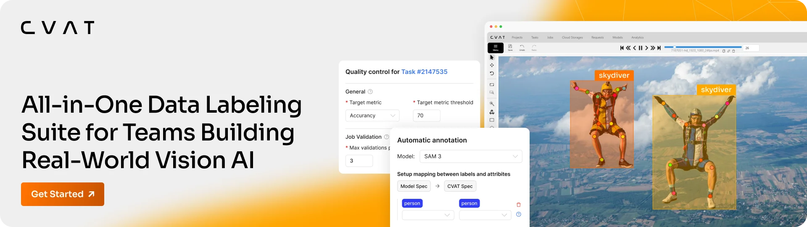
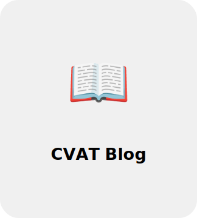
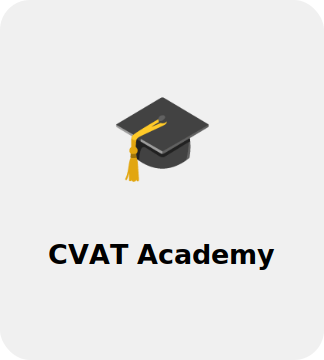
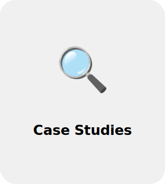

[](https://app.cvat.ai)
# CVAT: Computer Vision Annotation Tool

[![Release][release-img]][release-url]
[![GitHub stars][stars-img]][stars-url]
[![License][license-img]][license-url]
[![CI][ci-img]][ci-url]
[![server pulls][docker-server-pulls-img]][docker-server-image-url]
[![ui pulls][docker-ui-pulls-img]][docker-ui-image-url]
[![CVAT Online][online-img]][online-url]
[![CVAT Enterprise][enterprise-img]][enterprise-url]
[![Status][status-img]][status-url]
[![Discord][discord-img]][discord-url]
[![Docs][docs-img]][docs-url]

[Website](https://www.cvat.ai/) ·
[Docs](https://docs.cvat.ai/docs/) ·
[Changelog](https://www.cvat.ai/resources/changelog) ·
[Tutorials](https://www.cvat.ai/resources/videos) ·
[Academy](https://www.cvat.ai/resources/academy) ·
[Blog](https://www.cvat.ai/resources/blog)

## What is CVAT Community?

**CVAT Community** is the free, self-hosted open-source edition of [CVAT](https://www.cvat.ai/) — one of
the most widely used data annotation platforms for building high-quality visual datasets for
computer vision and visual AI.
Since 2018, CVAT has become one of the best-known data annotation tools in computer vision, with a
large open-source community, millions of Docker pulls, and broad adoption across research and
production AI teams.

CVAT Community supports image, video, and 3D annotation, dataset management, team collaboration, cloud storage
integration, developer-friendly SDKs and APIs, and gives your team full control over your data
and annotation infrastructure.
The platform serves as the foundation of
[CVAT Online](https://www.cvat.ai/pricing/cvat-online) and
[CVAT Enterprise](https://www.cvat.ai/enterprise), and is actively maintained by the CVAT engineering team.

Why teams choose CVAT Community:

- **Own your data:** Run entirely within your own infrastructure. No data leaves your environment.
- **AI-powered annotation:** Connect your own ML models for detection, segmentation, and tracking to speed up labeling.
- **Team collaboration:** Multi-user and multi-organization support with roles, task assignments,
  and review workflows.
- **MIT-licensed core:** Use, modify, and distribute CVAT Community under the permissive MIT License. Some serverless
assets and dependencies may have separate licenses.
- **Production-grade:** The foundation of all CVAT commercial products — battle-tested at scale.
- **True open-source:** Transparent development, active community, on GitHub since 2018.

This repository contains the source code and deployment assets for CVAT Community.

For a fully managed setup, annotation services, or enterprise features, see
[CVAT Online](https://www.cvat.ai/pricing/cvat-online),
[CVAT Enterprise](https://www.cvat.ai/enterprise) and
[CVAT Labeling Services](https://www.cvat.ai/annotation-services).

## Getting Started

> 💡 Want to explore CVAT before deploying anything?
> **[Try CVAT Online (Free plan)](https://app.cvat.ai)** directly in your browser.
> Feature availability and usage limits vary by plan; see
> [CVAT Online pricing](https://www.cvat.ai/pricing/cvat-online) for details.

### Installation

**Prerequisites:**

- [Docker Engine](https://docs.docker.com/engine/install/)
- [Docker Compose](https://docs.docker.com/compose/install/)
- [Git](https://git-scm.com/)

> 💡 CVAT is primarily tested with Chromium-based browsers (Google Chrome, Microsoft Edge).
> Firefox may work with some caveats; Safari/WebKit is not supported.

**1. Start the default stack**

Clone the repository and launch the services.

```bash
git clone https://github.com/cvat-ai/cvat
cd cvat

# Optional: set your IP or domain
# export CVAT_HOST=your-ip-or-domain

docker compose up -d
```

**2. Create an admin account**

```bash
docker exec -it cvat_server bash -ic 'python3 ~/manage.py createsuperuser'
```

See the [Installation Guide](https://docs.cvat.ai/docs/administration/community/basics/installation/) for full
instructions and OS-specific setup.

**3. Sign in and start labeling**

- Open [http://localhost:8080](http://localhost:8080) (or your `CVAT_HOST`) in your browser.
- Log in with your superuser account.
- Create a project or task, upload your data (images, videos, or point clouds), and define labels to start annotating.

Learn more about annotation tools and workflows in the [CVAT Documentation](https://docs.cvat.ai/docs/) or
take our free course – [CVAT Academy](https://www.cvat.ai/resources/academy).

_For alternative deployments (AWS, Kubernetes, external PostgreSQL, backups, upgrades), see the [Deployment Guides](https://docs.cvat.ai/docs/administration/community/advanced/)._

## Key Capabilities

- **[Manual & Auto-labeling](https://docs.cvat.ai/docs/annotation/manual-annotation/):** Annotate images, videos, and
  3D point clouds with bounding boxes, polygons, masks, keypoints, cuboids, tags, and more. Speed up labeling
  by connecting your own models for automatic annotation.
- **[Task Management](https://docs.cvat.ai/docs/workspace/):** Organize datasets into projects, split them into tasks
  and jobs, assign work to annotators, and track progress in real time.
- **[Collaboration](https://docs.cvat.ai/docs/account_management/user-roles/):** Create organizations, invite teammates,
  assign roles, and collaborate on annotations with comments and issues.
- **[Quality Control](https://docs.cvat.ai/docs/qa-analytics/manual-qa/):** Review annotations, flag issues, compare
  results across annotators with consensus, and run Ground Truth and Honeypot checks through the server API.
- **[Analytics](https://docs.cvat.ai/docs/administration/community/advanced/analytics/):** Monitor user activity,
  working time by job, events, and server logs with Grafana dashboards.
- **[Data Ops & Integrations](https://docs.cvat.ai/docs/dataset_management/export-datasets/):** Export/import in 20+
  formats (COCO, YOLO, Pascal VOC, KITTI, etc.), connect to cloud storage (S3, Azure, Google Cloud), and automate
  via REST API and Python SDK.

Advanced capabilities such as advanced project analytics, quality control UI, built-in auto-labeling with SAM 2
 and SAM 3, AI agents, SSO, and more are available in [CVAT Online](https://www.cvat.ai/pricing/cvat-online)
 paid plans (Solo, Team) and [CVAT Enterprise](https://www.cvat.ai/enterprise).

## Developer Tools

CVAT is designed for automation. Beyond the Web UI, you can integrate it into your pipelines using:

- [Python SDK](https://docs.cvat.ai/docs/api_sdk/sdk/): install with `pip install cvat-sdk` and automate task creation,
uploads, and exports from Python.
- [Command line tool](https://docs.cvat.ai/docs/api_sdk/cli/): install with `pip install cvat-cli`
and script common CVAT workflows from the terminal.
- [REST API](https://docs.cvat.ai/docs/api_sdk/api/): full programmatic control over CVAT.

## Data and Formats

CVAT Community supports image, video, and 3D (point cloud) annotation workflows. You can move data in and out using 20+
industry-standard formats: CVAT (XML), COCO (JSON), YOLO (TXT), Ultralytics YOLO (TXT/YAML), Pascal VOC (XML),
KITTI (TXT), MOT (TXT), and more.

[Full list of supported formats.](https://docs.cvat.ai/docs/dataset_management/formats/)

## ML and AI Models

CVAT Community supports automatic annotation via pre-built serverless models powered by Nuclio,
covering detection, segmentation, pose estimation, and tracking:

| Model | Framework | Type |
| --- | --- | --- |
| [Segment Anything (SAM)](https://github.com/cvat-ai/cvat/tree/develop/serverless/pytorch/facebookresearch/sam/nuclio) | PyTorch | Interactor |
| [Inside-Outside Guidance (IOG)](https://github.com/cvat-ai/cvat/tree/develop/serverless/pytorch/shiyinzhang/iog/nuclio) | PyTorch | Interactor |
| [RetinaNet R101](https://github.com/cvat-ai/cvat/tree/develop/serverless/pytorch/facebookresearch/detectron2/retinanet_r101/nuclio) | PyTorch | Detector |
| [HRNet32 Whole Body Pose](https://github.com/cvat-ai/cvat/tree/develop/serverless/pytorch/mmpose/hrnet32/nuclio) | PyTorch | Pose Estimation |
| [TransT](https://github.com/cvat-ai/cvat/tree/develop/serverless/pytorch/dschoerk/transt/nuclio) | PyTorch | Tracker |
| [YOLO v7](https://github.com/cvat-ai/cvat/tree/develop/serverless/onnx/WongKinYiu/yolov7/nuclio) | ONNX | Detector |
| [Mask RCNN Inception ResNet v2](https://github.com/cvat-ai/cvat/tree/develop/serverless/openvino/omz/public/mask_rcnn_inception_resnet_v2_atrous_coco/nuclio) | OpenVINO | Detector |
| [Face Detection 0205](https://github.com/cvat-ai/cvat/tree/develop/serverless/openvino/omz/intel/face-detection-0205/nuclio) | OpenVINO | Detector |
| [Faster RCNN Inception v2](https://github.com/cvat-ai/cvat/tree/develop/serverless/tensorflow/faster_rcnn_inception_v2_coco/nuclio) | TensorFlow | Detector |

To enable automatic annotation, add the serverless component to your deployment:

```bash
docker compose -f docker-compose.yml -f components/serverless/docker-compose.serverless.yml up -d
```

This starts the serverless infrastructure. To make models available in CVAT, install `nuctl` and deploy
the functions you need, for example SAM or YOLO, as described in the [Automatic Annotation Guide](https://docs.cvat.ai/docs/annotation/auto-annotation/automatic-annotation/).

## Which CVAT edition should I choose?

- **CVAT Online**: the fastest way to try CVAT and start labeling without deployment. Use it to evaluate CVAT in
the browser, explore managed features, and move to cost-efficient paid plans when you need more capacity or team
workflows.
- **CVAT Community**: the MIT-licensed self-hosted edition for teams that want to run CVAT themselves, customize the
stack, and control their infrastructure.
- **CVAT Enterprise**: for organizations that need CVAT in their own cloud or internal environment, enterprise support,
security controls such as SSO, paid platform features, and SLAs.
- **Labeling Services**: for teams that want to outsource annotation work to CVAT.ai’s experienced labeling team instead
of building an internal labeling operation. Customers get trial access to CVAT Online during the project.

For detailed plan limits and feature availability, see [CVAT Online pricing](https://www.cvat.ai/pricing/cvat-online),
 [CVAT Enterprise](https://www.cvat.ai/enterprise), and [Labeling Services](https://www.cvat.ai/annotation-services).

## Support

- **Usage questions:** ask the community on [Discord](https://discord.com/invite/fNR3eXfk6C) or
Stack Overflow with the `cvat` tag.
- **Bugs and feature requests:** use [GitHub Issues](https://github.com/cvat-ai/cvat/issues).
- **FAQ:** [Installation, upgrades, troubleshooting](https://docs.cvat.ai/docs/faq/).

For dedicated support, SLAs, or advanced deployments, consider [CVAT Enterprise](https://www.cvat.ai/enterprise).

## Contributing

We welcome all contributions: bug reports, documentation fixes, integrations, and code.

- If you'd like to contribute to CVAT, please refer to our
  [contribution documentation](https://docs.cvat.ai/docs/contributing/).
- For bug reports or feature requests, please use the [GitHub Issues](https://github.com/cvat-ai/cvat/issues) tracker.

## Security

- Please review our [Security Policy](https://github.com/cvat-ai/cvat/security/policy) before reporting vulnerabilities.
- For sensitive issues, contact: [secure@cvat.ai](mailto:secure@cvat.ai).

## License

CVAT Community is released under the MIT License.

- Code in `/serverless` is also MIT-licensed, but may use third-party assets under separate licenses (including
  non-commercial). Review those licenses before use.
- This software uses FFmpeg libraries under LGPL/GPL. See the Dockerfile and
  [FFmpeg legal info](https://www.ffmpeg.org/legal.html) for details.

## Additional Resources

For the latest product releases, feature walkthroughs, and all things CVAT see:

<table cellspacing="10" border="0"><tr>
  <td><a href="https://www.cvat.ai/resources/blog"></a></td>
  <td><a href="https://www.cvat.ai/resources/academy"></a></td>
  <td><a href="https://www.cvat.ai/resources/case-studies"></a></td>
  <td><a href="https://www.youtube.com/@cvat-ai"></a></td>
  <td><a href="https://www.linkedin.com/company/cvat-ai"></a></td>
</tr></table>

  <!-- Badges -->

[ci-img]: https://github.com/cvat-ai/cvat/actions/workflows/main.yml/badge.svg?branch=develop
[ci-url]: https://github.com/cvat-ai/cvat/actions

[docs-img]: https://img.shields.io/badge/docs-docs.cvat.ai-blue?style=flat-square
[docs-url]: https://docs.cvat.ai

[online-img]: https://img.shields.io/badge/CVAT%20Online-app.cvat.ai-success?style=flat-square
[online-url]: https://app.cvat.ai

[release-img]: https://img.shields.io/github/v/release/cvat-ai/cvat?style=flat-square
[release-url]: https://github.com/cvat-ai/cvat/releases

[license-img]: https://img.shields.io/github/license/cvat-ai/cvat?style=flat-square
[license-url]: https://github.com/cvat-ai/cvat/blob/develop/LICENSE

[stars-img]: https://img.shields.io/github/stars/cvat-ai/cvat?style=flat-square
[stars-url]: https://github.com/cvat-ai/cvat/stargazers

[status-img]: https://uptime.betterstack.com/status-badges/v2/monitor/1yl3h.svg
[status-url]: https://status.cvat.ai

[enterprise-img]: https://img.shields.io/badge/CVAT%20Enterprise-cvat.ai-orange?style=flat-square
[enterprise-url]: https://www.cvat.ai/enterprise

[docker-server-pulls-img]: https://img.shields.io/docker/pulls/cvat/server.svg?style=flat-square&label=server%20pulls
[docker-server-image-url]: https://hub.docker.com/r/cvat/server

[docker-ui-pulls-img]: https://img.shields.io/docker/pulls/cvat/ui.svg?style=flat-square&label=UI%20pulls
[docker-ui-image-url]: https://hub.docker.com/r/cvat/ui

[discord-img]: https://img.shields.io/discord/1000789942802337834?label=discord
[discord-url]: https://discord.gg/fNR3eXfk6C
