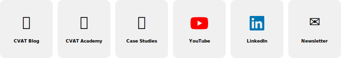

# CVAT Community: The Open-Source Edition of CVAT (Computer Vision Annotation Tool)

[![Release][release-img]][release-url]
[![GitHub stars][stars-img]][stars-url]
[![License][license-img]][license-url]
[![CI][ci-img]][ci-url]
[![Docs][docs-img]][docs-url]
[![CVAT Online][online-img]][online-url]
[![CVAT Enterprise][enterprise-img]][enterprise-url]
[![Status][status-img]][status-url]

[Website](https://www.cvat.ai/) ·
[Docs](https://docs.cvat.ai/docs/) ·
[Changelog](https://www.cvat.ai/resources/changelog) ·
[Tutorials](https://www.cvat.ai/resources/videos) ·
[Academy](https://www.cvat.ai/resources/academy) ·
[Blog](https://www.cvat.ai/resources/blog)

## What is CVAT Community?

**CVAT Community** is the free, self-hosted open-source edition of [CVAT](https://www.cvat.ai/) — the leading data
annotation platform for building and maintaining high-quality visual datasets for computer vision and visual AI. It
provides a production-ready environment for teams who want to own their data and labeling infrastructure, rather than
relying on a managed service.

CVAT Community supports image, video, and 3D annotation, dataset management, team collaboration, cloud storage
integration, and developer-friendly SDKs and APIs.

This repository contains the source code and deployment assets for CVAT Community.

For commercial hosted setups, advanced labeling tools, or managed services, see
[CVAT Online](https://www.cvat.ai/pricing/cvat-online),
[CVAT Enterprise](https://www.cvat.ai/enterprise) and
[CVAT Labeling Services](https://www.cvat.ai/annotation-services).

## Getting Started

> 💡 **Tip:** Want to explore CVAT before deploying anything?
> **[Try CVAT Online (Free plan)](https://app.cvat.ai)** directly in your browser.
> Includes SAM 3 segmentation, quality control UI, and built-in analytics
> so you can evaluate the full platform before committing to a self-hosted setup.

### Installation

**Prerequisites:**

- [Docker Engine](https://docs.docker.com/engine/install/)
- [Docker Compose](https://docs.docker.com/compose/install/)
- [Git](https://git-scm.com/)

**1. Start the default stack**

Clone the repository and launch the services.

```bash
git clone https://github.com/cvat-ai/cvat
cd cvat

# Optional: set your IP or domain
# export CVAT_HOST=your-ip-or-domain

docker compose up -d
```

**2. Create an admin account**

```bash
docker exec -it cvat_server bash -ic 'python3 ~/manage.py createsuperuser'
```

See the [Installation Guide](https://docs.cvat.ai/docs/administration/community/basics/installation/) for full
instructions and OS-specific setup.

**3. Sign in and start labeling**

- Open [http://localhost:8080](http://localhost:8080) (or your `CVAT_HOST`) in your browser.
- Log in with your superuser account.
- Create a project or task, upload your data (images, videos, or point clouds), and define labels to start annotating.

Learn more about annotation tools and workflows in the [CVAT Documentation](https://docs.cvat.ai/docs/) or
take our free course – [CVAT Academy](https://www.cvat.ai/resources/academy).

**4. Optional: Automatic annotation**

To enable ML-powered labeling (e.g., with Segment Anything (SAM), YOLO, or custom models):

```bash
docker compose -f docker-compose.yml -f components/serverless/docker-compose.serverless.yml up -d
```

See the [Automatic Annotation Guide](https://docs.cvat.ai/docs/annotation/auto-annotation/automatic-annotation/) for
details.

_For alternative deployments (AWS, Kubernetes, external PostgreSQL, backups, upgrades), see the [Deployment Guides](https://docs.cvat.ai/docs/administration/community/advanced/)._

## Key Capabilities

- **Manual & Auto-labeling:** Annotate images, videos, and 3D point clouds with bounding boxes, polygons, masks,
 keypoints, cuboids, tags, and more. Speed up labeling by connecting your own models for automatic annotation.
- **Task Management:** Organize datasets into projects, split them into tasks and jobs, assign work to annotators,
and track progress in real time.
- **Collaboration:** Create organizations, invite teammates, assign roles, and collaborate on annotations with
 comments and
issues.
- **Quality Control:** Review annotations, flag issues, compare results across annotators with consensus,
and run Ground Truth and Honeypot checks through the server API.
- **Analytics:** Monitor user activity, working time by job, events, and server logs with Grafana dashboards.
- **Data Ops & Integrations:** Export/import in 20+ formats (COCO, YOLO, Pascal VOC, KITTI, etc.), connect to cloud
  storage (S3, Azure, Google Cloud), and automate via REST API and Python SDK.

Advanced capabilities such as advanced project analytics, quality control UI, built-in auto-labeling with SAM 2
 and SAM 3, AI agents, SSO, and more are available in [CVAT Online](https://www.cvat.ai/pricing/cvat-online)
 paid plans (Solo, Team) and [CVAT Enterprise](https://www.cvat.ai/enterprise).

## Developer Tools

CVAT is designed for automation. Beyond the Web UI, you can integrate it into your pipelines using:

- [Python SDK & CLI](https://docs.cvat.ai/docs/api_sdk/sdk/): Automate task creation, data upload, and dataset exports.
- [REST API](https://docs.cvat.ai/docs/api_sdk/api/): Full programmatic control over every platform feature.

## Data and Formats

CVAT Community supports image, video, and 3D (point cloud) annotation workflows. You can move data in and out using
over 20+ industry-standard formats: CVAT (XML), COCO (JSON), YOLO (TXT), Ultralytics YOLO (TXT/YAML), Pascal VOC (XML),
KITTI (TXT), MOT (TXT), and more.

[Full list of supported formats.](https://docs.cvat.ai/docs/dataset_management/formats/)

## Editions Comparison

| Feature | CVAT Community | CVAT Online / Enterprise |
| --- | --- | --- |
| Basic Annotation Tools | ✅ | ✅ |
| Cloud Storage Connectors | ✅ | ✅ |
| Auto-annotation (Nuclio) | ✅ (Self-managed) | ✅ (Pre-configured) |
| AI Agents | ❌ | ✅ |
| SAM 2 Video Tracking | ❌ | ✅ |
| SAM 3 Segmentation (Text prompts) | ❌ | ✅ |
| Advanced Analytics | ⚠️ Basic (Grafana) | Custom Dashboards |
| Quality Control | ⚠️ (Manual QC, Consensus, GT Jobs & Honeypots via API) | ✅ |
| SSO (LDAP/AD/SAML) | ❌ | ✅ |
| Technical Support | Community-based | Dedicated / SLA |

For a full feature breakdown, visit [CVAT Pricing](https://www.cvat.ai/pricing/enterprise).

## Support

- **Community support:** via [GitHub Issues](https://github.com/cvat-ai/cvat/issues) and
  [Discord](https://discord.gg/cvat).
- **FAQ:** [Installation, upgrades, troubleshooting](https://docs.cvat.ai/docs/faq/).

For dedicated support, SLAs, or advanced deployments, consider [CVAT Enterprise](https://cvat.ai/enterprise).

## Contributing

We welcome all contributions: bug reports, documentation fixes, integrations, and code.

- If you'd like to contribute to CVAT, please refer to our
  [contribution documentation](https://docs.cvat.ai/docs/contributing/).
- For bug reports or feature requests, please use the [GitHub Issues](https://github.com/cvat-ai/cvat/issues) tracker.

## Security

- Please review our [Security Policy](https://github.com/cvat-ai/cvat/security/policy) before reporting vulnerabilities.
- For sensitive issues, contact: [secure@cvat.ai](mailto:secure@cvat.ai).

## License

CVAT Community is released under the MIT License.

- Code in `/serverless` is also MIT-licensed, but may use third-party assets under separate licenses (including
  non-commercial). Review those licenses before use.
- This software uses FFmpeg libraries under LGPL/GPL. See the Dockerfile and
  [FFmpeg legal info](https://www.ffmpeg.org/legal.html) for details.

## Additional Resources

For the latest product releases, feature walkthroughs, and all things CVAT see:


<map name="badges">
  <area href="https://www.cvat.ai/resources/blog"         coords="0,0,108,120"    shape="rect">
  <area href="https://www.cvat.ai/resources/academy"      coords="118,0,226,120"  shape="rect">
  <area href="https://www.cvat.ai/resources/case-studies" coords="236,0,344,120"  shape="rect">
  <area href="https://www.youtube.com/@cvat-ai"           coords="354,0,462,120"  shape="rect">
  <area href="https://www.linkedin.com/company/cvat-ai"   coords="472,0,580,120"  shape="rect">
  <area href="https://www.cvat.ai/#:~:text=Subscribe%20to%20the%20CVAT%20Newsletter" coords="590,0,698,120" shape="rect">
</map>

  <!-- Badges -->

[ci-img]: https://github.com/cvat-ai/cvat/actions/workflows/main.yml/badge.svg?branch=develop
[ci-url]: https://github.com/cvat-ai/cvat/actions

[docs-img]: https://img.shields.io/badge/docs-docs.cvat.ai-blue?style=flat-square
[docs-url]: https://docs.cvat.ai

[online-img]: https://img.shields.io/badge/CVAT%20Online-app.cvat.ai-success?style=flat-square
[online-url]: https://app.cvat.ai

[release-img]: https://img.shields.io/github/v/release/cvat-ai/cvat?style=flat-square
[release-url]: https://github.com/cvat-ai/cvat/releases

[license-img]: https://img.shields.io/github/license/cvat-ai/cvat?style=flat-square
[license-url]: https://github.com/cvat-ai/cvat/blob/develop/LICENSE

[stars-img]: https://img.shields.io/github/stars/cvat-ai/cvat?style=flat-square
[stars-url]: https://github.com/cvat-ai/cvat/stargazers

[status-img]: https://uptime.betterstack.com/status-badges/v2/monitor/1yl3h.svg
[status-url]: https://status.cvat.ai

[enterprise-img]: https://img.shields.io/badge/CVAT%20Enterprise-cvat.ai-orange?style=flat-square
[enterprise-url]: https://www.cvat.ai/enterprise
