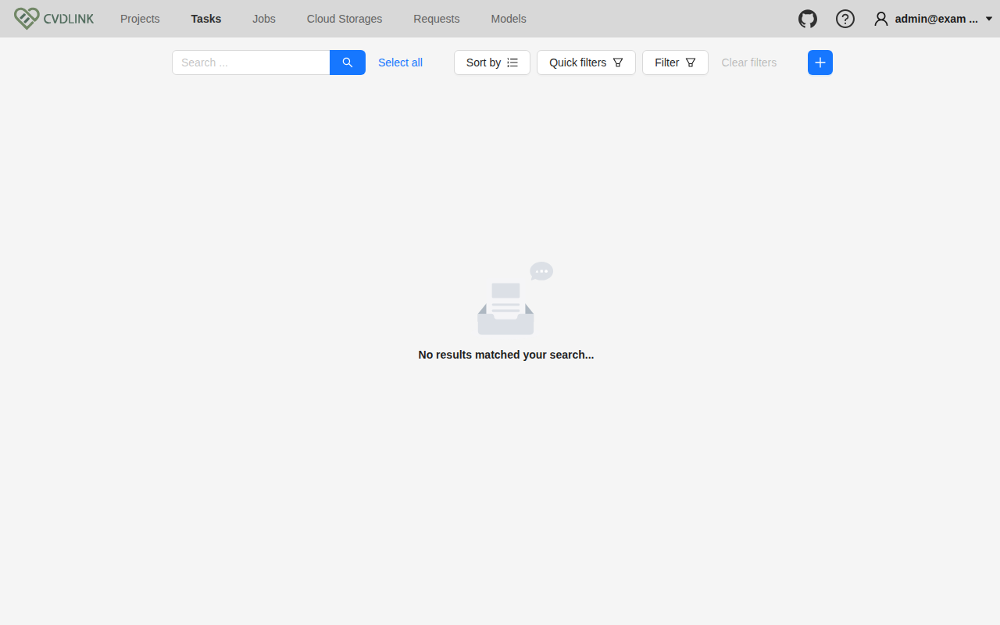
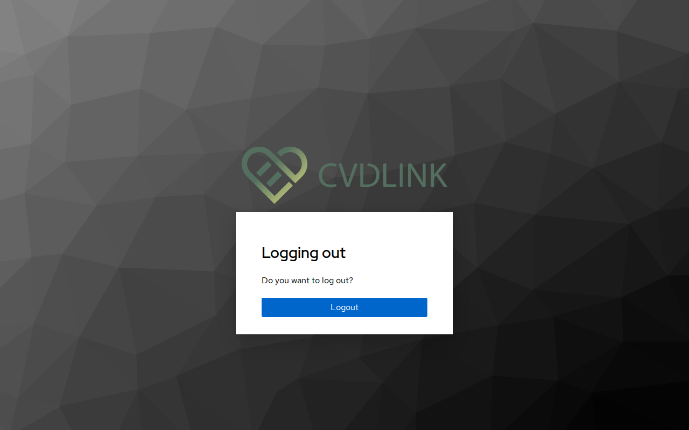
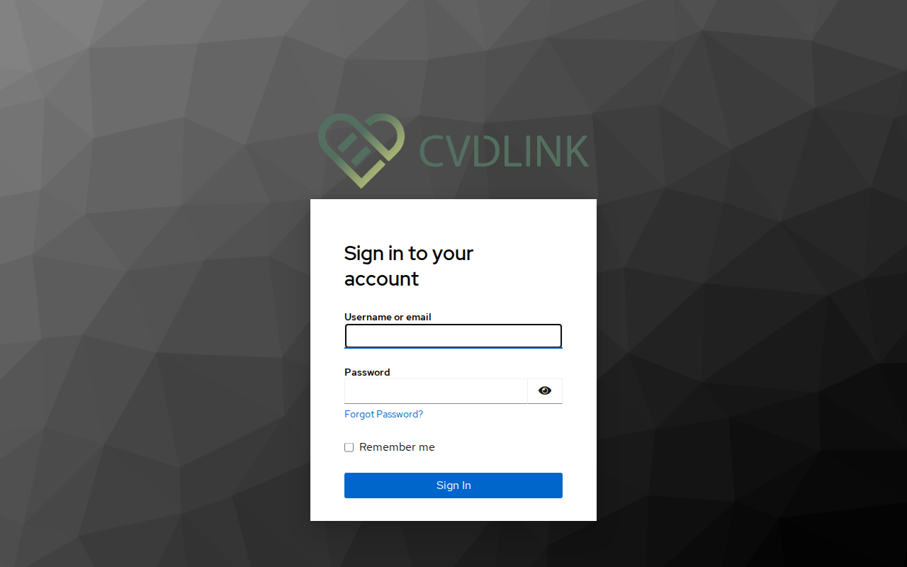

# CVDLINK fork — changes from upstream CVAT

This is a customized build of CVAT maintained as the CVDLINK fork. The notes
below summarize what differs from upstream `cvat-ai/cvat`. Everything else is
identical to upstream and tracks the `develop` branch.

| Section | What it covers |
| --- | --- |
| [DICOM support](#dicom-dcm-support) | Native ingestion of `.dcm` files, JPEG transfer syntax decoding, and YBR → RGB color correction. |
| [CVDLINK branding](#cvdlink-branding) | Logo, favicon, and product-name swaps; original CVAT assets kept alongside. |
| [Local HTTPS](#local-https-for-self-hosted-deployment) | Self-hosted TLS using locally-issued certs from `certs/` instead of Let's Encrypt. |
| [Keycloak SSO](#keycloak-sso-via-oauth2-proxy) | OpenID Connect single sign-on for the open-source build, layered in via oauth2-proxy + Traefik forwardAuth. |

## DICOM (`.dcm`) support

Upstream CVAT does not natively ingest DICOM files. This fork adds:

- A DICOM media extractor in `cvat/apps/engine/media_extractors.py` and a
  matching format module in `cvat/apps/dataset_manager/formats/dicom.py`,
  registered through `formats/registry.py`.
- `application/dicom` registered in `cvat/apps/engine/media.mimetypes` so
  uploaded `.dcm` files are recognized and routed to the DICOM extractor.
- Decoding of transfer syntax `1.2.840.10008.1.2.4.*` (JPEG-family) and
  correct YBR → RGB color conversion, so DICOMs that arrive in YBR_FULL /
  YBR_FULL_422 render with accurate colors instead of green-tinted output.
- An upload-page hint in the task creation UI explaining the DICOM input
  format expectations (`cvat-ui/src/utils/files.ts`,
  `create-task-content.tsx`).
- `pydicom` added to `cvat/requirements/base.in` / `base.txt`.

## CVDLINK branding

The CVAT logos and favicons are replaced with CVDLINK assets in:

- `cvat/apps/engine/static/` (logo)
- `cvat-ui/dist/favicon.ico`
- `site/assets/icons/` and `site/static/favicons/`
- The product name string in `cvat/settings/base.py`

Original CVAT assets are preserved alongside as `*_cvat.*` so the upstream
artwork can still be referenced if needed.

## Local HTTPS for self-hosted deployment

`docker-compose.https.yml` and `tls.yml` are tweaked so the stack can run
behind a locally-issued TLS certificate instead of Let's Encrypt. The
`certs/` directory is the expected mount point for `cert.pem` / `key.pem`
and is gitignored — certificates are never committed to the repository.

## Keycloak SSO via oauth2-proxy

Upstream CVAT's OpenID Connect SSO (the `auth_config.yml` flow described
on the [upstream docs](https://docs.cvat.ai/docs/account_management/sso/))
ships only with CVAT Enterprise. To get equivalent functionality on the
open-source build, this fork adds an OIDC layer **in front of** CVAT — no
fork of the auth code — using `oauth2-proxy` plus a Traefik `forwardAuth`
middleware. Django auto-provisions the user from a trusted email header on
first sign-in.

The functionality is **opt-in**: include `docker-compose.sso.yml` in the
compose chain (or run `./sso.sh up`) and SSO is active; omit the overlay
and the stack runs the upstream local username/password flow unchanged.

### What you get

| Step | Screenshot |
| --- | --- |
| Browser hits `https://<cvat-host>/`, gets bounced to Keycloak |  |
| After successful Keycloak login, lands directly on the CVAT dashboard, auto-provisioned by email |  |
| Logging out from CVAT redirects through Keycloak's end_session endpoint (one click confirmation in Keycloak 26+) |  |
| After confirming, both Django session, oauth2-proxy cookie, and Keycloak session are cleared — next visit requires fresh auth |  |

### Files added or modified for SSO

| Path | Why |
| --- | --- |
| `cvat/settings/sso.py` (new) | Django settings overlay. Imports `production`, registers `OIDCRemoteUserMiddleware` after `AuthenticationMiddleware`, prepends `RemoteUserBackend`, sets `SECURE_PROXY_SSL_HEADER` / `USE_X_FORWARDED_HOST`. |
| `cvat/apps/iam/middleware.py` (modified) | Adds `OIDCRemoteUserMiddleware`, a thin subclass of Django's `PersistentRemoteUserMiddleware` that reads `HTTP_X_AUTH_REQUEST_EMAIL` instead of the default `REMOTE_USER`. |
| `docker-compose.sso.yml` (new) | Compose overlay. Adds an `oauth2-proxy` sidecar, points `cvat_ui` at it as a reverse proxy, attaches Traefik `forwardAuth` to API routers, adds a header-based bypass (`Authorization: Token\|Basic\|Bearer`) so `cvat-cli` / `cvat-sdk` / webhooks keep working, exposes the health endpoint without auth, and bind-mounts `sso.py` plus the modified middleware on `cvat_server` and every `cvat_worker_*`. |
| `components/sso/traefik.yml` (new) | Traefik file-provider config defining the `cvat-sso-auth` (forwardAuth), `cvat-sso-logout` (redirectRegex on `/auth/login*` → SSO logout chain), and the `oauth2-proxy@file` service. The label-based equivalent did not load reliably for `errors`/`redirectRegex`, so the file provider is the source of truth. |
| `.env.sso.example` (new) | Documented template for `CVAT_HOST`, Keycloak issuer / client id / secret, cookie secret, redirect URL, audience claim override, optional URL overrides for dev Keycloaks whose `KC_HOSTNAME` doesn't match the public URL. |
| `.env.sso` (gitignored) | Your real values. Created from the template; never committed. |
| `.gitignore` | Force-included `.env.sso.example` (the broader `/.*env*` rule had hidden it). |
| `sso.sh` (new) | Convenience wrapper: `./sso.sh up`, `./sso.sh down`, `./sso.sh logs`. Equivalent to a long `docker compose -f ... -f docker-compose.sso.yml ...` invocation. |
| `site/content/en/docs/administration/community/advanced/sso-keycloak.md` (new) | Operator-facing doc with the same content as this section, picked up by the Hugo site build. |
| `docs/sso/*.png` (new) | The screenshots above. |

No code in `cvat/apps/engine`, `cvat-ui`, or any other part of upstream CVAT's
auth flow is modified — the SSO layer sits entirely in front of and around
the existing app.

### Setup

#### 1. Configure Keycloak

In the Keycloak admin console (under your realm):

1. Create an **OpenID Connect** client.
   - *Client ID:* whatever you want (e.g. `cvat`) — this is what you'll
     put in `SSO_CLIENT_ID`.
   - *Client authentication:* **On** (confidential).
   - *Standard flow:* on. Direct access grants: off.
2. In the client's *Settings* tab:
   - *Valid Redirect URIs:* `https://<cvat-host>/oauth2/callback`
   - *Valid post logout redirect URIs:* `https://<cvat-host>/*`
   - *Web origins:* `+`
3. *Credentials* tab → copy the **Client secret** for `SSO_CLIENT_SECRET`.
4. *(Recommended)* Set Keycloak's `KC_HOSTNAME` to the URL clients
   actually reach Keycloak at (e.g. `http://192.168.32.249:8081`). If
   Keycloak advertises a hostname users can't reach, browser cookies
   won't survive the form POST and you'll see "Cookie not found".

#### 2. Configure CVAT

```bash
cp .env.sso.example .env.sso
$EDITOR .env.sso        # CVAT_HOST, Keycloak issuer + client id/secret, cookie secret
```

Generate a fresh cookie signing key:

```bash
openssl rand -hex 16    # 32 alphanumeric chars — paste into SSO_COOKIE_SECRET
```

#### 3. Bring it up

Easiest:

```bash
./sso.sh up
./sso.sh logs           # tail oauth2-proxy + cvat_server + traefik
```

Or the equivalent `docker compose` invocation:

```bash
docker compose --env-file .env.sso \
  -f docker-compose.yml \
  -f docker-compose.https.yml \
  -f docker-compose.sso.yml \
  up -d
```

#### 4. Make yourself a CVAT admin (first user only)

`RemoteUserBackend` provisions everyone as a regular `user`. To promote
yourself to CVAT admin after first sign-in:

```bash
docker compose -p cvat exec cvat_server python manage.py shell -c "\
from django.contrib.auth import get_user_model; \
from django.contrib.auth.models import Group; \
u = get_user_model().objects.get(username='you@example.com'); \
u.is_staff = u.is_superuser = True; u.save(); \
u.groups.add(Group.objects.get(name='admin'))"
```

### Turning SSO off

Just don't include `docker-compose.sso.yml` in your compose command (or
don't run `./sso.sh`). The stack reverts to upstream local auth without
any further changes:

```bash
docker compose -f docker-compose.yml -f docker-compose.https.yml up -d
```

### CLI / SDK access

`cvat-cli`, `cvat-sdk`, and any service hitting `/api/*` with an
`Authorization: Token …` (or `Basic` / `Bearer`) header is matched by a
higher-priority Traefik router and routed straight to `cvat_server`,
bypassing oauth2-proxy. Issue a token the usual way and use it as you
always would:

```bash
curl -X POST -d 'username=you@example.com&password=...' \
  https://<cvat-host>/api/auth/login           # returns { "key": "..." }
curl -H "Authorization: Token <key>" \
  https://<cvat-host>/api/jobs                 # works unchanged
```

The local Django password flow only works for users who *also* have a
local password set. SSO-provisioned users have no password by default.

### Caveats

- The CVAT in-app login page is shadowed by oauth2-proxy. Browser users
  always go through Keycloak; `/auth/login` is intercepted by a Traefik
  redirect to start a full RP-initiated logout chain.
- Group → CVAT-role mapping is not automatic. Promote admins manually
  (see step 4 above). The `X-Auth-Request-Groups` header is already
  forwarded to Django, so a future signal handler reading it is a small
  follow-up — see `cvat/apps/iam/signals.py` for the LDAP-equivalent
  pattern.
- Keycloak 26+ requires user confirmation on the logout page unless
  `id_token_hint` is supplied. oauth2-proxy doesn't surface ID tokens to
  the browser by default, so users see a one-click "Logout?" prompt.
- The OIDC cookie is signed locally by oauth2-proxy. Logging out of
  Keycloak directly does not immediately invalidate that cookie — set a
  short `OAUTH2_PROXY_COOKIE_REFRESH` if that matters in your threat
  model.

---

<p align="center">
  
</p>
<p align="center">
  <a href="https://app.cvat.ai/">
    
  </a>
</p>

# Computer Vision Annotation Tool (CVAT)

[![CI][ci-img]][ci-url]
[![Gitter chat][gitter-img]][gitter-url]
[![Discord][discord-img]][discord-url]
[![Coverage Status][coverage-img]][coverage-url]
[![server pulls][docker-server-pulls-img]][docker-server-image-url]
[![ui pulls][docker-ui-pulls-img]][docker-ui-image-url]
[![DOI][doi-img]][doi-url]
[![Status][status-img]][status-url]

CVAT is an interactive video and image annotation
tool for computer vision. It is used by tens of thousands of users and
companies around the world. Our mission is to help developers, companies, and
organizations around the world to solve real problems using the Data-centric
AI approach.

Start using CVAT online: [cvat.ai](https://cvat.ai). You can use it for free,
or [subscribe](https://www.cvat.ai/pricing/cloud) to get unlimited data,
organizations, autoannotations, and [Roboflow and HuggingFace integration](https://www.cvat.ai/post/integrating-hugging-face-and-roboflow-models).

Or set CVAT up as a self-hosted solution:
[Self-hosted Installation Guide](https://docs.cvat.ai/docs/administration/basics/installation/).
We provide [Enterprise support](https://www.cvat.ai/pricing/on-prem) for
self-hosted installations with premium features: SSO, LDAP, Roboflow and
HuggingFace integrations, and advanced analytics (coming soon). We also
do trainings and a dedicated support with 24 hour SLA.

## Quick start ⚡

- [Installation guide](https://docs.cvat.ai/docs/administration/basics/installation/)
- [Manual](https://docs.cvat.ai/docs/manual/)
- [Contributing](https://docs.cvat.ai/docs/contributing/)
- [Datumaro dataset framework](https://github.com/cvat-ai/datumaro/blob/develop/README.md)
- [Server API](#api)
- [Python SDK](#sdk)
- [Command line tool](#cli)
- [XML annotation format](https://docs.cvat.ai/docs/manual/advanced/xml_format/)
- [AWS Deployment Guide](https://docs.cvat.ai/docs/administration/basics/aws-deployment-guide/)
- [Frequently asked questions](https://docs.cvat.ai/docs/faq/)
- [Where to ask questions](#where-to-ask-questions)

## Partners ❤️

CVAT is used by teams all over the world. In the list, you can find key companies which
help us support the product or an essential part of our ecosystem. If you use us,
please drop us a line at [contact@cvat.ai](mailto:contact+github@cvat.ai).

- [Human Protocol](https://hmt.ai) uses CVAT as a way of adding annotation service to the Human Protocol.
- [FiftyOne](https://fiftyone.ai) is an open-source dataset curation and model analysis
  tool for visualizing, exploring, and improving computer vision datasets and models that are
  [tightly integrated](https://voxel51.com/docs/fiftyone/integrations/cvat.html) with CVAT
  for annotation and label refinement.

## Public datasets

[ATLANTIS](https://github.com/smhassanerfani/atlantis), an open-source dataset for semantic segmentation
of waterbody images, developed by [iWERS](http://ce.sc.edu/iwers/) group in the
Department of Civil and Environmental Engineering at the University of South Carolina is using CVAT.

For developing a semantic segmentation dataset using CVAT, see:

- [ATLANTIS published article](https://www.sciencedirect.com/science/article/pii/S1364815222000391)
- [ATLANTIS Development Kit](https://github.com/smhassanerfani/atlantis/tree/master/adk)
- [ATLANTIS annotation tutorial videos](https://www.youtube.com/playlist?list=PLIfLGY-zZChS5trt7Lc3MfNhab7OWl2BR).

## CVAT online: [cvat.ai](https://cvat.ai)

This is an online version of CVAT. It's free, efficient, and easy to use.

[cvat.ai](https://cvat.ai) runs the latest version of the tool. You can create up
to 10 tasks there and upload up to 500Mb of data to annotate. It will only be
visible to you or the people you assign to it.

For now, it does not have [analytics features](https://docs.cvat.ai/docs/administration/advanced/analytics/)
like management and monitoring the data annotation team. It also does not allow exporting images, just the annotations.

We plan to enhance [cvat.ai](https://cvat.ai) with new powerful features. Stay tuned!

## Prebuilt Docker images 🐳

Prebuilt docker images are the easiest way to start using CVAT locally. They are available on Docker Hub:

- [cvat/server](https://hub.docker.com/r/cvat/server)
- [cvat/ui](https://hub.docker.com/r/cvat/ui)

The images have been downloaded more than 1M times so far.

## Screencasts 🎦

Here are some screencasts showing how to use CVAT.

<!--lint disable maximum-line-length-->

[Computer Vision Annotation Course](https://www.youtube.com/playlist?list=PL0to7Ng4PuuYQT4eXlHb_oIlq_RPeuasN):
we introduce our course series designed to help you annotate data faster and better
using CVAT. This course is about CVAT deployment and integrations, it includes
presentations and covers the following topics:

- **Speeding up your data annotation process: introduction to CVAT and Datumaro**.
  What problems do CVAT and Datumaro solve, and how they can speed up your model
  training process. Some resources you can use to learn more about how to use them.
- **Deployment and use CVAT**. Use the app online at [app.cvat.ai](https://app.cvat.ai).
  A local deployment. A containerized local deployment with Docker Compose (for regular use),
  and a local cluster deployment with Kubernetes (for enterprise users). A 2-minute
  tour of the interface, a breakdown of CVAT’s internals, and a demonstration of how
  to deploy CVAT using Docker Compose.

[Product tour](https://www.youtube.com/playlist?list=PL0to7Ng4Puua37NJVMIShl_pzqJTigFzg): in this course, we show how to use CVAT, and help to get familiar with CVAT functionality and interfaces. This course does not cover integrations and is dedicated solely to CVAT. It covers the following topics:

- **Pipeline**. In this video, we show how to use [app.cvat.ai](https://app.cvat.ai): how to sign up, upload your data, annotate it, and download it.

<!--lint enable maximum-line-length-->

For feedback, please see [Contact us](#contact-us)

## API

- [Documentation](https://docs.cvat.ai/docs/api_sdk/api/)

## SDK

- Install with `pip install cvat-sdk`
- [PyPI package homepage](https://pypi.org/project/cvat-sdk/)
- [Documentation](https://docs.cvat.ai/docs/api_sdk/sdk/)

## CLI

- Install with `pip install cvat-cli`
- [PyPI package homepage](https://pypi.org/project/cvat-cli/)
- [Documentation](https://docs.cvat.ai/docs/api_sdk/cli/)

## Supported annotation formats

CVAT supports multiple annotation formats. You can select the format
after clicking the **Upload annotation** and **Dump annotation** buttons.
[Datumaro](https://github.com/cvat-ai/datumaro) dataset framework allows
additional dataset transformations with its command line tool and Python library.

For more information about the supported formats, see:
[Annotation Formats](https://docs.cvat.ai/docs/manual/advanced/formats/).

<!--lint disable maximum-line-length-->

| Annotation format                                                                                | Import | Export |
| ------------------------------------------------------------------------------------------------ | ------ | ------ |
| [CVAT for images](https://docs.cvat.ai/docs/manual/advanced/xml_format/#annotation)              | ✔️     | ✔️     |
| [CVAT for a video](https://docs.cvat.ai/docs/manual/advanced/xml_format/#interpolation)          | ✔️     | ✔️     |
| [Datumaro](https://github.com/cvat-ai/datumaro)                                                  | ✔️     | ✔️     |
| [PASCAL VOC](http://host.robots.ox.ac.uk/pascal/VOC/)                                            | ✔️     | ✔️     |
| Segmentation masks from [PASCAL VOC](http://host.robots.ox.ac.uk/pascal/VOC/)                    | ✔️     | ✔️     |
| [YOLO](https://pjreddie.com/darknet/yolo/)                                                       | ✔️     | ✔️     |
| [MS COCO Object Detection](http://cocodataset.org/#format-data)                                  | ✔️     | ✔️     |
| [MS COCO Keypoints Detection](http://cocodataset.org/#format-data)                               | ✔️     | ✔️     |
| [MOT](https://motchallenge.net/)                                                                 | ✔️     | ✔️     |
| [MOTS PNG](https://www.vision.rwth-aachen.de/page/mots)                                          | ✔️     | ✔️     |
| [LabelMe 3.0](http://labelme.csail.mit.edu/Release3.0)                                           | ✔️     | ✔️     |
| [ImageNet](http://www.image-net.org)                                                             | ✔️     | ✔️     |
| [CamVid](http://mi.eng.cam.ac.uk/research/projects/VideoRec/CamVid/)                             | ✔️     | ✔️     |
| [WIDER Face](http://shuoyang1213.me/WIDERFACE/)                                                  | ✔️     | ✔️     |
| [VGGFace2](https://github.com/ox-vgg/vgg_face2)                                                  | ✔️     | ✔️     |
| [Market-1501](https://www.aitribune.com/dataset/2018051063)                                      | ✔️     | ✔️     |
| [ICDAR13/15](https://rrc.cvc.uab.es/?ch=2)                                                       | ✔️     | ✔️     |
| [Open Images V6](https://storage.googleapis.com/openimages/web/index.html)                       | ✔️     | ✔️     |
| [Cityscapes](https://www.cityscapes-dataset.com/login/)                                          | ✔️     | ✔️     |
| [KITTI](http://www.cvlibs.net/datasets/kitti/)                                                   | ✔️     | ✔️     |
| [Kitti Raw Format](https://www.cvlibs.net/datasets/kitti/raw_data.php)                           | ✔️     | ✔️     |
| [LFW](http://vis-www.cs.umass.edu/lfw/)                                                          | ✔️     | ✔️     |
| [Supervisely Point Cloud Format](https://docs.supervise.ly/data-organization/00_ann_format_navi) | ✔️     | ✔️     |
| [Ultralytics YOLO Detection](https://docs.ultralytics.com/datasets/detect/)                      | ✔️     | ✔️     |
| [Ultralytics YOLO Oriented Bounding Boxes](https://docs.ultralytics.com/datasets/obb/)           | ✔️     | ✔️     |
| [Ultralytics YOLO Segmentation](https://docs.ultralytics.com/datasets/segment/)                  | ✔️     | ✔️     |
| [Ultralytics YOLO Pose](https://docs.ultralytics.com/datasets/pose/)                             | ✔️     | ✔️     |
| [Ultralytics YOLO Classification](https://docs.ultralytics.com/datasets/classify/)               | ✔️     | ✔️     |

<!--lint enable maximum-line-length-->

## Deep learning serverless functions for automatic labeling

CVAT supports automatic labeling. It can speed up the annotation process
up to 10x. Here is a list of the algorithms we support, and the platforms they can be run on:

<!--lint disable maximum-line-length-->

| Name                                                                                                    | Type       | Framework  | CPU | GPU |
| ------------------------------------------------------------------------------------------------------- | ---------- | ---------- | --- | --- |
| [Segment Anything](/serverless/pytorch/facebookresearch/sam/nuclio/)                                    | interactor | PyTorch    | ✔️  | ✔️  |
| [Faster RCNN](/serverless/openvino/omz/public/faster_rcnn_inception_resnet_v2_atrous_coco/nuclio)       | detector   | OpenVINO   | ✔️  |     |
| [Mask RCNN](/serverless/openvino/omz/public/mask_rcnn_inception_resnet_v2_atrous_coco/nuclio)           | detector   | OpenVINO   | ✔️  |     |
| [YOLO v3](/serverless/openvino/omz/public/yolo-v3-tf/nuclio)                                            | detector   | OpenVINO   | ✔️  |     |
| [YOLO v7](/serverless/onnx/WongKinYiu/yolov7/nuclio)                                                    | detector   | ONNX       | ✔️  | ✔️  |
| [Object reidentification](/serverless/openvino/omz/intel/person-reidentification-retail-0277/nuclio)    | reid       | OpenVINO   | ✔️  |     |
| [Semantic segmentation for ADAS](/serverless/openvino/omz/intel/semantic-segmentation-adas-0001/nuclio) | detector   | OpenVINO   | ✔️  |     |
| [Text detection v4](/serverless/openvino/omz/intel/text-detection-0004/nuclio)                          | detector   | OpenVINO   | ✔️  |     |
| [SiamMask](/serverless/pytorch/foolwood/siammask/nuclio)                                                | tracker    | PyTorch    | ✔️  | ✔️  |
| [TransT](/serverless/pytorch/dschoerk/transt/nuclio)                                                    | tracker    | PyTorch    | ✔️  | ✔️  |
| [Inside-Outside Guidance](/serverless/pytorch/shiyinzhang/iog/nuclio)                                   | interactor | PyTorch    | ✔️  |     |
| [Faster RCNN](/serverless/tensorflow/faster_rcnn_inception_v2_coco/nuclio)                              | detector   | TensorFlow | ✔️  | ✔️  |
| [RetinaNet](serverless/pytorch/facebookresearch/detectron2/retinanet_r101/nuclio)                       | detector   | PyTorch    | ✔️  | ✔️  |
| [Face Detection](/serverless/openvino/omz/intel/face-detection-0205/nuclio)                             | detector   | OpenVINO   | ✔️  |     |

<!--lint enable maximum-line-length-->

## License

The code is released under the [MIT License](https://opensource.org/licenses/MIT).

The code contained within the `/serverless` directory is released under the **MIT License**.
However, it may download and utilize various assets, such as source code, architectures, and weights, among others.
These assets may be distributed under different licenses, including non-commercial licenses.
It is your responsibility to ensure compliance with the terms of these licenses before using the assets.

This software uses LGPL-licensed libraries from the [FFmpeg](https://www.ffmpeg.org) project.
The exact steps on how FFmpeg was configured and compiled can be found in the [Dockerfile](Dockerfile).

FFmpeg is an open-source framework licensed under LGPL and GPL.
See [https://www.ffmpeg.org/legal.html](https://www.ffmpeg.org/legal.html). You are solely responsible
for determining if your use of FFmpeg requires any
additional licenses. CVAT.ai Corporation is not responsible for obtaining any
such licenses, nor liable for any licensing fees due in
connection with your use of FFmpeg.

## Contact us

[Gitter](https://gitter.im/opencv-cvat/public) to ask CVAT usage-related questions.
Typically questions get answered fast by the core team or community. There you can also browse other common questions.

[Discord](https://discord.gg/S6sRHhuQ7K) is the place to also ask questions or discuss any other stuff related to CVAT.

[LinkedIn](https://www.linkedin.com/company/cvat-ai/) for the company and work-related questions.

[YouTube](https://www.youtube.com/@cvat-ai) to see screencast and tutorials about the CVAT.

[GitHub issues](https://github.com/cvat-ai/cvat/issues) for feature requests or bug reports.
If it's a bug, please add the steps to reproduce it.

[#cvat](https://stackoverflow.com/search?q=%23cvat) tag on StackOverflow is one more way to ask
questions and get our support.

[Use our website](https://www.cvat.ai/contact-us/enterprise) to reach out to us if you need commercial support.

## Links

- [Intel AI blog: New Computer Vision Tool Accelerates Annotation of Digital Images and Video](https://www.intel.ai/introducing-cvat)
- [Intel Software: Computer Vision Annotation Tool: A Universal Approach to Data Annotation](https://software.intel.com/en-us/articles/computer-vision-annotation-tool-a-universal-approach-to-data-annotation)
- [VentureBeat: Intel open-sources CVAT, a toolkit for data labeling](https://venturebeat.com/2019/03/05/intel-open-sources-cvat-a-toolkit-for-data-labeling/)
- [How to Use CVAT (Roboflow guide)](https://blog.roboflow.com/cvat/)
- [How to auto-label data in CVAT with one of 50,000+ models on Roboflow Universe](https://blog.roboflow.com/how-to-use-roboflow-models-in-cvat/)

  <!-- Badges -->

[docker-server-pulls-img]: https://img.shields.io/docker/pulls/cvat/server.svg?style=flat-square&label=server%20pulls
[docker-server-image-url]: https://hub.docker.com/r/cvat/server
[docker-ui-pulls-img]: https://img.shields.io/docker/pulls/cvat/ui.svg?style=flat-square&label=UI%20pulls
[docker-ui-image-url]: https://hub.docker.com/r/cvat/ui
[ci-img]: https://github.com/cvat-ai/cvat/actions/workflows/main.yml/badge.svg?branch=develop
[ci-url]: https://github.com/cvat-ai/cvat/actions
[gitter-img]: https://img.shields.io/gitter/room/opencv-cvat/public?style=flat
[gitter-url]: https://gitter.im/opencv-cvat/public
[coverage-img]: https://codecov.io/github/cvat-ai/cvat/branch/develop/graph/badge.svg
[coverage-url]: https://codecov.io/github/cvat-ai/cvat
[doi-img]: https://zenodo.org/badge/139156354.svg
[doi-url]: https://zenodo.org/badge/latestdoi/139156354
[discord-img]: https://img.shields.io/discord/1000789942802337834?label=discord
[discord-url]: https://discord.gg/fNR3eXfk6C
[status-img]: https://uptime.betterstack.com/status-badges/v2/monitor/1yl3h.svg
[status-url]: https://status.cvat.ai
