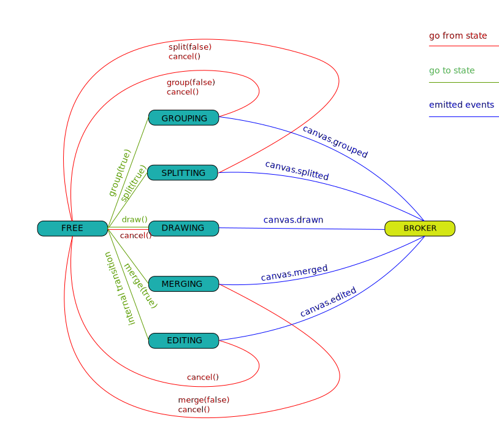

# Module CVAT-CANVAS

## Description
The CVAT module presents a canvas to viewing, drawing and editing of annotations.

- It has been written on typescript
- It contains the class ```Canvas``` and the enum ```Rotation```

## Commands
- Building of the module from sources in the ```dist``` directory:

```bash
npm run build
npm run build -- --mode=development     # without a minification
```

- Running development server
```bash
npm run server
```

- Updating of a module version:
```bash
npm version patch   # updated after minor fixes
npm version minor   # updated after major changes which don't affect API compatibility with previous versions
npm version major   # updated after major changes which affect API compatibility with previous versions
```

## Creation
Canvas is created by using constructor:

```js
    const { Canvas } = require('./canvas');
    const canvas = new Canvas();
```

- Canvas has transparent background

Canvas itself handles:
- Shape context menu (PKM)
- Image moving (mousedrag)
- Image resizing (mousewheel)
- Image fit (dblclick)
- Remove point (PKM)
- Polyshape editing (Shift + LKM)

## API
### Methods

All methods are sync.

```ts
    html(): HTMLElement;
    setup(frameData: FrameData, objectStates: ObjectState): void;
    activate(clientID: number, attributeID?: number): void;
    rotate(direction: Rotation): void;
    focus(clientID: number, padding?: number): void;
    fit(): void;
    grid(stepX: number, stepY: number): void;

    draw(enabled?: boolean, shapeType?: string, numberOfPoints?: number, initialState?: any): void | ObjectState;
    split(enabled?: boolean): void | ObjectState;
    group(enabled?: boolean): void | ObjectState;
    merge(enabled?: boolean): void | ObjectState;

    cancel(): any;
```

### CSS Classes/IDs

- Each drawn object (tag, shape, track) has id ```canvas_object_{objectState.id}```
- Drawn shapes and tracks have classes ```canvas_shape```,
 ```canvas_shape_activated```,
 ```canvas_shape_grouping```,
 ```canvas_shape_merging```,
 ```canvas_shape_drawing```
- Tags has a class ```canvas_tag```
- Canvas image has ID ```canvas_image```

### Events

Standard JS events are used.
```js
    - canvas.setup
    - canvas.activated => ObjectState
    - canvas.deactivated
    - canvas.moved => [ObjectState], x, y
    - canvas.drawn => ObjectState
    - canvas.edited => ObjectState
    - canvas.splitted => ObjectState
    - canvas.groupped => [ObjectState]
    - canvas.merged => [ObjectState]
```

## States

 

## API Reaction

|            | FREE | GROUPING | SPLITTING | DRAWING | MERGING | EDITING |
|------------|------|----------|-----------|---------|---------|---------|
| html()     | +    | +        | +         | +       | +       | +       |
| setup()    | +    | +        | +         | +       | +       | -       |
| activate() | +    | -        | -         | -       | -       | -       |
| rotate()   | +    | +        | +         | +       | +       | +       |
| focus()    | +    | +        | +         | +       | +       | +       |
| fit()      | +    | +        | +         | +       | +       | +       |
| grid()     | +    | +        | +         | +       | +       | +       |
| draw()     | +    | -        | -         | -       | -       | -       |
| split()    | +    | -        | +         | -       | -       | -       |
| group      | +    | +        | -         | -       | -       | -       |
| merge()    | +    | -        | -         | -       | +       | -       |
| cancel()   | -    | +        | +         | +       | +       | +       |
