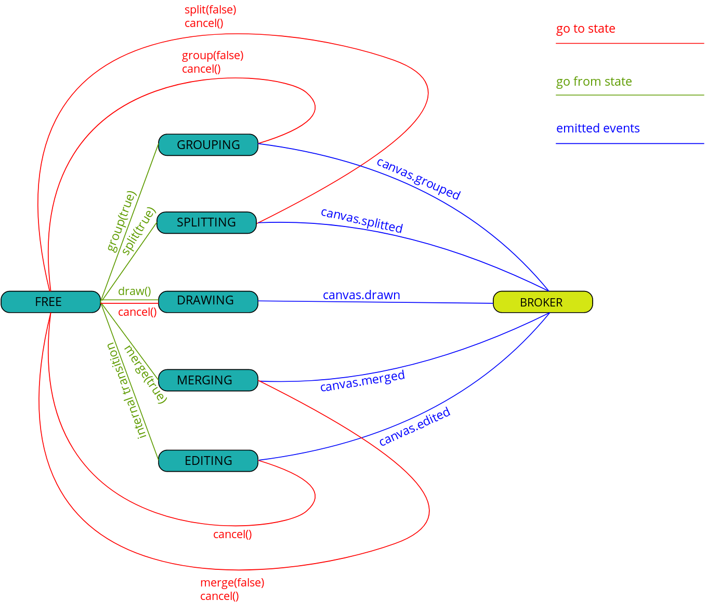

# Module

- Written on typescript
- Contains the class ```Canvas``` and the Enum ```Rotation```

## Creation
Canvas is created by using constructor:

```js
    const { Canvas } = require('./canvas');
    const canvas = new Canvas();
```

- Canvas has transparent background

Canvas itself handles:
- Shape context menu (PKM)
- Image moving (mousedrag)
- Image resizing (mousewheel)
- Image fit (dblclick)
- Remove point (PKM)
- Polyshape editing (Shift + LKM)

## API
### Methods

All methods are sync.

```js
    html() => canvas HTML element
    setup(const FrameData: frameData, [ObjectState]) => undefined

    activate(const number: clientID, const number: attributeID = null) => undefined // select if can't activate
    rotate(const Rotation: Rotation.CLOCKWISE) => undefined
    focus(const number: clientID, const number: padding) => undefined
    fit() => undefined
    grid(stepX, stepY, color, opacity) => undefined

    draw(shapeType, numberOfPoints = null, initializeState = null) => ObjectState
    split(const boolean: enabled = false) => ObjectState || undefined
    group(const boolean: enabled = false) => [ObjectState] || undefined
    merge(const boolean: enabled = false) => [ObjectState] || undefined

    cancel() => undefined
```

### CSS Classes/IDs

- Each drawn object (tag, shape, track) has id ```canvas_object_{objectState.id}```
- Drawn shapes and tracks have classes ```canvas_shape```,
 ```canvas_shape_activated```,
 ```canvas_shape_grouping```,
 ```canvas_shape_merging```,
 ```canvas_shape_drawing```
- Tags has a class ```canvas_tag```
- Canvas image has ID ```canvas_image```

### Events

Standard JS events are used.
```js
    - canvas.setup
    - canvas.activated => ObjectState
    - canvas.deactivated
    - canvas.moved => [ObjectState], x, y
    - canvas.drawn => ObjectState
    - canvas.edited => ObjectState
    - canvas.splitted => ObjectState
    - canvas.groupped => [ObjectState]
    - canvas.merged => [ObjectState]
```

## States

 

## API Reaction

|            | FREE | GROUPING | SPLITTING | DRAWING | MERGING | EDITING |
|------------|------|----------|-----------|---------|---------|---------|
| html()     | +    | +        | +         | +       | +       | +       |
| setup()    | +    | +        | +         | +       | +       | -       |
| activate() | +    | -        | -         | -       | -       | -       |
| rotate()   | +    | +        | +         | +       | +       | +       |
| focus()    | +    | +        | +         | +       | +       | +       |
| fit()      | +    | +        | +         | +       | +       | +       |
| grid()     | +    | +        | +         | +       | +       | +       |
| adjust()   | +    | +        | +         | +       | +       | +       |
| draw()     | +    | -        | -         | -       | -       | -       |
| split()    | +    | -        | +         | -       | -       | -       |
| group      | +    | +        | -         | -       | -       | -       |
| merge()    | +    | -        | -         | -       | +       | -       |
| cancel()   | -    | +        | +         | +       | +       | +       |
