- [User's guide](#users-guide)
  - [Getting started](#getting-started)
    - [Authorization](#authorization)
    - [Administration panel](#administration-panel)
    - [Creating an annotation task](#creating-an-annotation-task)
    - [Model manager](#model-manager)
    - [Search](#search)
  - [Interface of the annotation tool](#interface-of-the-annotation-tool)
    - [Basic navigation](#basic-navigation)
    - [Types of shapes (basics)](#types-of-shapes-basics)
    - [Annotation mode (basics)](#annotation-mode-basics)
    - [Interpolation mode (basics)](#interpolation-mode-basics)
    - [Attribute annotation mode (basics)](#attribute-annotation-mode-basics)
    - [Downloading annotations](#downloading-annotations)
    - [Task synchronization with a repository](#task-synchronization-with-a-repository)
    - [Vocabulary](#vocabulary)
    - [Workspace — Context menu](#workspace--context-menu)
    - [Settings](#settings)
    - [Bottom Panel](#bottom-panel)
    - [Side panel](#side-panel)
      - [Objects](#objects)
      - [Labels](#labels)
    - [Bottom side panel](#bottom-side-panel)
    - [Fullscreen player mode](#fullscreen-player-mode)
  - [Annotation mode (advanced)](#annotation-mode-advanced)
  - [Interpolation mode (advanced)](#interpolation-mode-advanced)
  - [Attribute annotation mode (advanced)](#attribute-annotation-mode-advanced)
  - [Annotation with polygons](#annotation-with-polygons)
  - [Annotation with polylines](#annotation-with-polylines)
  - [Annotation with points](#annotation-with-points)
  - [Annotation with Auto Segmentation](#annotation-with-auto-segmentation)
  - [Auto annotation](#auto-annotation)
  - [Shape grouping](#shape-grouping)
  - [Filter](#filter)
  - [Analytics](#analytics)
  - [Shortcuts](#shortcuts)
  - [Hints](#hints)

# User's guide

Computer Vision Annotation Tool (CVAT) is a web-based tool which helps to
annotate videos and images for Computer Vision algorithms. It was inspired
by [Vatic](http://carlvondrick.com/vatic/) free, online, interactive video
annotation tool. CVAT has many powerful features: _interpolation of bounding
boxes between key frames, automatic annotation using deep learning models,
shortcuts for most of critical actions, dashboard with a list of annotation
tasks, LDAP and basic authorization, etc..._ It was created for and used by
a professional data annotation team. UX and UI were optimized especially for
computer vision tasks developed by our team.

## Getting started

### Authorization
-   First of all, you have to log in to CVAT tool.

    

    

-   You can register a user but by default it will not have rights even to view
    list of tasks. Thus you should create a superuser. The superuser can use
    [Django administration panel](http://localhost:8080/admin) to assign correct
    groups to the user. Please use the command below to create an admin account:

    ``docker exec -it cvat bash -ic '/usr/bin/python3 ~/manage.py createsuperuser'``

-   If you want to create a non-admin account, you can do that using the link below
    on the login page. Don't forget to modify permissions for the new user in the
    administration panel. There are several groups (aka roles): admin, user,
    annotator, observer.

    

### Administration panel
Go to the [Django administration panel](http://localhost:8080/admin). There you can:
-   Create / edit / delete users
-   Control permissions of users and access to the tool.

    

### Creating an annotation task

1.  Create an annotation task pressing ``Create New Task`` button on the main page.

    

1.  Specify mandatory parameters of the task.
    You have to fill in ``Name``, ``Labels`` and press the ``Select Files`` button.
    After that you have to choose data you want to annotate.

    

    **Labels**. Use the following layout to create labels:
    ``label_name <prefix>input_type=attribute_name:attribute_value1,attribute_value2``.
    You can specify multiple labels and attributes and divide them pressing the space button.
    Attributes belong to a previous label.

    Example:
    - ``vehicle @select=type:__undefined__,car,truck,bus,train ~radio=quality:good,bad ~checkbox=parked:false`` -
    one label with multiple attributes
    - ``car person bike`` - three labels without attributes
    - ``circle @radio=color:green,red,blue @number=radius:0,10,0.1 line square`` -
    one label with two attributes and two labels without attributes

    ``label_name``: for example _vehicle, person, face etc._

    ``<prefix>``:
    - Use ``@`` for unique attributes which cannot be changed from frame to frame _(e.g. age, gender, color, etc.)_
    - Use ``~`` for temporary attributes which can be changed on any frame _(e.g. quality, pose, truncated, etc.)_

    ``input_type``: the following input types are available ``select``, ``checkbox``, ``radio``, ``number``, ``text``.

    ``attribute_name``: for example, _age, quality, parked_

    ``attribute_value``: for example, _middle-age, good, true_

    Default value for an attribute is the first value after "``:``".

    For ``select`` and ``radio`` input types the special value is available: ``__undefined__``.
    Specify this value first if an attribute should be annotated explicitly.

    **Bug Tracker**. Specify full bug tracker's URL if you have it.

    **Dataset Repository**.  URL link of the repository optionally specifies the path to the repository for storage
    (``default: annotation / <dump_file_name> .zip``).
    The .zip and .xml file extension of annotation are supported.
    Field format: ``URL [PATH]`` example: ``https://github.com/project/repos.git  [1/2/3/4/annotation.xml]``

    Supported URL formats :
    - ``https://github.com/project/repos[.git]``
    - ``github.com/project/repos[.git]``
    - ``git@github.com:project/repos[.git]``

    The task will be highlighted in red after creation if annotation isn't synchronized with the repository.

    **Use LFS**. If the annotation file is large, you can create a repository with
    [LFS](https://git-lfs.github.com/) support.

    **Source**. Choose "Local" if you want to use files from your PC.
    Choose the "Remote" option if you want to use a one url-adress or a list.
    To create huge tasks please use shared server directory (choose "Share"). 

    **Z-Order**. Defines the order on drawn polygons. Check the box for enable layered displaying.

    **Overlap Size**. Use this option to make overlapped segments.
    The option makes tracks continuous from one segment into another.
    Use it for interpolation mode. There are several options for using the parameter:
    - For an interpolation task (video sequence).
    If you annotate a bounding box on two adjacent segments they will be merged into one bounding box.
    If overlap equals to zero or annotation is poor on adjacent segments inside a dumped annotation file,
    you will have several tracks, one for each segment, which corresponds to the object.
    - For an annotation task (independent images).
    If an object exists on overlapped segments, the overlap is greater than zero
    and the annotation is good enough on adjacent segments, it will be automatically merged into one object.
    If overlap equals to zero or annotation is poor on adjacent segments inside a dumped annotation file,
    you will have several bounding boxes for the same object.
    Thus, you annotate an object on the first segment.
    You annotate the same object on second segment, and if you do it right, you
    will have one track inside the annotations.
    If annotations on different segments (on overlapped frames)
    are very different, you will have two shapes for the same object.
    This functionality works only for bounding boxes.
    Polygons, polylines, points don't support automatic merge on overlapped segments
    even the overlap parameter isn't zero and match between corresponding shapes on adjacent segments is perfect.

    **Segment size**. Use this option to divide a huge dataset into a few smaller segments.
    For example, one job cannot be annotated by several labelers (it isn't supported).
    Thus using "segment size" you can create several jobs for the same annotation task.
    It will help you to parallel data annotation process.

    **Image Quality**. Use this option to specify quality of uploaded images.
    The option helps to load high resolution datasets faster.
    Use the value from ``1`` (completely compressed images) to ``95`` (almost not compressed images).

    **Frame Filter**. Use this option to filter video frames.
    For example, enter ``step=25`` to leave every twenty fifth frame in the video. Use this option on video files only.

    **Select files or URL list**. If you select `` Remote`` in `` Source``, you'll see a field where you can enter
    a list of URLs (one URL per line).
    Press `` Local`` or `` Share`` in the `` source`` field to choose some files
    for anotation from your local PC or a network folder respectively.

    Push ``Submit`` button and it will be added into the list of annotation tasks.
    Then, the created task will be displayed on a dashboard:

    

1.  The Dashboard contains elements and each of them relates to a separate task. They are sorted in creation order.
    Each element contains: task name, preview, execution status, buttons, and one or more links.
    Each button is responsible for a specific function:
    - ``Dump Annotation`` — download an annotation file from a task. Several formats are available:
      - [CVAT XML 1.1 for video](/cvat/apps/documentation/xml_format.md#interpolation)
      is highlighted if a task has the interpolation mode 
      - [CVAT XML 1.1 for images](/cvat/apps/documentation/xml_format.md#annotation)
      is highlighted if a task has the annotation mode 
      - [PASCAL VOC ZIP 1.0](http://host.robots.ox.ac.uk/pascal/VOC/)
      - [YOLO ZIP 1.0](https://pjreddie.com/darknet/yolo/)
      - [COCO JSON 1.0](http://cocodataset.org/#format-data)
      - ``MASK ZIP 1.0`` — archive contains a mask of each frame in the png format and a text file
      with the value of each color
      - [TFRecord ZIP 1.0](https://www.tensorflow.org/tutorials/load_data/tf_records)
    - ``Upload annotation`` is possible in same format as ``Dump annotation``, with exception of ``MASK ZIP 1.0``
      format and without choosing whether [CVAT XML 1.1](/cvat/apps/documentation/xml_format.md)
      refers to an image or video.
    - ``Update Task`` — bring up "Update task" panel. It is used to edit or add labels line
    - ``Delete Task`` — delete the task
    - ``Git Repository Sync`` — sync annotation with the dataset repository.
      It is available only if you specify a dataset repository when the task has been created.
    - ``Run TF Annotation`` — automatic annotation with Tensorflow Object Detection API.
      Presence depends on how you build CVAT instance
    - ``Run Auto Annotation`` — automatic annotation with  OpenVINO toolkit.
      Presence depends on how you build CVAT instance.

    Item color depends on status of synchronization with the dataset repository:
    ``red`` means annotations are not synchronized with the repository,
    ``yellow`` means annotations are in a temporary branch of the repository,
    ``green`` means annotations are merged into the repository.

1.  Follow a link inside ``Jobs`` section to start annotation process.
    In some cases, you can have several links. It depends on size of your
    task and ``Overlap Size`` and ``Segment Size`` parameters. To improve
    UX, only the first several frames will be loaded and you will be able
    to annotate first images. Other frames will be loaded in background.

    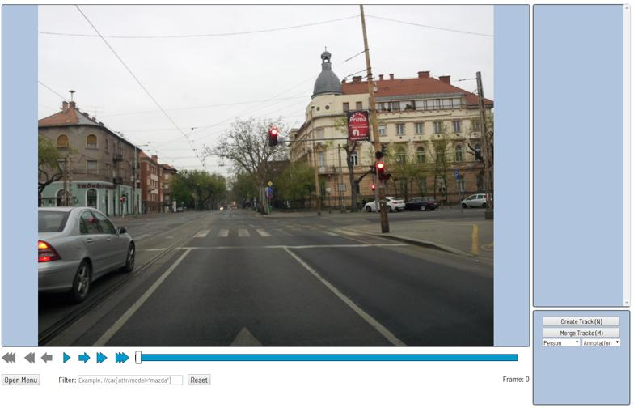

### Model manager

The application will be enabled automatically if [OpenVINO™ component](/components/openvino/README.md) is installed.
It allows to use custom models for auto annotation. Only models in OpenVINO™ toolkit format are supported.
If you would like to annotate a task with a custom model,
please convert it to the intermediate representation (IR) format via the model optimizer tool.
See [OpenVINO documentation](https://software.intel.com/en-us/articles/OpenVINO-InferEngine) for details.
You can "register" a model and "use" it after that to pre annotate your tasks.

The model manager allows you to manage your deep learning (DL) models uploaded for auto annotation.
Using the functionality you can upload, update or delete a specific DL model.
Use "Auto annotation" button to pre annotate a task using one of your DL models.
[Read more](/cvat/apps/auto_annotation)

### Search

There are several options how to use the search.

- Search within all fields (owner, assignee, task name, task status, task mode).
To execute enter a search string in search field.
- Search for specific fields. How to perform:
  - ``owner: admin`` - all tasks created by the user who has the substring "admin" in his name
  - ``assignee: employee``  - all tasks which are assigned to a user who has the substring "employee" in his name
  - ``name: mighty`` - all tasks with the substring "mighty" in their names
  - ``mode: annotation`` or ``mode: interpolation`` - all tasks with images or videos.
  - ``status: annotation`` or ``status: validation`` or ``status: completed``  - search by status
  - ``id: 5`` - task with id = 5.
- Multiple filters. Filters can be combined (except for the identifier) ​​using the keyword `` AND``:
  - ``mode: interpolation AND owner: admin``
  - ``mode: annotation and status: annotation``

The search is case insensitive.

## Interface of the annotation tool

The tool consists of:
- ``Workspace`` — where images are shown;
- ``Bottom panel`` (under workspace) — for navigation, filtering annotation and accessing tools' menu;
- ``Side panel`` — contains two lists: objects (on the frame) and labels (of objects on the frame);
- ``Bottom side panel`` — contains the main annotation functions (create, merge, group objects).
  Here you can choose a type of shape, a label you want to annotate and a mode (annotation or interpolation)

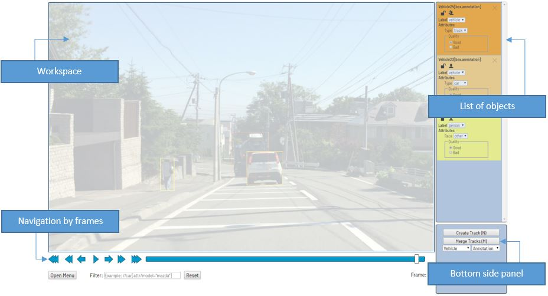

There is also:
- ``Settings`` (F2) — the button inside ``Open Menu`` in the bottom panel. Contains different parameters
  which can be adjusted according to the user's needs.
- ``Context menu`` — available on right mouse button.

### Basic navigation

1.  Use arrows below to move on next/previous frame.
    Use the scroll bar slider to scroll through frames.
    Almost every button is covered by a shortcut.
    To get a hint about a shortcut, just put your mouse pointer over an UI element.

    

1.  An image can be scaled in/out using mouse's wheel. The image will be zoomed relatively your current cursor position.
    Thus, if you point on an object, it will be under your mouse during zooming process.

1.  An image can be moved/shifted by holding left mouse button inside some area without annotated objects.
    If ``Mouse Wheel`` is pressed, then all annotated objects are ignored.
    Otherwise, a highlighted bounding box will be moved instead of the image itself.

### Types of shapes (basics)
There are four shapes which you can annotate your images with:
- ``box``
- ``polygon``
- ``polyline``
- ``points``
- ``auto segmentation``

And there is how they all look like:

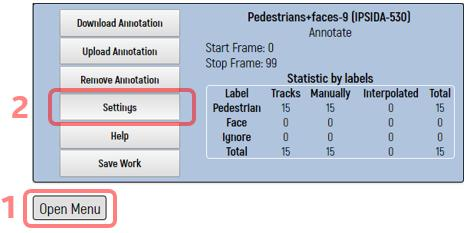 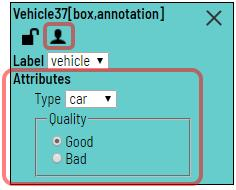

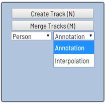 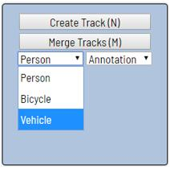

### Annotation mode (basics)
Usage examples:
- Create new annotations for a set of images.
- Add/modify/delete objects for existing annotations.

1.  Before starting, you need to check if ``Annotation`` is selected:

     

1.  Create a new annotation:

    -   Choose a right ``Shape`` (box etc.) and ``Label`` (was specified by you while creating the task) beforehand:

         

    -   Create a bounding box by clicking on ``Create Shape`` button or ``N`` shortcut.
        Choose opposite points. Your first bounding box is ready!

        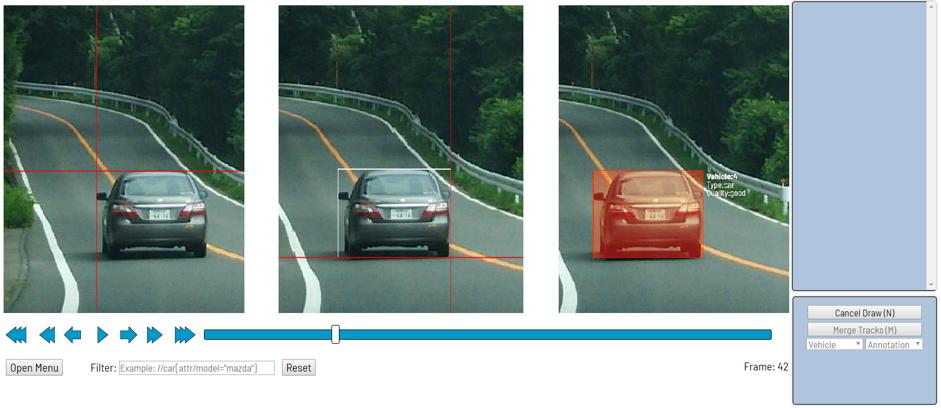

    -   It is possible to adjust boundaries and location of the bounding box using mouse.
        Box's size is shown in the top right corner , you can check it clicking on the one point of box.
        You can also undo your actions using ``Ctrl+Z`` and redo them with ``Shift+Ctrl+Z`` or ``Ctrl+Y``.

1.  In the list of objects you can see the labeled car.
    In the side panel you can perform basic operations under the object — choose attributes,
    change its label or delete box.

    

1.  The following figure is an example of fully annotated frame in ``Annotation`` mode.

    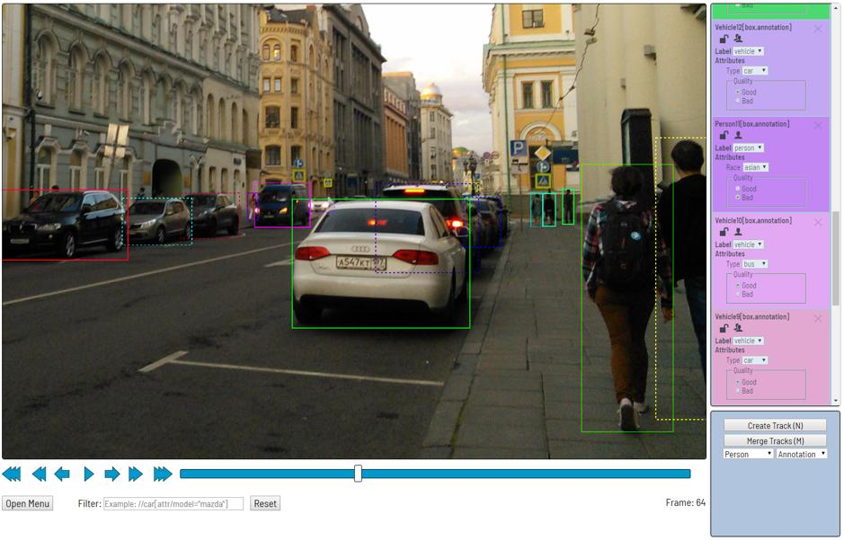

### Interpolation mode (basics)
Usage examples:
- Create new annotations for a sequence of frames.
- Add/modify/delete objects for existing annotations.
- Edit tracks, merge a lot of bounding boxes into one track.

1.  Before starting, you have to be sure that ``Interpolation`` is selected.

    

1.  Create a track for an object (look at the selected car as an example):
    - Annotate a bounding box on the first frame for the object.
    - In ``Interpolation`` mode the bounding box will be interpolated on next frames automatically.

    

1.  If the object starts to change its position, you need to modify bounding
    boxes where it happens. It isn't necessary to change bounding boxes on each
    frame. It is enough to update several key frames and frames between them
    will be interpolated automatically. See an example below:
    -   The car starts moving on frame #630. Let's mark the frame as a key frame.
        You can press ``K`` for that or push ``star`` button (see the screenshot below)

        

    -   Let's jump 30 frames forward and adjust boundaries of the object.

        

    -   After that, bounding boxes of the object between 630 and 660 frames
        will be changed automatically. For example, frame #645 looks like on the figure below:

        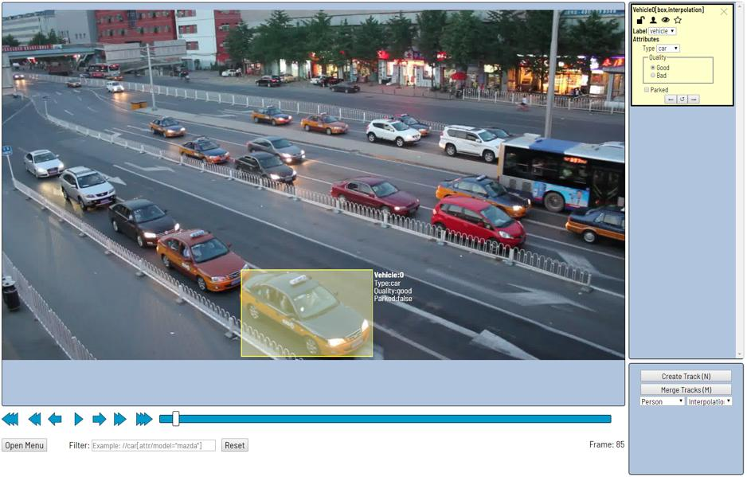

1.  When the annotated object disappears or becomes too small, you need to
    finish the track. You have to choose ``Outside Property``, shortcut ``O``.

    

1.  If the object isn't visible on a couple of frames and then appears again,
    you can use ``Merge Tracks`` feature to merge several individual tracks
    into one.

    

    -   Let's create a track for the bus.

        

        After that, you should create a track when it appears again on the sequence of frames.

        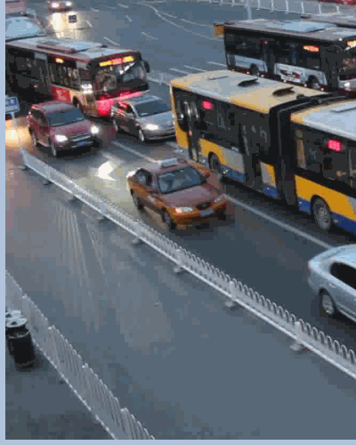

    -   Press ``Merge Tracks`` button and click on any bounding box of the
        first track and on any bounding box of the second track.

        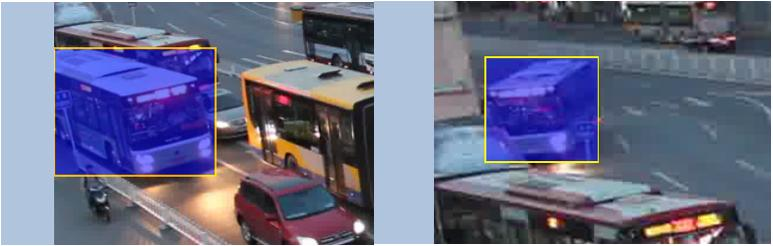

    -   Press ``Apply Merge`` button to apply changes.

        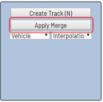

    -   The final annotated sequence of frames in ``Interpolation`` mode can
        look like the clip below:

        

### Attribute annotation mode (basics)

-   In this mode you can edit attributes with fast navigation between
    objects and frames using keyboard. Press ``Shift+Enter`` shortcut
    to enter the mode. After that, you can change attributes using a keyboard.

    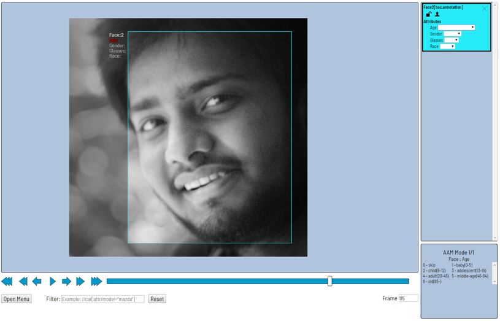

-   The active attribute will be red. It is ``gender`` in this case. Look at
    the bottom side panel to see all possible shortcuts for changing the
    attribute. Press ``2`` key on your keyboard to assign ``female`` value for
    the attribute.

    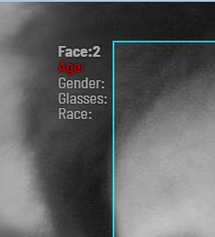 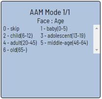

-   Press ``Up Arrow``/``Down Arrow`` on your keyboard to go to next/previous
    attribute. In this case, after pressing ``Down Arrow`` you will be able to
    edit ``Age`` attribute.

     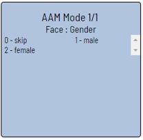

-   Use ``Right Arrow``/``Left Arrow`` keys to move on previous/next image with annotation.

### Downloading annotations

1.  To download the latest annotations, you have to save all changes first.
    To do this, click ``Open Menu`` button. 

1.  After that, press ``Save Work`` button. There is ``Ctrl+S``
    shortcut to save annotations quickly.

    

1.  After that, press ``Dump Annotation`` button.

    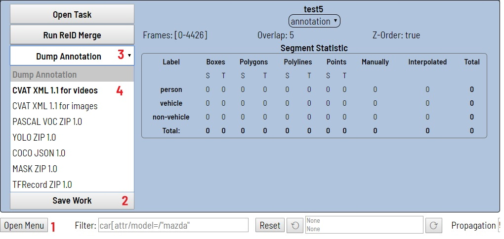

1.  Choose format dump annotation file. Dump annotation are available in several formats:
    - [CVAT XML 1.1 for video](/cvat/apps/documentation/xml_format.md#interpolation)
    is highlighted if a task has the interpolation mode
    - [CVAT XML 1.1 for images](/cvat/apps/documentation/xml_format.md#annotation)
    is highlighted if a task has the annotation mode

     

    - [PASCAL VOC ZIP 1.0](http://host.robots.ox.ac.uk/pascal/VOC/)
    - [YOLO ZIP 1.0](https://pjreddie.com/darknet/yolo/)
    - [COCO JSON 1.0](http://cocodataset.org/#format-data)
    - ``MASK ZIP 1.0`` — archive contains a mask of each frame in the png format and a text file with
    the value of each color
    - [TFRecord ZIP 1.0](https://www.tensorflow.org/tutorials/load_data/tf_records) 

### Task synchronization with a repository

1.  At the end of the annotation process, a task is synchronized clicking
    the `` Git Repository Sync`` on the main page. Notice: this feature
    works only if a git repository was specified when the task was created.

    

1.  Clicking `` Sync`` starts synchronization of annotation with the
    repository, the url address of which is specified in the
    ``Repository URL`` field. The synchronization process may take some time.

    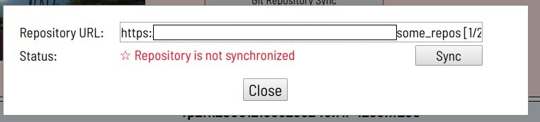

    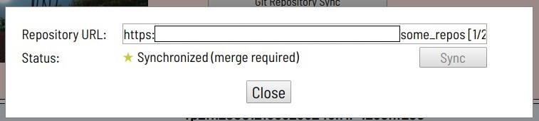

1.  After synchronization, the task in the list is highlighted in yellow. The
    annotation is now in the repository, in a temporary branch.

    

1.  The next step is to go to the repository and manually create a pull request to the main branch.
1.  After confirming the PR, when the annotation is saved in the main branch, the color of the task changes to green.

    
    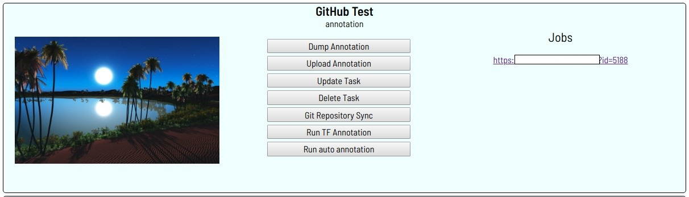

### Vocabulary

**Bounding box** is an area which defines boundaries of an object. To specify
it, you need to define two opposite corners.

**Tight bounding box** is a bounding box where margin between the object inside
and boundaries of the box is absent. This type of bounding box is used in most
tasks by default, but precision completely depends on an annotation task.

| Bounding box                                  | Tight bounding box                            |
| ------------                                  | :----------------:                            |
|  | 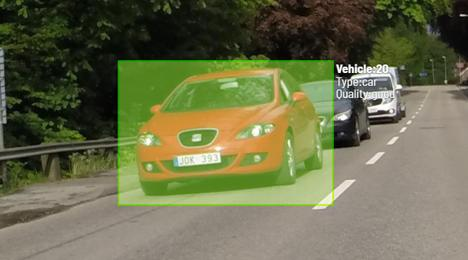 |

---
**Label** is a type of an annotated object (e.g. person, car, face, etc.)

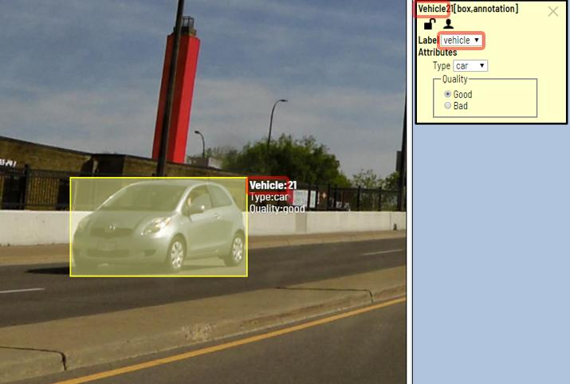

---

**Attribute** is a property of an annotated object (e.g. color, model,
quality, etc.). There are two types of attributes:

-   **Unique**: immutable and can't be changed from frame to frame (e.g. age, gender, color, etc.)

    

-   **Temporary**: mutable and can be changed on any frame (e.g. quality, pose, truncated, etc.)

    

---
**Track** is a set of shapes on different frames which corresponds to one object. Tracks are created in ``Interpolation mode``

---
**Annotation** is a set of shapes and tracks. There are several types of annotations:
- _Manual_ which is created by a person
- _Semi-automatic_ which is created mainly automatically, but the user provides some data (e.g. interpolation)
- _Automatic_ which is created automatically without a person in the loop

---
### Workspace — Context menu

Press the ``Right mouse button`` to see the context menu.

Next options are available clicking inside bounding box:
- ``Copy Object URL`` — copying to the buffer address of an object on the frame
in the task
- ``Change Color`` — change color of active shape
- ``Remove Shape`` — deleting the shape
- ``Switch Occluded`` — attribute is used if an object is occluded by another
object or isn't fully visible on the frame. Use the ``Q`` shortcut to set the
property quickly.
- ``Switch Lock`` — block editing the active shape
- ``Enable Dragging`` — (only for polygons) allows to adjust polygons position
- ``Split`` — allows to split an interpolated track into two separate tracks. This function is the opposite
of the merge function.

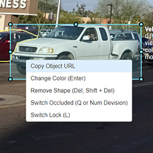
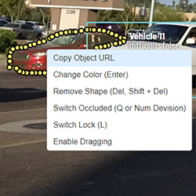
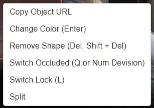

Clicking on the points of poly-shapes, ``Remove`` option is available.

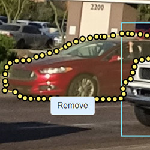

Clicking outside any shapes, you can copy ``Frame URL`` (link to present frame) or ``Job URL`` (link from address bar)

Applying ``split`` into an interpolated track divides it into two separate tracks.

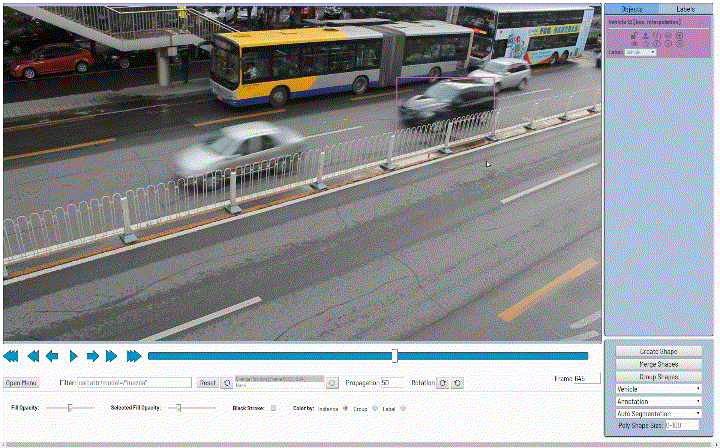

---
### Settings

Press ``F2`` to access settings menu.

There is ``Player Settings`` which adjusts ``Workspace`` and ``Other Settings``.

In ``Player Settings`` you can:
-   Control step of ``C`` and ``V`` shortcuts
-   Control speed of ``Space``/``Play`` button
-   Show every image in full or zoomed out like previous
    (it is enabled by default for interpolation mode and disabled for annotation mode)
-   Enable ``Grid`` when you don't need small objects. ``Grid`` can have
    different opacity, color and cells' size — use ``F2`` to configure settings.

    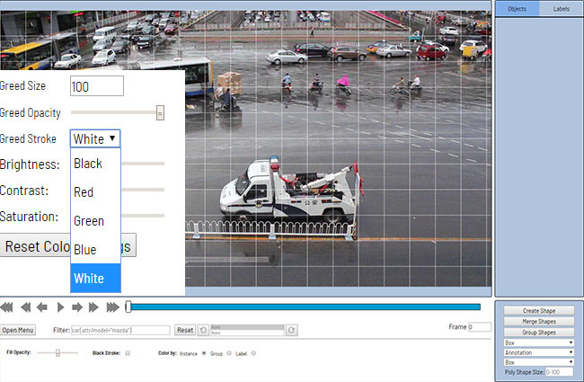

-   Adjust ``Brightness``/``Contrast``/``Saturation`` of too exposing or too
    dark images using ``F2`` — color settings (changes displaying and not the
    image itself).

Shortcuts:
-   ``Shift+B``/``Alt+B`` for brightness
-   ``Shift+C``/``Alt+C`` for contrast
-   ``Shift+S``/``Alt+S`` for saturation
-   ``F2`` —> ``Reset Color Settings`` to default values

    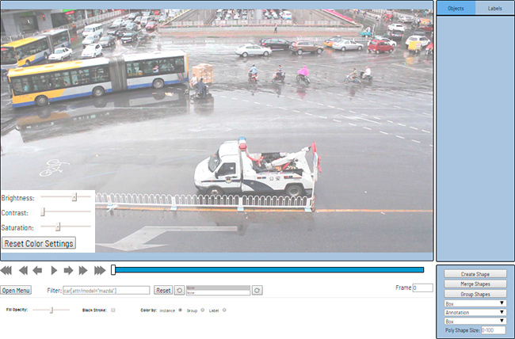

``Other Settings`` contains:
- ``Show All Interpolation Tracks`` checkbox — shows hidden object on the
  side panel for every interpolated object (turned off by default)
- ``AAM Zoom Margin`` slider — defines margins for shape in attribute annotation mode
- ``Enable AutoSaving`` checkbox — turned off by default
- ``AutoSaving Interval (min)`` input box — 15 minutes by default
- ``Rotate all images``  checkbox — switch the rotation of all frames / individual frame

---
### Bottom Panel

---
Go to the first and latest frames.

---
Go to the next/previous frame with a predefined step. Shortcuts:
``V`` — step backward, ``C`` — step forward. By default the step is ``10``
(change at ``Open Menu`` —> ``Settings`` —> ``Player Step``).

---
Go to the next/previous frame with step equals to 1. Shortcuts: ``D`` — previous, ``F`` — next.

---
Play the sequence of frames or the set of images. Shortcut: ``Space`` (change at ``Open Menu`` —> ``Settings`` —> ``Player Speed``).

---
Go to specified frame. Press ``~`` to focus on the element.

---
**Open Menu** button

It is the main menu of the annotation tool. It can be used to download, upload and remove annotations.

Button assignment:

- ``Open Task`` — open task in cvat dashboard
- ``RunReID Merge`` — The ReID application uses deep learning model to perform
  an automatic merging of bounding boxes between neighbor frames. You can use
  "Merge" and "Split" functionality to edit automatically generated annotation
  [read more](/cvat/apps/reid).
- ``Dump Annotation`` — download annotations from the task
- ``Upload Annotation`` — uploading annotations to the task
- ``Remove Annotation`` — remove annotations from current task
- ``Settings`` — open the settings menu
- ``Fullscreen Player`` — fullscreen player mode
- ``Switch AAM`` — switch to attribute annotation mode
- ``Help`` — open the shortkeys
- ``Save Work`` — save annotations for the current job. The button has an
  indication of the saving process

It also shows statistics about the current task, for example:
- task name
- status of the task: ``annotation``, ``validation`` or ``completed task``
- technical information about task
- number of created bounding boxes, sorted by labels (e.g. vehicle, person) and
type of annotation (polygons, boxes, etc.)

---
**Filter** input box

The way how to use filters is described in the advanced guide (below).

---
**History / Undo-redo** panel

Use ``Ctrl+Z`` for undo actions and  ``Ctrl+Shift+Z`` or ``Ctrl+Y`` to redo them.

---
**Propagation** input box

Allows you to select how many frames of the selected object will be copied clicking ``Ctrl+B`` (50 by default)

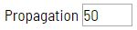

---
**Rotation** of an image

Buttons are used to rotate the image clockwise / counterclockwise or use ``Ctrl+R``/``Ctrl+Shift+R``

---
**Fill Opacity** slider

Change opacity of every bounding box in the annotation.

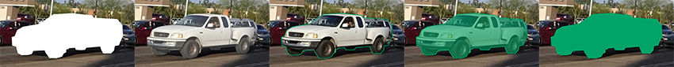

Opacity can be changed from 0% to 100% and by random colors or white. If any
white option is chosen, ``Color By`` scheme won't work.

**Selected Fill Opacity** slider

Change the opacity of the selected object's fill.

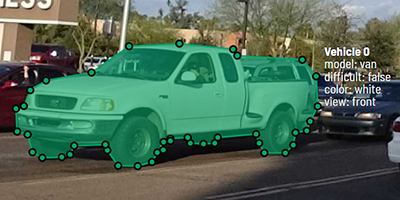

Opacity can be changed from 0% to 100%.

**Black Stroke** checkbox

Change bounding box border from white/colored to black.

**Color By** options

Change the color scheme of annotation:
-   ``Instance`` — every bounding box has random color

    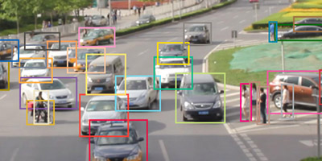

-   ``Group`` — every group of boxes has its own random color, ungrouped boxes are white

    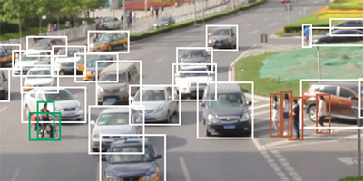

-   ``Label`` — every label (e.g. vehicle, pedestrian, road marks) has its own random color

    

    You can change any random color pointing on needed box on a frame or on a
    side panel and press ``Enter``.

---
### Side panel

#### Objects
In the side panel you can see the list of available objects on the current
frame. The following figure is an example of how a list might look like:

| Annotation mode                               | Interpolation mode                            |
|--                                             |--                                             |
|  |  |

#### Labels
You can also see all labels that were used on this frame and highlight them clicking on a label you need

---
**Objects** on the side bar

A shape can be removed. Shortcut: ``Delete``. You can delete a locked shape using the ``Shift+Delete`` shortcut.

---
A shape can be locked to prevent its modification or moving by an accident. Shortcut to lock an object: ``L``.

---
A shape can be **Occluded**. Shortcut: ``Q``. Such shapes have dashed boundaries.

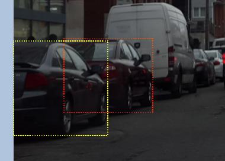

---
You can copy and paste an object in a particular frame. The keyboard
shortcuts ``Ctrl + C`` / ``Ctrl + V`` work when you hover over an object

---
You can propagate an object in the following X frames. The keyboard
shortcut ``Ctrl + B`` works when you hover the mouse over an object. You can
change the number of propagating frames in the bottom panel.

---
You can change the way an object is displayed on a frame.
It could be hide, shows only box, shows box and title. ``H`` is for this
object, ``T+H`` for all objects on this frame.

---
The type of a shape can be changed selecting **Label** property. For instance, it can look like on the figure below:

To change a type of a highlighted shape using keyboard, you need to press ``Shift+<number>``.

### Bottom side panel

- ``Create Shape`` (``N``) — start/stop drawing new shape mode
- ``Merge Shapes`` (``M``) — start/stop merging shapes mode
- ``Group Shapes`` (``G``) — start/stop grouping shapes mode
- ``Label Type`` — (e.g. face, person, vehicle)
- ``Working Mode`` — Annotation or Interpolation modes. You can't interpolate
polygons/polylines/points, but you can propagate them using ``Ctrl+B`` or
merge into a track
- ``Shape Type`` — (e.g. box, polygon, polyline, points)
- ``Poly Shape Size`` — (optional) hard number of dots for creating polygon, polyline and points shapes

### Fullscreen player mode

Go to ``Open Menu`` —> ``Fullscreen Player``
Exit with ``F11`` or ``Ecs``.

This is how it looks like.

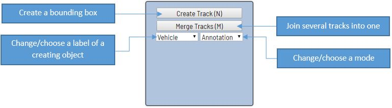

## Annotation mode (advanced)

Basic operations in the mode were described above.

**Occluded** attribute is used if an object is occluded by another object or
isn't fully visible on the frame. Use ``Q`` shortcut to set the property
quickly.

Example: both cars on the figure below should be labeled as **occluded**.

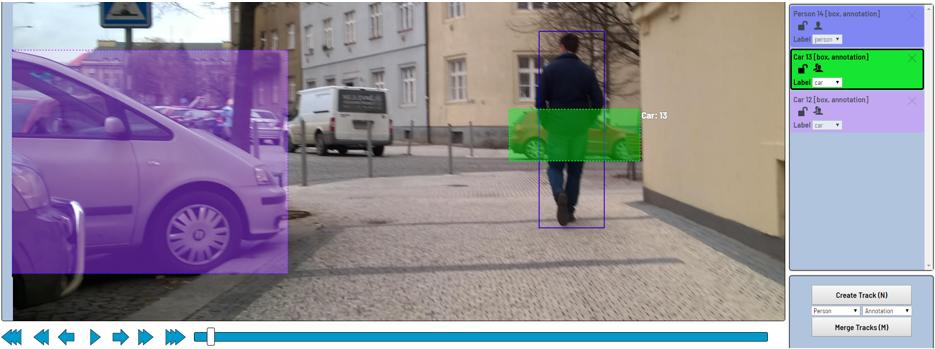

If a frame contains too many objects and it is difficult to annotate them
due to many shapes that are placed mostly in the same place, it makes sense
to lock them. Shapes for locked objects are transparent, and it is easy to
annotate new objects. Besides, you can't change previously annotated objects
by accident. Shortcut: ``L``.

## Interpolation mode (advanced)

Basic operations in the mode were described above.

Bounding boxes that were created in the mode, have extra navigation buttons.
-   These buttons help to jump to previous/next key frame.

    

-   The button helps to jump to initial frame for the object (first bounding box for the track).

    

## Attribute annotation mode (advanced)

Basic operations in the mode was described above.

It is possible to handle lots of objects on the same frame in the mode.

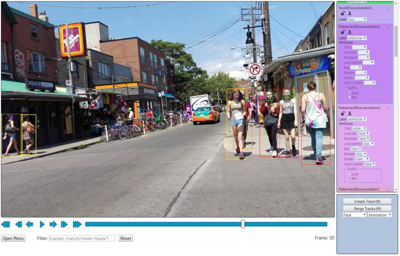

It is more convenient to annotate objects of the same type. You can specify
the appropriate filter in this case. For example, the following filter will
hide all objects except pedestrians: ``pedestrian``.

To navigate between objects (pedestrians in the case), use the following shortcuts:
- ``Tab`` — go to the next object
- ``Shift+Tab`` — go to the previous object.

By default, objects in the mode are zoomed. Check
``Open Menu`` —> ``Settings`` —> ``AAM Zoom Margin`` to adjust that.

## Annotation with polygons

It is used for semantic / instance segmentation.

Be sure ``Z-Order`` flag in ``Create task`` dialog is enabled if you want to
annotate polygons. Z-Order flag defines order of drawing. It is necessary to
get right annotation mask without extra work (additional drawing of borders).
Z-Order can be changed by ``+``/``-`` which set maximum/minimum z-order
accordingly.

Before starting, you need to be sure that ``Polygon`` is selected.

Press ``N`` for entering drawing mode. There are two ways to draw a polygon
— you either create points by clicking or by dragging mouse on the screen
holding ``Shift``.

| Clicking points                                | Holding Shift+Dragging                      |
| --                                             | --                                          |
|     | 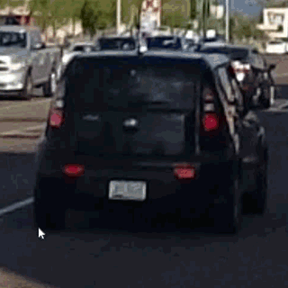 |

When ``Shift`` isn't pressed, you can zoom in/out (when scrolling the mouse
wheel) and move (when clicking the mouse wheel and moving the mouse), you can
delete the previous point clicking right mouse button. Press ``N`` again for
completing the shape. You can move points or delete them by double-clicking.
Double-click with pressed ``Shift`` will open a polygon editor. There you can
create new points (clicking or dragging) or delete part of a polygon closing
the red line on another point. Press ``Esc`` to cancel editing.

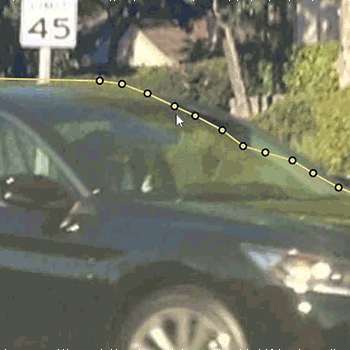

Also, you can set fixed number of points in the "poly shape size" field, then
drawing will be stopped automatically. To enable dragging, you should right-click
inside polygon and choose ``Enable Dragging``.

Below you can see results with opacity and black stroke:

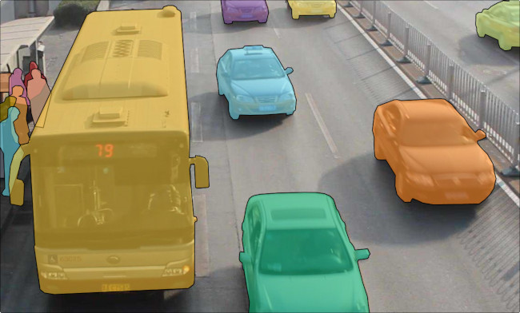

Also, if you need to annotate small objects, increase ``Image Quality`` to
``95`` in ``Create task`` dialog for annotator's convenience.

## Annotation with polylines

It is used for road markup annotation etc.

Before starting, you have to be sure that ``Polyline`` is selected.

Press ``N`` for entering drawing mode. There are two ways to draw a polyline —
you either create points clicking or dragging mouse on the screen, holding ``Shift``.

When ``Shift`` isn't pressed, you can zoom in/out (when scrolling the mouse wheel)
and move (when clicking the mouse wheel and moving the mouse), you can delete
previous point clicking right mouse button. Press ``N`` again to complete the
shape. You can delete points double-clicking them. Double-click with pressed
``Shift`` will open a polyline editor. There you can create new points
(clicking or dragging) or delete part of a polygon closing the red line on
another point. Press ``Esc`` to cancel editing. Also, you can set fixed number
of points in the "poly shape size" field, then drawing will be stopped
automatically. You can adjust the polyline after it has been drawn.

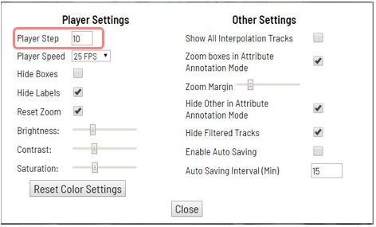

## Annotation with points

### Points in annotation mode

It is used for face landmarks annotation etc.

Before starting, you have to be sure that ``Points`` is selected.

Press ``N`` for entering drawing mode. Now you can start annotating the necessary area.
Press ``N`` again for finishing marking an area. You can delete points
double-clicking them. Double-click with pressed ``Shift`` will open a points
shape editor. There you can create new points into existing shape. Also, you
can set fixed number of points in the "poly shape size" field, then drawing
will be stopped automatically. Points are automatically grouped — all points
will be considered linked between individual start and finish. You can zoom
in/out (when scrolling the mouse wheel) and move (when clicking the mouse
wheel and moving the mouse) while drawing. You can drag object after it has
been drawn and fix a position of individual points after finishing the object.
You can add/delete points after finishing.

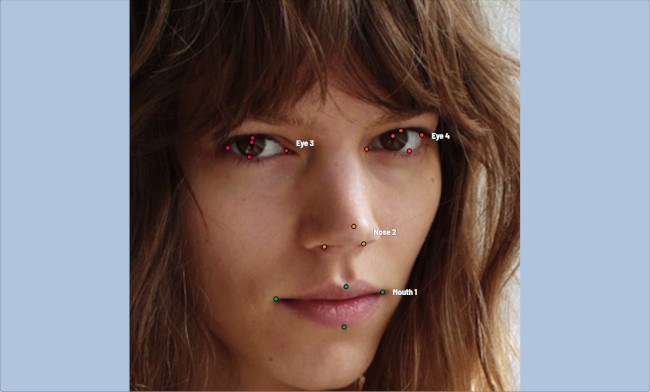

### Linear interpolation with one point

You can use linear interpolation for points to annotate a moving object:

1.  Before starting, you have to be sure that ``Points`` is selected. 
1.  Linear interpolation works only with one point, so you need to set ``Poly Shapes Size``: 1. 
1.  After that select the interpolation mode.
    
    

1.  Press ``N`` or click ``Create Shape`` for entering drawing mode.
    Click LMB to create a point and shape will be automatically completed. 

    

1.  Move forward a few frames and move the point to the desired position,
    this way you will create a keyframe and intermediate frames will be drawn automatically.
    You can work with this object as with an interpolated track: hide with help of ``Outside``,
    move around keyframes, etc.

    

1.  This way you'll get linear interpolation using `` Points``.

    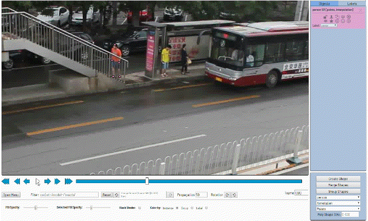

## Annotation with Auto Segmentation

Used to create a polygon semi-automatically. Before starting, you have to be
sure that ``Auto Segmentation`` is selected.

Press ``N`` for entering drawing mode. Now you can start annotating the necessary area.
Press ``N`` again for finishing marking an area. A shape must consist of 4
points minimum. You can set a fixed number of points in the field
"poly shape size", then drawing will be stopped automatically. You can zoom
in/out (when scrolling the mouse wheel) and move (when clicking the mouse
wheel and moving the mouse) while drawing. At the end of Auto Segmentation,
a shape is created and you can work with it as a polygon.

## Auto annotation

1.  First you need to upload deep learning (DL) models using model manager.
    Only models in OpenVINO™ toolkit format are supported.
    If you would like to annotate a task with a custom model please convert it
    to the intermediate representation (IR) format via the model optimizer tool.
    See [OpenVINO documentation](https://software.intel.com/en-us/articles/OpenVINO-InferEngine) for details.

    

1.  Enter model name, and select model file using "Select files" button. To annotate a task with a custom model
    you need to prepare 4 files:
    - ``Model config`` (*.xml) - a text file with network configuration. 
    - ``Model weights`` (*.bin) - a binary file with trained weights. 
    - ``Label map`` (*.json) - a simple json file with label_map dictionary like an object with 
    string values for label numbers.
    - ``Interpretation script`` (*.py) - a file used to convert net output layer to a predefined structure 
    which can be processed by CVAT. 
    More about creating model files can be found [here](/cvat/apps/auto_annotation).

    

1.  After downloading a model you have to  create a task or find an already created one and
    click ``Run Auto Annotation`` button.

    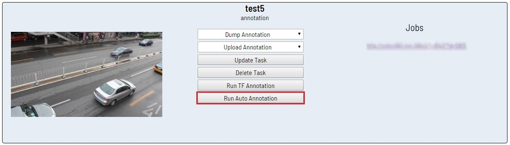

1.  In dialog window select a model you need. If it's necessary select the ``Delete current annotation`` checkbox.
    Adjust the labels so that the task labels will correspond to the labels of the DL model.
    Click ``Start`` to begin the auto annotatiton process.

    

1.  At runtime, you can see percentage of completion. You can also cancel the auto annotation
    process by clicking ``Cancel Auto Annotation``

    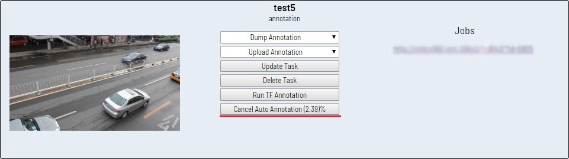

1.  As a result, you will get an annotation with separate bounding boxes (or other shapes)

    

1.  Separated bounding boxes can be edited by removing false positives, adding unlabeled objects, and
    merging into tracks using ``Merge Shape``

    

## Shape grouping

This feature allows to group several shapes.

You may use ``Group Shapes`` button or shortcuts:
- ``G`` — switch group mode
- ``Alt+G`` — close group mode
- ``Shift+G`` — reset group for selected shapes

You may select shapes clicking on them or selecting an area.

Grouped shapes will have ``group_id`` filed in dumped annotation.

Also you may switch color distribution from an instance (default) to a group.
You have to switch ``Color By Group`` checkbox for that.

Shapes that don't have ``group_id``, will be highlighted in white.

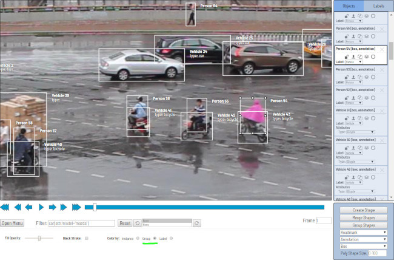

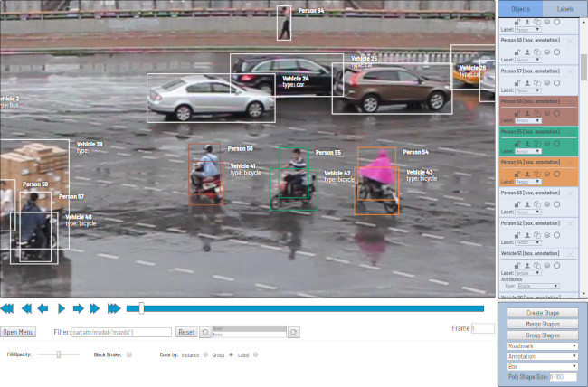

## Filter

There are some reasons to use the feature:

1. When you use a filter, objects that don't match the filter will be hidden.
1. Fast navigation between frames that have an object of interest. Use
``Left Arrow`` / ``Right Arrow`` keys for the purpose. If the filter is empty,
the arrows go to previous/next frames which contain any objects.
1. The list contains frequently used and recent filters.

To use the functionality, it is enough to specify a value inside ``Filter`` text
box and defocus the text box (for example, click on the image). After that, the
filter will be applied.

---
In the trivial case, the correct filter must match the template: ``label[prop operator "value"]``

``label`` is a type of an object (e.g. _person, car, face_, etc.). If the type isn't important, you can use ``*``.

``prop`` is a property which should be filtered. The following items are available:

- ``id`` — identifier of an object. It helps to find a specific object easily
in case of huge number of objects and images or frames.
- ``type`` — an annotation type. Possible values: ``annotation``, ``interpolation``
- ``lock`` accepts ``true`` and ``false`` values. It can be used to hide all locked objects.
- ``occluded`` accepts ``true`` and ``false`` values. It can be used to hide all occluded objects.
- ``attr`` is a prefix to access attributes of an object. For example, it is possible to
access _race_ attribute. For the purpose you should specify
- ``attr/race``. To access all attributes, it is necessary to write ``attr/*``.

``operator`` can be ``=`` (equal), ``!=`` (not equal), ``<`` (less), ``>``
(more), ``<=`` (less or equal), ``>=`` (more or equal).

``"value"`` — value of an attribute or a property. It has to be specified in quotes.

---

| Example                        | Description                                                   |
| -------------------------------|-------------                                                  |
| ``face``                       | all faces                                                     |
| ``*[id=4]``                    | object with id #4                                             |
| ``*[type="annotation"]``       | annotated objects only                                        |
| ``car[occluded="true"]``       | cars with _occluded_ property                                 |
| ``*[lock!="true"]``            | all unlocked objects                                          |
| ``car[attr/parked="true"]``    | parked cars                                                   |
| ``*[attr/*="__undefined__"]``  | any objects with ``__undefined__`` value of an attribute      |
| ``*[width<300 or height<300]`` | shape less than 300 pixels wide and more than 200 pixels high |

---

The functionality allows to create more complex conditions. Several filters can
be combined by ``or``, ``and``, ``|`` operators. Operators ``or``, ``and`` can
be applied inside square brackets. ``|`` operator (union) can be applied
outside of square brackets.

| Example                                                                          | Description                                      |
| --------------------------------------------------------                         |-------------                                     |
| ``person[attr/age>="25" and attr/age<="35"]``                                    | people with age between 25 and 35.               |
| ``face[attr/glass="sunglass" or attr/glass="no"]``                               | faces with sunglasses or without glasses at all. |
| ``person[attr/race="asian"]`` \| ``car[attr/model="bmw" or attr/model="mazda"]`` | asian persons or bmw or mazda cars.              |

## Analytics

If your CVAT instance is created with analytics support, you can press the
"analytics" button in dashboard, a new tab with analytics and journals will
be opened.

It allows you to see how much working time every user spend on each task and how much they did, over any time range.

It also has activity graph which can be modified with number of users shown and timeframe.

## Shortcuts

Many UI elements have shortcut hints. Put your pointer to a required element to see it.

| Shortcut                         | Common                                                                     |
|-----------------------           |------------------------------                                              |
| ``F1``                           | open help                                                                  |
| ``F1`` in dashboard              | open page with documentation                                               |
| ``F2``                           | open settings                                                              |
| ``L``                            | lock/unlock an active shape                                                |
| ``L+T``                          | lock/unlock all shapes on the current frame                                |
| ``Q`` or ``Num/``                | set occluded property for an active shape                                  |
| ``N``                            | start/stop draw mode                                                       |
| ``Esc``                          | close draw mode without create                                             |
| ``Ctrl+<number>``                | change type of an active shape                                             |
| ``Shift+<number>``               | change type of new shape by default                                        |
| `` Alt + >``                     | switch next default shape type                                             |
| ``Alt + <``                      | switch previous default shape type                                         |
| ``Enter``                        | change color of active shape                                               |
| ``H``                            | hide active shape                                                          |
| ``T+H``                          | hide all shapes                                                            |
| ``J``                            | hide labels with attributes on every frame                                 |
| ``Delete``                       | delete an active shape                                                     |
| ``Shift+Delete``                 | delete an active shape even if it is locked                                |
| ``F``                            | go to next frame                                                           |
| ``D``                            | go to previous frame                                                       |
| ``V``                            | go forward with a predefined step                                          |
| ``C``                            | go backward with a predefined step                                         |
| ``~``                            | focus to ``go to frame`` element                                           |
| ``Ctrl + R``                     | clockwise image rotation                                                   |
| ``Ctrl + Shift + R``             | counter clockwise image rotation                                           |
| ``Ctrl+C``                       | copy an active shape                                                       |
| ``Ctrl+V``                       | insert a copied shape                                                      |
| ``Ctrl+Z``                       | undo previous action                                                       |
| ``Ctrl+Shift+Z``/``Ctrl+Y``      | redo previous action                                                       |
| ``Shift+B``/``Alt+B``            | increase/decrease brightness on an image                                   |
| ``Shift+C``/``Alt+C``            | increase/decrease contrast on an image                                     |
| ``Shift+S``/``Alt+S``            | increase/decrease saturation on an image                                   |
| ``Alt + G + '+', Alt + G + '-'`` | increase/decrease grid opacity                                             |
| ``Alt + G + Enter``              | change grid color                                                          |
| ``Ctrl+S``                       | save job                                                                   |
| ``Ctrl+B``                       | propagate active shape                                                     |
| ``+``/``-``                      | change relative order of highlighted box (if Z-Order is enabled)           |
|                                  | **Interpolation**                                                          |
| ``M``                            | enter/apply merge mode                                                     |
| ``Esc``                          | close merge mode without apply the merge                                   |
| ``R``                            | go to the next key frame of an active shape                                |
| ``E``                            | go to the previous key frame of an active shape                            |
| ``O``                            | change attribute of an active shape to "Outside the frame"                 |
| ``K``                            | mark current frame as key frame on an active shape                         |
|                                  | **Attribute annotation mode**                                              |
| ``Shift+Enter``                  | enter/leave Attribute Annotation mode                                      |
| ``Up Arrow``                     | go to the next attribute (up)                                              |
| ``Down Arrow``                   | go to the next attribute (down)                                            |
| ``Tab``                          | go to the next annotated object                                            |
| ``Shift+Tab``                    | go to the previous annotated object                                        |
| ``<number>``                     | assign a corresponding value to the current attribute                      |
|                                  | **Grouping**                                                               |
| ``G``                            | switch group mode                                                          |
| ``Esc``                          | close group mode                                                           |
| ``Shift+G``                      | reset group for selected shapes                                            |
|                                  | **Filter**                                                                 |
| ``Left Arrow``                   | go to the previous frame which corresponds to the specified filter value   |
| ``Right Arrow``                  | go to the next frame which corresponds to the specified filter value       |

## Hints
Hold ``Mouse Wheel`` to move frame (for example, while drawing)

Hold ``Ctrl`` when shape is active and fix it.

Hold ``Ctrl`` when paste shape from buffer for multiple pasting.
