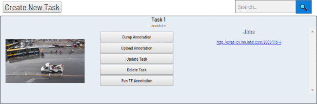
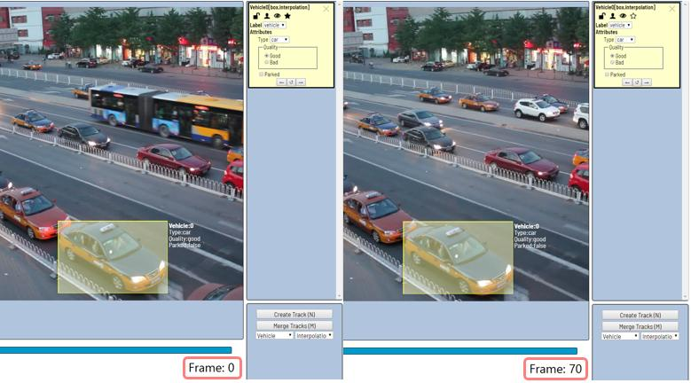
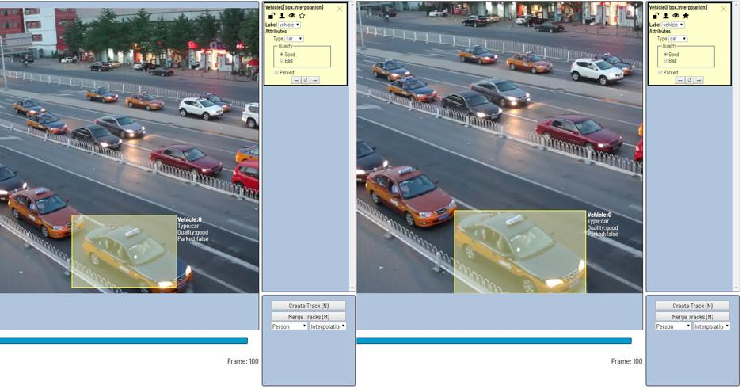
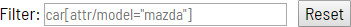

# User's guide

Computer Vision Annotation Tool (CVAT) is a web-based tool which helps to annotate video and images for Computer Vision algorithms. It was inspired by [Vatic](http://carlvondrick.com/vatic/) free, online, interactive video annotation tool. CVAT has many powerful features: __interpolation of bounding boxes between key frames, automatic annotation using TensorFlow OD API, shortcuts for most of critical actions, dashboard with a list of annotation tasks, LDAP and basic authorization, etc...__ It was created for and used by a professional data annotation team. UX and UI were optimized especially for computer vision tasks developed by our team.

## Getting started

### Authorization
- First of all you have to log in to CVAT tool.

    

    

- If you don't have an account you have to create it using the link below the login page.

    

### Administration panel
Type ``/admin`` in URL to go to the administration panel.
There you can:
 - Create / edit / delete users
 - Control user's permission and access to the tool.


### Creating an annotation task

1. Create an annotation task by pressing ``Create New Task`` button on the main page.

    

2. Specify mandatory parameters of the task. You have to fill ``Name``, ``Labels`` and press ``Select Files`` at least.

    

    __Labels__. Use the following scheme to create labels: ``label_name <prefix>input_type=attribute_name:attribute_value1,attribute_value2``. You can specify multiple labels and multiple attributes separated by space. Attributes belong to previous label.

    Example:
    - ``vehicle @select=type:__undefined__,car,truck,bus,train ~radio=quality:good,bad ~checkbox=parked:false`` -
    one label with multiple attributes
    - ``car person bike`` - three labels without attributes
    - ``circle @radio=color:green,red,blue @number=radius:0,10,0.1 line square`` - one label with two attributes and two labels without attributes

    ``label_name``: for example *vehicle, person, face etc.*

    ``<prefix>``:
      - Use ``@`` for unique attributes which cannot be changed from frame to frame *(e.g. age, gender, color, etc.)*
      - Use ``~`` for temporary attributes which can be changed on any frame *(e.g. quality, pose, truncated, etc.)*

    ``input_type``: the following input types are available ``select``, ``checkbox``, ``radio``, ``number``, ``text``.

    ``attribute_name``: for example *age, quality, parked*

    ``attribute_value``: for example *middle-age, good, true*

    Default value for an attribute is the first value after "``:``".

    For ``select`` and ``radio`` input types the special value is available: ``__undefined__``. Specify this value first if an attribute should be annotated explicitly.


    __Bug Tracker__. Specify full URL your bug tracker if you have it.

    __Source__. To create huge tasks please use ``shared`` server directory (choose ``Share`` option in the dialog).

    __Flip images__. All selected files will be turned around 180.

    __Z-Order__. Defines the order on drawn polygons. Check the box for enable layered displaying.

    __Overlap Size__. Use this option to make overlapped segments. The option makes tracks continuous from one segment into another. Use it for interpolation mode. There are several use cases for the parameter:
    - For an interpolation task (video sequence) if an object exists on overlapped segments it will be automatically merged into one track if overlap is greater than zero and annotation is good enough on adjacent segments. If overlap equals to zero or annotation is poor on adjacent segments inside a dumped annotation file you will have several tracks, one for each segment, which correspond to the object).
    - For an annotation task (independent images) if an object exists on overlapped segments bounding boxes will be automatically merged into one if overlap is greater than zero and annotation is good enough on adjacent segments. If overlap equals to zero or annotation is poor on adjacent segments inside a dumped annotation file you will have several bounding boxes for the same object.

    Thus you annotate an object on the first segment. You annotate the same object on second segment and if you do it right you will have one track inside your annotation file. If annotations on different segments (on overlapped frames) are very different or overlap is zero you will have two tracks for the same object. This functionality works only for bounding boxes. Polygon, polyline, points don't support automatic merge on overlapped segments even the overlap parameter isn't zero and match between corresponding shapes on adjacent segments is perfect.

    __Segment size__. Use this option to divide a huge dataset into a few smaller segments.

    __Image Quality__. Use this option to specify quality of uploaded images. The option makes it faster to load high-quality datasets. Use the value from ``1`` (completely compressed images) to ``95`` (almost not compressed images).

    Push ``Submit`` button and it will be added into the list of annotation tasks. Finally you should see something similar to the figure below:

    

3. Follow a link inside ``Jobs`` section to start annotation process. In some cases you can have several links. It depends on size of your task and ``Overlap Size`` and ``Segment Size`` parameters. To improve UX only several first frames will be loaded and you will be able to annotate first images. Other frames will be loaded in background.

    

### Basic navigation

1. Use arrows below to move on next/previous frame. Almost every button is covered by a shortcut. To get a hint about the shortcut just put your mouse pointer over an UI element.

    

2. An image can be zoom in/out using mouse's wheel. The image will be zoomed relatively your current cursor position. Thus if you point on an object it will be under your mouse during zooming process.

3. An image can be moved/shifted by holding left mouse button inside some area without annotated objects. If ``Mouse Wheel`` is pressed then all annotated objects are ignored otherwise a highlighted bounding box will be moved instead of the image itself.

### Types of Shapes (basic)
There are four shapes you can annotate your images with:
- ``box``
- ``polygon``
- ``polyline``
- ``points``

And there is how they all look like:

 

 

### Annotation mode (basics)
Usage examples:
 - Create new annotations for a set of images.
 - Add/modify/delete objects for existing annotations.

1. Before starting need to check that ``Annotation`` is selected:

     

2. Create a new annotation:
  
   - Choose right ``Shape`` (box etc.) and ``Label`` (was specified by you while creating the task) beforehand:

     

   - Create a bounding box by clicking on ``Create Shape`` button or ``N`` shortcut. Choose opposite points. Your first bounding box is ready!

    

    - It is possible to adjust boundaries and location of the bounding box using mouse. In the top right corner boxes' size is shown, you can check it by clicking one of the boxes' points. You can also undo your actions by using ``Ctrl+Z`` and redo them with ``Shift+Ctrl+Z`` or ``Ctrl+Y``.

3. In the list of objects you can see the labeled car. In the side panel you can perform basic operations under the object — choose attributes, change label or delete box.

    

4. An example of fully annotated frame in ``Annotation`` mode can look like on the figure below.

    

### Interpolation mode (basics)
Usage examples:
 - Create new annotations for a sequence of frames.
 - Add/modify/delete objects for existing annotations.
 - Edit tracks, merge many bounding boxes into one track.

1. Before starting need to be sure that ``Interpolation`` is selected.

    

2. Create a track for an object (look at the selected car as an example):
    - Annotate a bounding box on the first frame for the object.
    - In ``Interpolation`` mode the bounding box will be interpolated on next frames automatically.

        

3. If the object starts to change its position you need to modify bounding boxes where it happens. Changing of bounding boxes on each frame isn't necessary. It is enough to update several key frames and frames between them will be interpolated automatically. See an example below:
    - The car starts moving on frame #70. Let's mark the frame as a key frame. You can press ``K`` for that.

        

    - Let's jump 30 frames forward and adjust boundaries of the object.

        

    - After that bounding boxes of the object between 70 and 100 frames will be changed automatically. For example, frame #85 looks like on the figure below:

        

4. When the annotated object disappears or becomes too small, you need to finish the track. To do that you need to choose ``Outside Property``, shortcut ``O``.

    

5. If the object isn't visible on a couple of frames and after that it appears again it is possible to use ``Merge Tracks`` functionality to merge several separated tracks into one.

    

    - Let's create a track for the bus.

        

    - After that create a track when it appears again on the sequence of frames.

        

    - Press ``Merge Tracks`` button and click on any bounding box of the first track and on any bounding box of the second track.

        

    - Press ``Apply Merge`` button to apply changes.

        

    - The final annotated sequence of frames in ``Interpolation`` mode can look like the clip below:

        

### Attribute annotation mode (basics)

- In this mode you can edit attributes with fast navigation between objects and frames using keyboard. Press ``Shift+Enter`` shortcut to enter AAMode. After that it is possible to change attributes using keyboard.

    

- The active attribute will be red. In this case it is ``gender``. Look at the bottom side panel to see all possible shortcuts to change the attribute. Press ``2`` key on your keyboard to assign ``female`` value for the attribute.

     

- Press ``Up Arrow``/``Down Arrow`` on your keyboard to go to next/previous attribute. In this case after pressing ``Down Arrow`` you will be able to edit ``Age`` attribute.

     

- Use ``Right Arrow``/``Left Arrow`` keys to move on previous/next image with annotation.

### Downloading annotations

1. To download latest annotations save all changes first. Press ``Open Menu`` and then ``Save Work`` button. There is ``Ctrl+S`` shortcut to save annotations quickly.

2. After that press ``Open Menu`` and then ``Dump Annotation`` button.

    

3. The annotation will be written into **.xml** file. To find the annotation file go to the directory where your browser saves downloaded files by default. For more information visit [.xml format page](./documentation/xml_format.html).

    

### Vocabulary

**Bounding box** is an area which defines boundaries of an object. To specify it you need to define two opposite corners.

**Tight bounding box** is a bounding box where margin between the object inside and boundaries of the box is absent. This type of bounding box is used in most tasks by default but precision completely depends on an annotation task.

| Bounding box |Tight bounding box|
| ------------ |:----------------:|
|  | |

---
**Label** is a type of an annotated object (e.g. person, car, face, etc.)


---

**Attribute** is a property of an annotated object (e.g. color, model, quality, etc.). There are two types of attributes:

- __Unique__: immutable and can't be changed from frame to frame (e.g. age, gender, color, etc.)

    

- __Temporary__: mutable and can be changed on any frame (e.g. quality, pose, truncated, etc.)

    

---
**Track** is a set of shapes on different frames which corresponds to one object. Tracks are created in ``Interpolation mode``


---
**Annotation** is a set of shapes and tracks. There are several types of annotations:
- *Manual* which is created by a person
- *Semi-automatic* which is created mainly automatically but the user provides some data (e.g. interpolation)
- *Automatic* which is created automatically without a person in the loop

## Interface of the annotation tool

The tool is composed of:
- ``Workspace`` — where images are shown;
- ``Bottom panel`` (under workspace) — for navigation, filtering annotation and accessing tools' menu;
- ``Side panel`` — contains two lists: of objects (on the frame) and labels (of objects on the frame);
- ``Bottom side panel`` — for choosing types of/creating/merging/grouping annotation;


There is also:
- ``Settings`` (F2) — pop-up in the Bottom panel, contains different parameters which can be adjusted by the user's needs

- ``Context menu`` — available on right mouse button.

---
### Workspace — Context menu

Context menu opens by right mouse click.

By clicking inside bounding box the next is available:
- ``Copy Object URL`` — copying in buffer address of an object on the frame in the task
- ``Change Color``
- ``Remove Shape``
- ``Switch Occluded``
- ``Switch Lock``
- ``Enable Dragging`` — (only for polygons) allows to adjust polygons position

 

By clicking on the points of poly-shapes ``Remove`` option is available.


By clicking outside any shapes you can either copy ``Frame URL`` (link to present frame) or ``Job URL`` (link from address bar)

 

---
### Settings

Click ``F2`` to access settings menu.


There is ``Player Settings`` which adjusts ``Workspace`` and ``Other Settings``.

In ``Player Settings`` you can:
 - Control step of ``C`` and ``V`` shortcuts
 - Control speed of ``Space``/Play button
 - Show every image in full or zoomed out like previous (reset by default)

  - Enable ``Grid`` when you don't need too small annotation. ``Grid`` can have different opacity, color and cells' size — use ``F2`` to tune settings.

    

 - Adjust ``Brightness``/``Contrast``/``Saturation`` of too exposing or too dark images using ``F2`` — color settings (changes displaying and not the image itself).
Shortcuts:
   - ``Shift+B``/``Alt+B`` for brightness
   - ``Shift+C``/``Alt+C`` for contrast
   - ``Shift+S``/``Alt+S`` for saturation
   - ``F2`` —> ``Reset Color Settings`` for default image

     

``Other Settings`` contains:
 - ``Show All Interpolation Tracks`` checkbox — shows hidden object on the side panel for every interpolated object (turned off by default)
 - ``AAM Zoom Margin`` slider — defines margins for shape in attribute annotation mode
 - ``Enable AutoSaving`` checkbox — turned off by default
 - ``AutoSaving Interval (min)`` input box — 15 minutes by default
 - ``Propagate Frames`` input box — allows to choose on how many frames of selected object will be copied in by ``Ctrl+B`` (50 by default)

---
### Bottom Panel


---
Go to the first and latest frames.


---
Go to the next/previous frame with a predefined step. Shortcuts: ``v`` — step backward, ``c`` — step forward. By default the step is ``10`` (change at ``Open Menu`` —> ``Settings`` —> ``Player Step``).


---
Go to the next/previous frame with step equals to 1. Shortcuts: ``d`` — previous, ``f`` — next.


---
Play the sequence of frames or the set of images. Shortcut: ``Space`` (change at ``Open Menu`` —> ``Settings`` —> ``Player Speed``).


---
Go to specified frame. Press ``~`` to highlight element.


---
__Open Menu__ button

It is the main menu for the annotation tool. It can be used to download, upload and remove annotations.


As well it shows statistics about the current task, such as:
- task name
- type of performance on the task: ``annotation``, ``validation`` or ``completed task``
- technical information about task
- number of created bounding boxes, sorted by labels (e.g. vehicle, person) and type of annotation (polygons, boxes, etc.)

---
__Filter__ input box

The way how to use filters is described in the advanced guide (below).


---
__History / Undo-redo panel__

Use ``Ctrl+Z`` for undo actions and  ``Ctrl+Shift+Z`` or ``Ctrl+Y`` to redo them.


---
__Fill Opacity slider__

Change opacity of every bounding box in the annotation.


Opacity can be chaged from 0% to 100% and by random colors or white. If any white option is chosen, ``Color By`` scheme won't work.

__Selected Fill Opacity slider__

Change opacity of bounding box under mouse pointer.


Opacity can be changed from 0% till 100%.

__Black Stroke checkbox__

Change bounding box border from white/colored to black.


__Color By options__

Change color scheme of annotation:
- ``Instance`` — every bounding box has random color


- ``Group`` — every group of boxes has its own random color, ungrouped boxes are white


- ``Label`` — every label (e.g. vehicle, pedestrian, roadmark) has its own random color


You can change any random color by pointing on needed box on a frame or on a side panel and pressing ``Enter``.

---
### Side panel

#### Objects
In the side panel you can see the list of available objects on the current frame. An example how the list can look like is below:

|Annotation mode|Interpolation mode|
|--|--|
|||

#### Labels
You also can see all the labels that used on this frame and highlight them by clicking needed label.


---
__Objects' card__

A shape can be removed. Shortcut: ``Delete``. A locked shape can be deleted using ``Shift+Delete`` shortcut.


---
A shape can be locked to prevent its modification or moving by an accident. Shortcut to lock an object: ``l``.


---
A shape can be **Occluded**. Shortcut: ``q``. Such shapes have dashed boundaries.


---
You can copy and paste this object on this or another frame. ``Ctrl+C``/``Ctrl+V`` shortcuts works under mouse point.


---
You can propagate this object on next X frames. ``Ctrl+B`` shortcut works under mouse point. ``F2`` for change on how many frames in nesessary to propagate this object.


---
You can change the way this objects' annotation is displayed on this frame. It could be hide, shows only box, shows box and title. ``H`` is for this object, ``T+H`` for all objects on this frame.


---
The type of a shape can be changed by selecting __Label__ property. For instance, it can look like on the figure below:


To change a type of a highlighted shape using keyboard you need to press ``Shift+<number>``.

### Bottom side panel

- ``Create Shape`` (``N``) — start/stop drawing new shape mode
- ``Merge Shapes`` (``M``) — start/stop merging boxes mode
- ``Group Shapes`` (``G``) — start/stop grouping boxes mode
- ``Label Type`` — (e.g. face, person, vehicle)
- ``Working Mode`` — Annotation or Interpolation modes. You can't interpolate polygons/polylines/points, but you can propagate them using ``Ctrl+B`` or merge into a track
- ``Shape Type`` — (e.g. box, polygon, polyline, points)
- ``Poly Shape Size`` — (optional) hard number of dots for creating polygon/polyline shapes


#### Fullscreen player mode

Go to ``Open Menu`` —> ``Fullscreen Player``
Exit with ``F11`` or ``Ecs``.

That is how it looks like.


## Annotation mode (advanced)

Basic operations in the mode were described above.

__occluded__ attribute is used if an object is occluded by another object or it isn't fully visible on the frame. Use ``Q`` shortcut to set the property quickly.


Example: both cars on the figure below should be labeled as __occluded__.


If a frame contains too many objects and it is difficult to annotate them due to many shapes which are placed mostly in the same place then it makes sense to lock them. Shapes for locked objects are transparent and it is easy to annotate new objects. Also it will not be possible to change previously annotated objects by an accident. Shortcut: ``L``.


## Interpolation mode (advanced)

Basic operations in the mode were described above.

Bounding boxes created in the mode have extra navigation buttons.
- These buttons help to jump to previous/next key frame.

    

- The button helps to jump to initial frame for the object (first bounding box for the track).

    


## Attribute annotation mode (advanced)

Basic operations in the mode was described above.

It is possible to handle many objects on the same frame in the mode.


It is more convenient to annotate objects of the same type. For the purpose it is possible to specify a corresponding filter. For example, the following filter will hide all objects except pedestrians: ``pedestrian``.

To navigate between objects (pedestrians in the case) use the following shortcuts:
- ``Tab`` — go to the next object
- ``Shift+Tab`` — go to the previous object.

By default in the mode objects are zoomed in to full screen. Check
``Open Menu`` —> ``Settings`` —> ``AAM Zoom Margin`` for adjust that.

## Annotation with polygons

It is used for semantic / instance segmentation.

Be sure ``Z-Order`` flag in ``Create task`` dialog is enabled if you want to annotate polygons. Z-Order flag defines order of drawing. It is necessary to get right annotation mask without extra work (additional drawing of borders). Z-Order can be changed by `+`/`-` which set maximum/minimum z-order respectively.


Before starting need to be sure that ``Polygon`` is selected.


Click ``N`` for entering drawing mode. There are two ways to draw a polygon — you either create points by clicking or by dragging mouse on the screen, holding ``Shift``.

|Clicking points|Holding Shift+Dragging|
|--|--|
|||


When ``Shift`` isn't pressed, you can zoom in/out (on mouse wheel scroll) and move (on mouse wheel press and mouse move), you can delete previous point by clicking right mouse button. Click ``N`` again for completing the shape. You can move points or delete them by double-clicking. Double-click with pressed ``Shift`` will open a polygon editor. In it you can create new points (by clicking or dragging) or delete part of a polygon by closing the red line on other point. Press ``Esc`` to cancel editing.


Also you can set fixed number of points in the field "poly shape size", then drawing will be stopped automatically. 
To enable dragging, right-click inside polygon and choose ``Enable Dragging``.


Below you can see results with opacity and black stroke:


Also if you need to annotate small objects, increase ``Image Quality`` to ``95`` in ``Create task`` dialog for annotators convenience.

## Annotation with polylines

It is used for road markup annotation etc.

Before starting you have to be sure that ``Polyline`` is selected.


Click ``N`` for entering drawing mode. There are two ways to draw a polyline — you either create points by clicking or by dragging mouse on the screen, holding ``Shift``.
When ``Shift`` isn't pressed, you can zoom in/out (on mouse wheel scroll) and move (on mouse wheel press and mouse move), you can delete previous point by clicking right mouse button. Click ``N`` again for completing the shape. You can delete points by double-clicking them. Double-click with pressed ``Shift`` will open a polyline editor. In it you can create new points (by clicking or dragging) or delete part of a polyline by closing the red line on other point. Press ``Esc`` to cancel editing. Also you can set fixed number of points in the field "poly shape size", then drawing will be stopped automatically.
You can adjust polyline after it was drawn.


## Annotation with points

It is used for face landmarks annotation etc.

Before starting you have to be sure that ``Points`` is selected.


Click ``N`` for entering drawing mode. Now you can start marking a needed area.
Click ``N`` again for finishing marking an area. You can delete points by double-clicking them. Double-click with pressed ``Shift`` will open a points shape editor. In it you can create new points into existing shape. Also you can set fixed number of points in the field "poly shape size", then drawing will be stopped automatically. Points are automatically grouped — between individual start and finish all points will be considered linked. You can zoom in/out (on mouse wheel scroll) and move (on mouse wheel press and mouse move) while drawing. You can drag object after it was drawn and fix a position of individual points after finishing the object. You can add/delete points after finishing.


## Shape grouping

This feature allows to group several shapes.

You may use ``Group Shapes`` button or shortcuts:
  - ``G`` — switch group mode
  - ``Alt+G`` — close group mode
  - ``Shift+G`` — reset group for selected shapes

You may select shapes by clicking or by area selection.

Grouped shapes will have ``group_id`` filed in dumped annotation.

Also you may switch color distribution from by instance (default) to by group. To do this you have to switch ``Color By Group`` checkbox.

Shapes which haven't ``group_id`` will be highlighted with white color.


## Filter



There are several reasons for using the feature:

1. When using a filter objects which don't correspond to the filter will be hidden.
2. Fast navigation between frames which have an object of interest. Use ``Left Arrow/Right Arrow`` keys for the purpose. If the filter is empty the mentioned arrows will go to previous/next frames which contain any objects.

To use the functionality it is enough to specify a value inside ``Filter`` text box and defocus the text box (for example, click on the image). After that the filter will be applied.

---
In a trivial case a correct filter should correspond to the template: ``label[prop operator "value"]``

``label`` is a type of an object (e.g. _person, car, face_, etc.). If the type isn't important you can use ``*``.

``prop`` is a property which should be filtered. The following items are available:

 - ``id`` — identifier of an object. It helps to find a specific object easily in case of huge number of objects and images/frames.
 - ``type`` — an annotation type. Possible values:
    - ``annotation``
    - ``interpolation``
 - ``lock`` accepts ``true`` and ``false`` values. It can be used to hide all locked objects.
 - ``occluded`` accepts ``true`` and ``false`` values. It can be used to hide all occluded objects.
 - ``attr`` is a prefix to access attributes of an object. For example, it is possible to access _race_ attribute. For the purpose you should specify ``attr/race``. To access all attributes it is necessary to write ``attr/*``.

``operator`` can be ``=`` (equal), ``!=`` (not equal), ``<`` (less), ``>`` (more), ``<=`` (less or equal), ``>=`` (more or equal).

``"value"`` — value of an attribute or a property. It has to be specified in quotes.

---

Example                        | Description
-------------------------------|-------------
``face``                     | all faces
``*[id=4]``                  | object with id #4
``*[type="annotation"]``     | *annotation* objects only
``car[occluded="true"]``     | cars with *occluded* property
``*[lock!="true"]``          | all unlocked objects
``car[attr/parked="true"]``  | parked cars
``*[attr/*="__undefined__"]``| any objects with ``__undefined__`` value of an attribute

---

The functionality allows to create more complex conditions. Several filters can be combined by ``or``, ``and``, ``|`` operators. Operators ``or``, ``and`` can be applied inside square brackets. ``|`` operator (union) can be applied outside of square brackets.

Example                                                 | Description
--------------------------------------------------------|-------------
``person[attr/age>="25" and attr/age<="35"]``           | people with age between 25 and 35.
``face[attr/glass="sunglass" or attr/glass="no"]``      | faces with sunglasses or without glasses at all.
```person[attr/race="asian"] | car[attr/model="bmw" or attr/model="mazda"]``` | asian persons or bmw or mazda cars.

## Analytics

If your CVAT instance is built with [analytics](/components/analytics) support you can press F3 in dashboard, a new tab with analytics and logs will be opened.

It allows to see how much working time every user spend on each task and how much they did, over any time range.


It also has activity graph, which can be modified with number of users shown, and timeframe.


## Shortcuts

Many UI elements have shortcut hints. Put your pointer to a required element to see it.


| Shortcut             | Common                        |
-----------------------|------------------------------
``F1``                 | open help
``F1`` in dashboard    | open page with documentation
``F2``                 | open settings
``L``                  | lock/unlock an active shape
``L+T``                | lock/unlock all shapes on the current frame
``Q`` or ``Num/``      | set occluded property for an active shape
``N``                  | start/stop draw mode
``Esc``                | close draw mode without create
``Ctrl+<number>``      | change type of an active shape
``Shift+<number>``     | change type of new shape by default
``Enter``              | change color of active shape
``H``                  | hide active shape
``T+H``                | hide all shapes
``J``                  | hide labels with attributes on every frame
``Delete``             | delete an active shape
``Shift+Delete``       | delete an active shape even if it is locked
``F``                  | go to next frame
``D``                  | go to previous frame
``V``                  | go forward with a predefined step
``C``                  | go backward with a predefined step
``~``                  | focus to ``go to frame`` element
``Ctrl+C``             | copy an active shape
``Ctrl+V``             | insert a copied shape
``Ctrl+Z``             | undo previous action
``Ctrl+Shift+Z``/``Ctrl+Y``| redo previous action
``Shift+B``/``Alt+B``  | increase/decrease brightness on an image
``Shift+C``/``Alt+C``  | increase/decrease contrast on an image
``Shift+S``/``Alt+S``  | increase/decrease saturation on an image
``Ctrl+S``             | save job
``Ctrl+B``             | propagate active shape
``+``/``-``            | change relative order of highlighted box (if Z-Order is enabled)
|                      | __Interpolation__             |
``M``                  | enter/apply merge mode
``Esc``                | close merge mode without apply the merge
``R``                  | go to the next key frame of an active shape
``E``                  | go to the previous key frame of an active shape
``O``                  | change attribute of an active shape to "Outside the frame"
``K``                  | mark current frame as key frame on an active shape
|                      | __Attribute annotation mode__ |
``Shift+Enter``        | enter/leave Attribute Annotation mode
``Up Arrow``           | go to the next attribute (up)
``Down Arrow``         | go to the next attribute (down)
``Tab``                | go to the next annotated object
``Shift+Tab``          | go to the previous annotated object
``<number>``           | assign a corresponding value to the current attribute
|                      | __Grouping__                  |
``G``                  | switch group mode
``Esc``                | close group mode
``Shift+G``            | reset group for selected shapes
|                      | __Filter__                    |
``Left Arrow``         | go to the previous frame which corresponds to the specified filter value
``Right Arrow``        | go to the next frame which corresponds to the specified filter value

### Hints

Hold ``Mouse Wheel`` in order to move frame (for example during drawing)

Hold ``Ctrl`` when shape is active and fix it.

Hold ``Ctrl`` when paste shape from buffer for multiple pasting.
