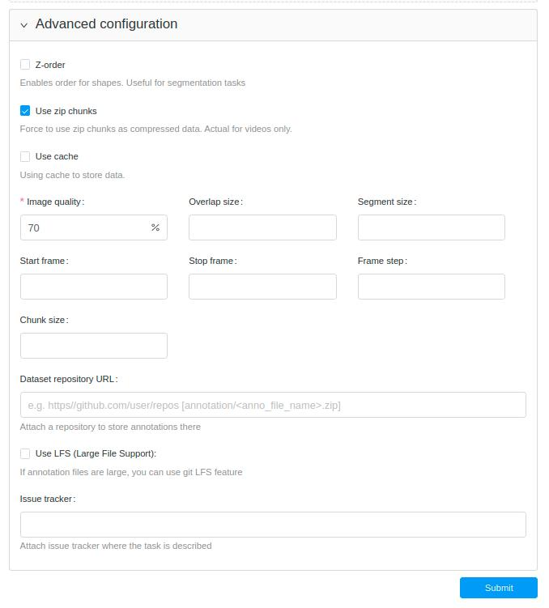
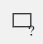
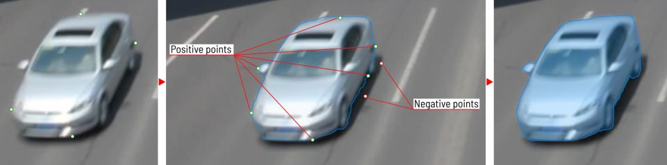
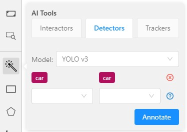
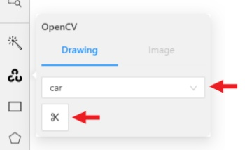
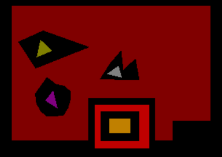
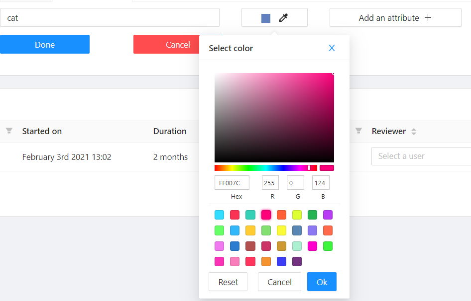
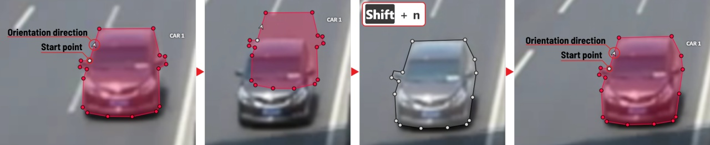
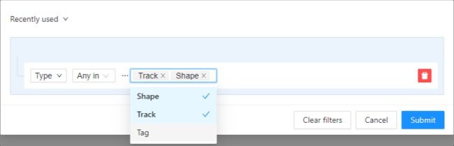
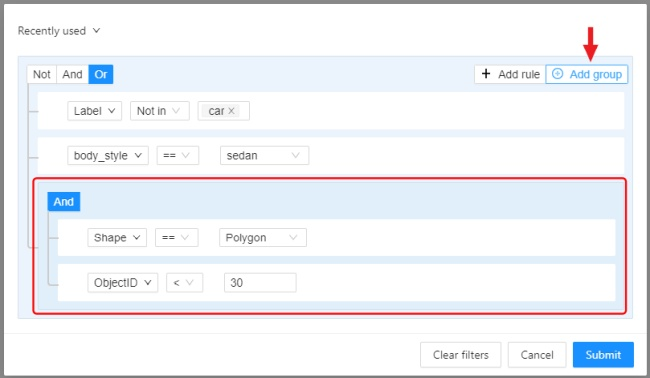

- [User's guide](#users-guide)
  - [Getting started](#getting-started)
    - [Authorization](#authorization)
    - [Administration panel](#administration-panel)
    - [Creating an annotation task](#creating-an-annotation-task)
    - [Projects](#projects)
    - [Models](#models)
    - [Search](#search)
  - [Interface of the annotation tool](#interface-of-the-annotation-tool)
    - [Basic navigation](#basic-navigation)
    - [Types of shapes (basics)](#types-of-shapes-basics)
    - [Shape mode (basics)](#shape-mode-basics)
    - [Track mode (basics)](#track-mode-basics)
    - [Attribute annotation mode (basics)](#attribute-annotation-mode-basics)
    - [Downloading annotations](#downloading-annotations)
    - [Task synchronization with a repository](#task-synchronization-with-a-repository)
    - [Vocabulary](#vocabulary)
    - [Workspace](#workspace)
    - [Settings](#settings)
    - [Top Panel](#top-panel)
    - [Controls sidebar](#controls-sidebar)
    - [Objects sidebar](#objects-sidebar)
      - [Objects](#objects)
      - [Labels](#labels)
  - [Shape mode (advanced)](#shape-mode-advanced)
  - [Track mode (advanced)](#track-mode-advanced)
  - [Attribute annotation mode (advanced)](#attribute-annotation-mode-advanced)
  - [AI Tools](#ai-tools)
  - [OpenCV Tools](#opencv-tools)
  - [Annotation with rectangle by 4 points](#annotation-with-rectangle-by-4-points)
  - [Annotation with polygons](#annotation-with-polygons)
    - [Creating masks](#creating-masks)
  - [Annotation with polylines](#annotation-with-polylines)
  - [Annotation with points](#annotation-with-points)
    - [Points in shape mode](#points-in-shape-mode)
    - [Linear interpolation with one point](#linear-interpolation-with-one-point)
  - [Annotation with cuboids](#annotation-with-cuboids)
  - [Annotation with tags](#annotation-with-tags)
  - [Track mode with polygons](#track-mode-with-polygons)
  - [Review](#review)
  - [Automatic annotation](#automatic-annotation)
  - [Shape grouping](#shape-grouping)
  - [Filter](#filter)
  - [Analytics](#analytics)
  - [Shortcuts](#shortcuts)

# User's guide

Computer Vision Annotation Tool (CVAT) is a web-based tool which helps to
annotate videos and images for Computer Vision algorithms. It was inspired
by [Vatic](http://carlvondrick.com/vatic/) free, online, interactive video
annotation tool. CVAT has many powerful features: _interpolation of bounding
boxes between key frames, automatic annotation using deep learning models,
shortcuts for most of critical actions, dashboard with a list of annotation
tasks, LDAP and basic authorization, etc..._ It was created for and used by
a professional data annotation team. UX and UI were optimized especially for
computer vision tasks developed by our team.

## Getting started

### Authorization

- First of all, you have to log in to CVAT tool.

  

- For register a new user press "Create an account"

  

- You can register a user but by default it will not have rights even to view
  list of tasks. Thus you should create a superuser. The superuser can use
  [Django administration panel](http://localhost:8080/admin) to assign correct
  groups to the user. Please use the command below to create an admin account:

  `docker exec -it cvat bash -ic 'python3 ~/manage.py createsuperuser'`

- If you want to create a non-admin account, you can do that using the link below
  on the login page. Don't forget to modify permissions for the new user in the
  administration panel. There are several groups (aka roles): admin, user,
  annotator, observer.

  

### Administration panel

Go to the [Django administration panel](http://localhost:8080/admin). There you can:

- Create / edit / delete users
- Control permissions of users and access to the tool.

  

### Creating an annotation task

1.  Create an annotation task pressing `Create new task` button on the tasks page or on the project page.
    

1.  Specify parameters of the task:

    #### Basic configuration

    **Name** The name of the task to be created.

    

    **Projects** The project that this task will be related with.

    

    **Labels**. There are two ways of working with labels (available only if the task is not related to the project):

    - The `Constructor` is a simple way to add and adjust labels. To add a new label click the `Add label` button.
      

      You can set a name of the label in the `Label name` field and choose a color for each label.

      

      If necessary you can add an attribute and set its properties by clicking `Add an attribute`:

      

      The following actions are available here:

      1. Set the attribute’s name.
      1. Choose the way to display the attribute:
         - Select — drop down list of value
         - Radio — is used when it is necessary to choose just one option out of few suggested.
         - Checkbox — is used when it is necessary to choose any number of options out of suggested.
         - Text — is used when an attribute is entered as a text.
         - Number — is used when an attribute is entered as a number.
      1. Set values for the attribute. The values could be separated by pressing `Enter`.
         The entered value is displayed as a separate element which could be deleted
         by pressing `Backspace` or clicking the close button (x).
         If the specified way of displaying the attribute is Text or Number,
         the entered value will be displayed as text by default (e.g. you can specify the text format).
      1. Checkbox `Mutable` determines if an attribute would be changed frame to frame.
      1. You can delete the attribute by clicking the close button (x).

      Click the `Continue` button to add more labels.
      If you need to cancel adding a label - press the `Cancel` button.
      After all the necessary labels are added click the `Done` button.
      After clicking `Done` the added labels would be displayed as separate elements of different colour.
      You can edit or delete labels by clicking `Update attributes` or `Delete label`.

    - The `Raw` is a way of working with labels for an advanced user.
      Raw presents label data in _json_ format with an option of editing and copying labels as a text.
      The `Done` button applies the changes and the `Reset` button cancels the changes.
      

    In `Raw` and `Constructor` mode, you can press the `Copy` button to copy the list of labels.

    **Select files**. Press tab `My computer` to choose some files for annotation from your PC.
    If you select tab `Connected file share` you can choose files for annotation from your network.
    If you select ` Remote source` , you'll see a field where you can enter a list of URLs (one URL per line).
    If you upload a video or dataset with images and select `Use cache` option, you can attach a `manifest.jsonl` file.
    You can find how to prepare it [here](/utils/dataset_manifest/README.md).

    

    #### Advanced configuration

    

    **Use zip chunks**. Force to use zip chunks as compressed data. Actual for videos only.

    **Use cache**. Defines how to work with data. Select the checkbox to switch to the "on-the-fly data processing",
    which will reduce the task creation time (by preparing chunks when requests are received)
    and store data in a cache of limited size with a policy of evicting less popular items.
    See more [here](/cvat/apps/documentation/data_on_fly.md).

    **Image Quality**. Use this option to specify quality of uploaded images.
    The option helps to load high resolution datasets faster.
    Use the value from `5` (almost completely compressed images) to `100` (not compressed images).

    **Overlap Size**. Use this option to make overlapped segments.
    The option makes tracks continuous from one segment into another.
    Use it for interpolation mode. There are several options for using the parameter:

    - For an interpolation task (video sequence).
      If you annotate a bounding box on two adjacent segments they will be merged into one bounding box.
      If overlap equals to zero or annotation is poor on adjacent segments inside a dumped annotation file,
      you will have several tracks, one for each segment, which corresponds to the object.
    - For an annotation task (independent images).
      If an object exists on overlapped segments, the overlap is greater than zero
      and the annotation is good enough on adjacent segments, it will be automatically merged into one object.
      If overlap equals to zero or annotation is poor on adjacent segments inside a dumped annotation file,
      you will have several bounding boxes for the same object.
      Thus, you annotate an object on the first segment.
      You annotate the same object on second segment, and if you do it right, you
      will have one track inside the annotations.
      If annotations on different segments (on overlapped frames)
      are very different, you will have two shapes for the same object.
      This functionality works only for bounding boxes.
      Polygons, polylines, points don't support automatic merge on overlapped segments
      even the overlap parameter isn't zero and match between corresponding shapes on adjacent segments is perfect.

    **Segment size**. Use this option to divide a huge dataset into a few smaller segments.
    For example, one job cannot be annotated by several labelers (it isn't supported).
    Thus using "segment size" you can create several jobs for the same annotation task.
    It will help you to parallel data annotation process.

    **Start frame**. Frame from which video in task begins.

    **Stop frame**. Frame on which video in task ends.

    **Frame Step**. Use this option to filter video frames.
    For example, enter `25` to leave every twenty fifth frame in the video or every twenty fifth image.

    **Chunk size**. Defines a number of frames to be packed in a chunk when send from client to server.
    Server defines automatically if empty.

    Recommended values:

    - 1080p or less: 36
    - 2k or less: 8 - 16
    - 4k or less: 4 - 8
    - More: 1 - 4

    **Dataset Repository**. URL link of the repository optionally specifies the path to the repository for storage
    (`default: annotation / <dump_file_name> .zip`).
    The .zip and .xml file extension of annotation are supported.
    Field format: `URL [PATH]` example: `https://github.com/project/repos.git [1/2/3/4/annotation.xml]`

    Supported URL formats :

    - `https://github.com/project/repos[.git]`
    - `github.com/project/repos[.git]`
    - `git@github.com:project/repos[.git]`

    The task will be highlighted in red after creation if annotation isn't synchronized with the repository.

    **Use LFS**. If the annotation file is large, you can create a repository with
    [LFS](https://git-lfs.github.com/) support.

    **Issue tracker**. Specify full issue tracker's URL if it's necessary.

    Push `Submit` button and it will be added into the list of annotation tasks.
    Then, the created task will be displayed on a tasks page:

    

1.  The tasks page contains elements and each of them relates to a separate task. They are sorted in creation order.
    Each element contains: task name, preview, progress bar, button `Open`, and menu `Actions`.
    Each button is responsible for a in menu `Actions` specific function:

    - `Dump Annotation` and `Export as a dataset` — download annotations or
      annotations and images in a specific format. The following formats are available:
      - [CVAT for video](/cvat/apps/documentation/xml_format.md#interpolation)
        is highlighted if a task has the interpolation mode.
      - [CVAT for images](/cvat/apps/documentation/xml_format.md#annotation)
        is highlighted if a task has the annotation mode.
      - [PASCAL VOC](http://host.robots.ox.ac.uk/pascal/VOC/)
      - [(VOC) Segmentation mask](http://host.robots.ox.ac.uk/pascal/VOC/) —
        archive contains class and instance masks for each frame in the png
        format and a text file with the value of each color.
      - [YOLO](https://pjreddie.com/darknet/yolo/)
      - [COCO](http://cocodataset.org/#format-data)
      - [TFRecord](https://www.tensorflow.org/tutorials/load_data/tf_records)
      - [MOT](https://motchallenge.net/)
      - [LabelMe 3.0](http://labelme.csail.mit.edu/Release3.0/)
      - [Datumaro](https://github.com/opencv/cvat/blob/develop/datumaro/)
    - `Upload annotation` is available in the same formats as in `Dump annotation`.
      - [CVAT](/cvat/apps/documentation/xml_format.md) accepts both video and image sub-formats.
    - `Automatic Annotation` — automatic annotation with OpenVINO toolkit.
      Presence depends on how you build CVAT instance.
    - `Delete` — delete task.

    Push `Open` button to go to task details.

1.  Task details is a task page which contains a preview, a progress bar
    and the details of the task (specified when the task was created) and the jobs section.

    

    - The next actions are available on this page:
      1. Change the task’s title.
      1. Open `Actions` menu.
      1. Change issue tracker or open issue tracker if it is specified.
      1. Change labels (available only if the task is not related to the project).
         You can add new labels or add attributes for the existing labels in the Raw mode or the Constructor mode.
         By clicking `Copy` you will copy the labels to the clipboard.
      1. Assigned to — is used to assign a task to a person. Start typing an assignee’s name and/or
         choose the right person out of the dropdown list.
    - `Jobs` — is a list of all jobs for a particular task. Here you can find the next data:
      - Jobs name with a hyperlink to it.
      - Frames — the frame interval.
      - A status of the job. The status is specified by the user in the menu inside the job.
        There are three types of status: annotation, validation or completed.
        The status of the job is changes the progress bar of the task.
      - Started on — start date of this job.
      - Duration — is the amount of time the job is being worked.
      - Assignee is the user who is working on the job.
        You can start typing an assignee’s name and/or choose the right person out of the dropdown list.
      - Reviewer – a user assigned to carry out the review, read more in the [review](#review) section.
      - `Copy`. By clicking `Copy` you will copy the job list to the clipboard.
        The job list contains direct links to jobs.

        You can filter or sort jobs by status, as well as by assigner or reviewer.

1.  Follow a link inside `Jobs` section to start annotation process.
    In some cases, you can have several links. It depends on size of your
    task and `Overlap Size` and `Segment Size` parameters. To improve
    UX, only the first chunk of several frames will be loaded and you will be able
    to annotate first images. Other frames will be loaded in background.

    

### Projects

At CVAT, you can create a project containing tasks of the same type. All tasks related to the project will inherit a list of labels.

To create a project, go to the projects section by clicking on the `Projects` item in the top menu. 
On the projects page, you can see a list of projects, use a search, or create a new project by clicking `Create New Project`.

You can change: the name of the project, the list of labels (which will be used for tasks created as parts of this project) and a link to the issue.

Once created, the project will appear on the projects page. To open a project, just click on it.

Here you can do the following:

1. Change the project's title.
1. Open the `Actions` menu.
1. Change issue tracker or open issue tracker if it is specified.
1. Change labels.
   You can add new labels or add attributes for the existing labels in the Raw mode or the Constructor mode. 
   You can also change the color for different labels. By clicking `Copy` you can copy the labels to the clipboard.
1. Assigned to — is used to assign a project to a person. Start typing an assignee's name and/or choose the right person out of the dropdown list.
1. `Tasks` — is a list of all tasks for a particular project.

You can remove the project and all related tasks through the Action menu.

### Models

The Models page contains a list of deep learning (DL) models deployed for semi-automatic and automatic annotation.
To open the Models page, click the Models button on the navigation bar.
The list of models is presented in the form of a table. The parameters indicated for each model are the following:

- `Framework` the model is based on
- model `Name`
- model `Type`:
  - `detector` - used for automatic annotation (available in [detectors](#detectors) and [automatic annotation](#automatic-annotation))
  - `interactor` - used for semi-automatic shape annotation (available in [interactors](#interactors))
  - `tracker` - used for semi-automatic track annotation (available in [trackers](#trackers))
  - `reid` - used to combine individual objects into a track (available in [automatic annotation](#automatic-annotation))
- `Description` - brief description of the model
- `Labels` - list of the supported labels (only for the models of the `detectors` type)

Read how to install your model [here](installation.md#semi-automatic-and-automatic-annotation).

### Search

There are several options how to use the search.

- Search within all fields (owner, assignee, task name, task status, task mode).
  To execute enter a search string in search field.
- Search for specific fields. How to perform:
  - `owner: admin` - all tasks created by the user who has the substring "admin" in his name
  - `assignee: employee` - all tasks which are assigned to a user who has the substring "employee" in his name
  - `name: training` - all tasks with the substring "training" in their names
  - `mode: annotation` or `mode: interpolation` - all tasks with images or videos.
  - `status: annotation` or `status: validation` or `status: completed` - search by status
  - `id: 5` - task with id = 5.
- Multiple filters. Filters can be combined (except for the identifier) ​​using the keyword ` AND`:
  - `mode: interpolation AND owner: admin`
  - `mode: annotation and status: annotation`

The search is case insensitive.

## Interface of the annotation tool

The tool consists of:

- `Header` - pinned header used to navigate CVAT sections and account settings;
- `Top panel` — contains navigation buttons, main functions and menu access;
- `Workspace` — space where images are shown;
- `Controls sidebar` — contains tools for navigating the image, zoom,
  creating shapes and editing tracks (merge, split, group)
- `Objects sidebar` — contains label filter, two lists:
  objects (on the frame) and labels (of objects on the frame) and appearance settings.

### Basic navigation

1.  Use arrows below to move to the next/previous frame.
    Use the scroll bar slider to scroll through frames.
    Almost every button has a shortcut.
    To get a hint about a shortcut, just move your mouse pointer over an UI element.

    

1.  To navigate the image, use the button on the controls sidebar.
    Another way an image can be moved/shifted is by holding the left mouse button inside
    an area without annotated objects.
    If the `Mouse Wheel` is pressed, then all annotated objects are ignored. Otherwise the
    a highlighted bounding box will be moved instead of the image itself.

    

1.  You can use the button on the sidebar controls to zoom on a region of interest.
    Use the button `Fit the image` to fit the image in the workspace.
    You can also use the mouse wheel to scale the image
    (the image will be zoomed relatively to your current cursor position).

    

### Types of shapes (basics)

There are five shapes which you can annotate your images with:

- `Rectangle` or `Bounding box`
- `Polygon`
- `Polyline`
- `Points`
- `Cuboid`
- `Tag`

And there is how they all look like:

 

 

 

`Tag` - has no shape in the workspace, but is displayed in objects sidebar.

### Shape mode (basics)

Usage examples:

- Create new annotations for a set of images.
- Add/modify/delete objects for existing annotations.

1.  You need to select `Rectangle` on the controls sidebar:

    

    Before you start, select the correct ` Label` (should be specified by you when creating the task)
    and ` Drawing Method` (by 2 points or by 4 points):

    

1.  Creating a new annotation in `Shape mode`:

    - Create a separate `Rectangle` by clicking on `Shape`.

      

    - Choose the opposite points. Your first rectangle is ready!

      

    - To learn about creating a rectangle using the by 4 point drawing method, ([read here](#annotation-by-rectangle-4-points)).

    - It is possible to adjust boundaries and location of the rectangle using a mouse.
      Rectangle's size is shown in the top right corner , you can check it by clicking on any point of the shape.
      You can also undo your actions using `Ctrl+Z` and redo them with `Shift+Ctrl+Z` or `Ctrl+Y`.

1.  You can see the `Object card` in the objects sidebar or open it by right-clicking on the object.
    You can change the attributes in the details section.
    You can perform basic operations or delete an object by clicking on the action menu button.

    

1.  The following figure is an example of a fully annotated frame with separate shapes.

    

    Read more in the section [shape mode (advanced)](#shape-mode-advanced).

### Track mode (basics)

Usage examples:

- Create new annotations for a sequence of frames.
- Add/modify/delete objects for existing annotations.
- Edit tracks, merge several rectangles into one track.

1.  Like in the `Shape mode`, you need to select a `Rectangle` on the sidebar,
    in the appearing form, select the desired `Label` and the `Drawing method`.

    

1.  Creating a track for an object (look at the selected car as an example):

    - Create a `Rectangle` in `Track mode` by clicking on `Track`.

      

    - In `Track mode` the rectangle will be automatically interpolated on the next frames.
    - The cyclist starts moving on frame #2270. Let's mark the frame as a key frame.
      You can press `K` for that or click the `star` button (see the screenshot below).

      

    - If the object starts to change its position, you need to modify the rectangle where it happens.
      It isn't necessary to change the rectangle on each frame, simply update several keyframes
      and the frames between them will be interpolated automatically.
    - Let's jump 30 frames forward and adjust the boundaries of the object. See an example below:

      

    - After that the rectangle of the object will be changed automatically on frames 2270 to 2300:

      

1.  When the annotated object disappears or becomes too small, you need to
    finish the track. You have to choose `Outside Property`, shortcut `O`.

    

1.  If the object isn't visible on a couple of frames and then appears again,
    you can use the `Merge` feature to merge several individual tracks
    into one.

    

    - Create tracks for moments when the cyclist is visible:

      

    - Click `Merge` button or press key `M` and click on any rectangle of the first track
      and on any rectangle of the second track and so on:

      

    - Click `Merge` button or press `M` to apply changes.

      

    - The final annotated sequence of frames in `Interpolation` mode can
      look like the clip below:

      

      Read more in the section [track mode (advanced)](#track-mode-advanced).

### Attribute annotation mode (basics)

- In this mode you can edit attributes with fast navigation between objects and frames using a keyboard.
  Open the drop-down list in the top panel and select Attribute annotation Mode.

  

- In this mode objects panel change to a special panel :

  

- The active attribute will be red. In this case it is `gender` . Look at the bottom side panel to see all possible
  shortcuts for changing the attribute. Press key `2` on your keyboard to assign a value (female) for the attribute
  or select from the drop-down list.

  

- Press `Up Arrow`/`Down Arrow` on your keyboard or click the buttons in the UI to go to the next/previous
  attribute. In this case, after pressing `Down Arrow` you will be able to edit the `Age` attribute.

  

- Use `Right Arrow`/`Left Arrow` keys to move to the previous/next image with annotation.

To see all the hot keys available in the attribute annotation mode, press `F2`.
Read more in the section [attribute annotation mode (advanced)](#attribute-annotation-mode-advanced).

### Downloading annotations

1.  To download the latest annotations, you have to save all changes first.
    click the `Save` button. There is a `Ctrl+S` shortcut to save annotations quickly.
1.  After that, сlick the `Menu` button.
1.  Press the `Dump Annotation` button.

    

1.  Choose format dump annotation file. Dump annotation are available in several formats:

    - [CVAT for video](/cvat/apps/documentation/xml_format.md#interpolation)
      is highlighted if a task has the interpolation mode.
    - [CVAT for images](/cvat/apps/documentation/xml_format.md#annotation)
      is highlighted if a task has the annotation mode.

    

    - [PASCAL VOC](http://host.robots.ox.ac.uk/pascal/VOC/)
    - [(VOC) Segmentation mask](http://host.robots.ox.ac.uk/pascal/VOC/) —
      archive contains class and instance masks for each frame in the png
      format and a text file with the value of each color.
    - [YOLO](https://pjreddie.com/darknet/yolo/)
    - [COCO](http://cocodataset.org/#format-data)
    - [TFRecord](https://www.tensorflow.org/tutorials/load_data/tf_records)
    - [MOT](https://motchallenge.net/)
    - [LabelMe 3.0](http://labelme.csail.mit.edu/Release3.0/)
    - [Datumaro](https://github.com/opencv/cvat/blob/develop/datumaro/)

### Task synchronization with a repository

1.  At the end of the annotation process, a task is synchronized by clicking
    ` Synchronize` on the task page. Notice: this feature
    works only if a git repository was specified when the task was created.

    

1.  After synchronization the button `Sync` is highlighted in green. The
    annotation is now in the repository in a temporary branch.

    

1.  The next step is to go to the repository and manually create a pull request to the main branch.
1.  After confirming the PR, when the annotation is saved in the main branch, the color of the task changes to blue.

    

### Vocabulary

**Label** is a type of an annotated object (e.g. person, car, vehicle, etc.)

---

**Attribute** is a property of an annotated object (e.g. color, model,
quality, etc.). There are two types of attributes:

- **Unique**: immutable and can't be changed from frame to frame (e.g. age, gender, color, etc.)

  

- **Temporary**: mutable and can be changed on any frame (e.g. quality, pose, truncated, etc.)

  

---

**Track** is a set of shapes on different frames which corresponds to one object.
Tracks are created in `Track mode`

---

**Annotation** is a set of shapes and tracks. There are several types of annotations:

- _Manual_ which is created by a person
- _Semi-automatic_ which is created mainly automatically, but the user provides some data (e.g. interpolation)
- _Automatic_ which is created automatically without a person in the loop

---

### Workspace

This is the main field in which drawing and editing objects takes place.
In addition the workspace also has the following functions:

- Right-clicking on an object calls up the `Object card` - this is an element containing
  the necessary controls for changing the label and attributes of the object, as well as the action menu.

  

- Right-clicking a point deletes it.

  

- `Z-axis slider` - Allows you to switch annotation layers hiding the upper layers
  (slider is enabled if several z layers are on a frame).
  This element has a button for adding a new layer. When pressed, a new layer is added and switched to it.
  You can move objects in layers using the `+` and `-` keys.

  

- `Image settings panel` -  used to set up the grid and set up image brightness contrast saturation.

  - Show `Grid`, change grid size, choose color and transparency:

    

  - Adjust `Brightness`/`Contrast`/`Saturation` of too exposed or too
  dark images using `F3` — color settings (changes displaying settings and not the
  image itself).

  Shortcuts:

  - `Shift+B+=`/`Shift+B+-` for brightness.
  - `Shift+C+=`/`Shift+C+-` for contrast.
  - `Shift+S+=`/`Shift+S+-` for saturation.

    

  - `Reset color settings` to default values.

---

### Settings

To open the settings open the user menu in the header and select the settings item or press `F2`.

`Settings` have two tabs:

In tab `Player` you can:

- Control step of `C` and `V` shortcuts.
- Control speed of `Space`/`Play` button.
- Select canvas background color. You can choose a background color or enter manually (in RGB or HEX format).
- `Reset zoom` Show every image in full size or zoomed out like previous
  (it is enabled by default for interpolation mode and disabled for annotation mode).
- `Rotate all images` checkbox — switch the rotation of all frames or an individual frame.

---

In tab `Workspace` you can:

- `Enable auto save` checkbox — turned off by default.
- `Auto save interval (min)` input box — 15 minutes by default.
- `Show all interpolation tracks` checkbox — shows hidden objects on the
  side panel for every interpolated object (turned off by default).
- `Always show object details` - show text for an object on the canvas not only when the object is activated:

  

- `Automatic bordering` - enable automatic bordering for polygons and polylines during drawing/editing.
  For more information To find out more, go to the section [annotation with polygons](#Annotation-with-polygons).

- `Intelligent polygon cropping` - activates intelligent cropping when editing the polygon (read more in the section [edit polygon](#edit-polygon)

- `Attribute annotation mode (AAM) zoom margin` input box — defines margins (in px)
  for shape in the attribute annotation mode.
- Click `Save` to save settings (settings will be saved on the server and will not change after the page is refreshed). Click `Cancel`  or press `F2` to return to the annotation.

---

### Top Panel

---

#### Menu button

It is the main menu of the annotation tool. It can be used to download, upload and remove annotations.

Button assignment:

- `Dump Annotations` — downloads annotations from a task.
- `Upload Annotations` — uploads annotations into a task.
- `Remove Annotations` — removes annotations from the current job.
- `Export as a dataset` — download a data set from a task. Several formats are available:
  - [Datumaro](https://github.com/opencv/cvat/blob/develop/datumaro/docs/design.md)
  - [Pascal VOC 2012](http://host.robots.ox.ac.uk/pascal/VOC/)
  - [MS COCO](http://cocodataset.org/#format-data)
  - [YOLO](https://pjreddie.com/darknet/yolo/)
- `Open the task` — opens a page with details about the task.
- `Request a review` - calls up the form to submit the job for a review, read more in the [review](#review) section.
- `Finish the job` - changes the status of the job to `completed` and returns to the task page without review.
- `Submit the review` - (available during the review) calls up the form to submit a review, read more in the [review](#review) section.

#### Save Work

Saves annotations for the current job. The button has an indication of the saving process.

#### Undo-redo buttons

Use buttons to undo actions or redo them.

---

#### Player

Go to the first /the latest frames.

Go to the next/previous frame with a predefined step. Shortcuts:
`V` — step backward, `C` — step forward. By default the step is `10` frames
(change at `Account Menu` —> `Settings` —> `Player Step`).

The button to go to the next / previous frame has the customization possibility. To customize, right-click on the button and select one of three options:

1. The default option - go to the next / previous frame (the step is 1 frame).
2. Go to the next / previous frame that has any objects (in particular filtered). Read the [filter](#filter) section to know the details how to use it.
3. Go to the next / previous frame without annotation at all. Use this option in cases when you need to find missed frames quickly.

Shortcuts: `D` - previous, `F` - next.

Play the sequence of frames or the set of images.
Shortcut: `Space` (change at `Account Menu` —> `Settings` —> `Player Speed`).

Go to a specific frame. Press `~` to focus on the element.

---

#### Fullscreen Player

The fullscreen player mode. The keyboard shortcut is `F11`.

#### Info

Open the job info.

_Overview_:

- `Assinger` - the one to whom the job is assigned.
- `Reviewer` – a user assigned to carry out the review, read more in the [review](#review) section.
- `Start Frame` - the number of the first frame in this job.
- `End Frame` - the number of the last frame in this job.
- `Frames` - the total number of all frames in the job.

_Annotations statistics_:

This is a table number of created shapes, sorted by labels (e.g. vehicle, person)
and type of annotation (shape, track). As well as the number of manual and interpolated frames.

#### UI switcher

Switching between user interface modes.

---

### Controls sidebar

**Navigation block** - contains tools for moving and rotating images.
|Icon |Description |
|-- |-- |
||`Cursor` (`Esc`)- a basic annotation pedacting tool. |
||`Move the image`- a tool for moving around the image without  the possibility of editing.|
||`Rotate`- two buttons to rotate the current frame  a clockwise (`Ctrl+R`) and anticlockwise (`Ctrl+Shift+R`).  You can enable `Rotate all images` in the settings to rotate all the images in the job

**Zoom block** - contains tools for image zoom.
|Icon |Description |
|-- |-- |
||`Fit image`- fits image into the workspace size.  Shortcut - double click on an image|
||`Select a region of interest`- zooms in on a selected region.  You can use this tool to quickly zoom in on a specific part of the frame.|

**Shapes block** - contains all the tools for creating shapes.
|Icon |Description |Links to section |
|-- |-- |-- |
||`AI Tools` |[AI Tools](#ai-tools)|
||`OpenCV` |[OpenCV](#opencv)|
||`Rectangle`|[Shape mode](#shape-mode-basics); [Track mode](#track-mode-basics);  [Drawing by 4 points](#annotation-with-rectangle-by-4-points)|
||`Polygon` |[Annotation with polygons](#annotation-with-polygons); [Track mode with polygons](#track-mode-with-polygons) |
||`Polyline` |[Annotation with polylines](#annotation-with-polylines)|
||`Points` |[Annotation with points](#annotation-with-points) |
||`Cuboid` |[Annotation with cuboids](#annotation-with-cuboids) |
||`Tag` |[Annotation with tags](#annotation-with-tag) |
||`Open an issue` |[Review](#review) (available only in review mode) |

**Edit block** - contains tools for editing tracks and shapes.
|Icon |Description |Links to section |
|-- |-- |-- |
||`Merge Shapes`(`M`) — starts/stops the merging shapes mode. |[Track mode (basics)](#track-mode-basics)|
||`Group Shapes` (`G`) — starts/stops the grouping shapes mode.|[Shape grouping](#shape-grouping)|
||`Split` — splits a track. |[Track mode (advanced)](#track-mode-advanced)|

---

### Objects sidebar

`Hide` - the button hides the object's sidebar.

#### Objects

**Filter** input box

The way how to use filters is described in the advanced guide [here](#filter).

**List of objects**

- Switch lock property for all - switches lock property of all objects in the frame.
- Switch hidden property for all - switches hide property of all objects in the frame.
- Expand/collapse all - collapses/expands the details field of all objects in the frame.
- Sorting - sort the list of objects: updated time, ID - accent, ID - descent

In the objects sidebar you can see the list of available objects on the current
frame. The following figure is an example of how the list might look like:

| Shape mode                                    | Track mode                                    |
| --------------------------------------------- | --------------------------------------------- |
|  |  |

---

**Objects** on the side bar

The type of a shape can be changed by selecting **Label** property. For instance, it can look like shown on the figure below:

**Object action menu**

The action menu calls up the button:

The action menu contains:

- `Create object URL` - puts a link to an object on the clipboard. After you open the link, this object will be filtered.
- `Make a copy`- copies an object. The keyboard shortcut is `Ctrl + C` `Ctrl + V`.
- `Propagate` - Сopies the form to several frames,
  invokes a dialog box in which you can specify the number of copies
  or the frame onto which you want to copy the object. The keyboard shortcut `Ctrl + B`.

  

- `To background` - moves the object to the background. The keyboard shortcut `-`,`_`.
- `To foreground` - moves the object to the foreground. The keyboard shortcut `+`,`=`.
- `Change instance color`- choosing a color using the color picker (available only in instance mode).

  

- `Remove` - removes the object. The keyboard shortcut `Del`,`Shift+Del`.

A shape can be locked to prevent its modification or moving by an accident. Shortcut to lock an object: `L`.

A shape can be **Occluded**. Shortcut: `Q`. Such shapes have dashed boundaries.

You can change the way an object is displayed on a frame (show or hide).

`Switch pinned property` - when enabled, a shape cannot be moved by dragging or dropping.

By clicking on the `Details` button you can collapse or expand the field with all the attributes of the object.

---

#### Labels

In this tab you can lock or hide objects of a certain label.
To change the color for a specific label,
you need to go to the task page and select the color by clicking the edit button,
this way you will change the label color for all jobs in the task.

---

#### Appearance

**Color By** options

Change the color scheme of annotation:

- `Instance` — every shape has random color

  

- `Group` — every group of shape has its own random color, ungrouped shapes are white

  

- `Label` — every label (e.g. car, person) has its own random color

  

  You can change any random color pointing to a needed box on a frame or on an
  object sidebar.

**Fill Opacity** slider

Change the opacity of every shape in the annotation.

**Selected Fill Opacity** slider

Change the opacity of the selected object's fill.

**Outlines borders** checkbox

You can change a special shape border color by clicking on the `Eyedropper` icon.

**Show bitmap** checkbox

If enabled all shapes are displayed in white and the background is black.

**Show projections** checkbox

Enables / disables the display of auxiliary perspective lines. Only relevant for cuboids

## Shape mode (advanced)

Basic operations in the mode were described in section [shape mode (basics)](#shape-mode-basics).

**Occluded**
Occlusion is an attribute used if an object is occluded by another object or
isn't fully visible on the frame. Use `Q` shortcut to set the property
quickly.

Example: the three cars on the figure below should be labeled as **occluded**.

If a frame contains too many objects and it is difficult to annotate them
due to many shapes placed mostly in the same place, it makes sense
to lock them. Shapes for locked objects are transparent, and it is easy to
annotate new objects. Besides, you can't change previously annotated objects
by accident. Shortcut: `L`.

## Track mode (advanced)

Basic operations in the mode were described in section [track mode (basics)](#track-mode-basics).

Shapes that were created in the track mode, have extra navigation buttons.

- These buttons help to jump to the previous/next keyframe.

  

- The button helps to jump to the initial frame and to the last keyframe.

  

You can use the `Split` function to split one track into two tracks:

## Attribute annotation mode (advanced)

Basic operations in the mode were described in section [attribute annotation mode (basics)](#attribute-annotation-mode-basics).

It is possible to handle lots of objects on the same frame in the mode.

It is more convenient to annotate objects of the same type. In this case you can apply
the appropriate filter. For example, the following filter will
hide all objects except person: `label=="Person"`.

To navigate between objects (person in this case),
use the following buttons `switch between objects in the frame` on the special panel:

or shortcuts:

- `Tab` — go to the next object
- `Shift+Tab` — go to the previous object.

In order to change the zoom level, go to settings (press `F3`)
in the workspace tab and set the value Attribute annotation mode (AAM) zoom margin in px.

## AI Tools

The tool is designed for semi-automatic and automatic annotation using DL models.
The tool is available only if there is a corresponding model.
For more details about DL models read the [Models](#models) section.

### Interactors

Interactors are used to create a polygon semi-automatically.
Supported DL models are not bound to the label and can be used for any objects.
To create a polygon usually you need to use regular or positive points.
For some kinds of segmentation negative points are available.
Positive points are the points related to the object.
Negative points should be placed outside the boundary of the object.
In most cases specifying positive points alone is enough to build a polygon.

- Before you start, select the magic wand on the controls sidebar and go to the `Interactors` tab.
  Then select a label for the polygon and a required DL model.

  

- Click `Interact` to enter the interaction mode. Now you can place positive and/or negative points.
  Left click creates a positive point and right click creates a negative point.
  `Deep extreme cut` model requires a minimum of 4 points. After you set 4 positive points,
  a request will be sent to the server and when the process is complete a polygon will be created.
  If you are not satisfied with the result, you can set additional points or remove points by left-clicking on it.
  If you want to postpone the request and create a few more points, hold down `Ctrl` and continue,
  the request will be sent after the key is released.

  

- To finish interaction, click on the icon on the controls sidebar or press `N` on your keyboard.

- When the object is finished, you can edit it like a polygon.
  You can read about editing polygons in the [Annotation with polygons](#annotation-with-polygons) section.

### Detectors

Detectors are used to automatically annotate one frame. Supported DL models are suitable only for certain labels.

- Before you start, click the magic wand on the controls sidebar and select the Detectors icon tab.
  You need to match the labels of the DL model (left column) with the labels in your task (right column).
  Then click `Annotate`.

  

- This action will automatically annotates one frame.
  In the [Automatic annotation](#automatic-annotation) section you can read how to make automatic annotation of all frames.

## OpenCV tools

The tool based on [Open CV](https://opencv.org/) Computer Vision library which is an open-source product that includes many CV algorithms. Some of these algorithms can be used to simplify the annotation process.

First step to work with OpenCV is to load it into CVAT. Click on the toolbar icon, then click `Load OpenCV`.

Once it is loaded, the tool's functionality will be available.

### Intelligent scissors

Intelligent scissors is an CV method of creating a polygon by placing points with automatic drawing of a line between them.
The distance between the adjacent points is limited by the threshold of action,
displayed as a red square which is tied to the cursor.

- First, select the label and then click on the `intelligent scissors` button.

  

- Create the first point on the boundary of the allocated object.
  You will see a line repeating the outline of the object.
- Place the second point, so that the previous point is within the restrictive threshold.
  After that a line repeating the object boundary will be automatically created between the points.

  

  To increase or lower the action threshold, hold `Ctrl` and scroll the mouse wheel.
  Increasing action threshold will affect the performance.
  During the drawing process you can remove the last point by clicking on it with the left mouse button.

- Once all the points are placed, you can complete the creation of the object by clicking on the icon or clicking `N`.
  As a result, a polygon will be created (read more about the polygons in the [annoation with polygons](#annotation-with-polygons)).

## Annotation with rectangle by 4 points

It is an efficient method of bounding box annotation, proposed
[here](https://arxiv.org/pdf/1708.02750.pdf).
Before starting, you need to make sure that the drawing method by 4 points is selected.

Press `Shape` or `Track` for entering drawing mode. Click on four extreme points:
the top, bottom, left- and right-most physical points on the object.
Drawing will be automatically completed right after clicking the fourth point.
Press `Esc` to cancel editing.

## Annotation with polygons

### Manual drawing

It is used for semantic / instance segmentation.

Before starting, you need to select `Polygon` on the controls sidebar and choose the correct Label.

- Click `Shape` to enter drawing mode.
  There are two ways to draw a polygon: either create points by clicking or
  by dragging the mouse on the screen while holding `Shift`.

| Clicking points                                    | Holding Shift+Dragging                             |
| -------------------------------------------------- | -------------------------------------------------- |
|  |  |

- When `Shift` isn't pressed, you can zoom in/out (when scrolling the mouse
  wheel) and move (when clicking the mouse wheel and moving the mouse), you can also
  delete the previous point by right-clicking on it.
- Press `N` again for completing the shape.
- After creating the polygon, you can move the points or delete them by right-clicking and selecting `Delete point`
  or clicking with pressed `Alt` key in the context menu.

### Drawing using automatic borders

You can use auto borders when drawing a polygon. Using automatic borders allows you to automatically trace
the outline of polygons existing in the annotation.

- To do this, go to settings -> workspace tab and enable `Automatic Bordering`
  or press `Ctrl` while drawing a polygon.

  

- Start drawing / editing a polygon.
- Points of other shapes will be highlighted, which means that the polygon can be attached to them.
- Define the part of the polygon path that you want to repeat.

  

- Click on the first point of the contour part.

  

- Then click on any point located on part of the path. The selected point will be highlighted in purple.

  

- Сlick on the last point and the outline to this point will be built automatically.

  

Besides, you can set a fixed number of points in the `Number of points` field, then
drawing will be stopped automatically. To enable dragging you should right-click
inside the polygon and choose `Switch pinned property`.

Below you can see results with opacity and black stroke:

If you need to annotate small objects, increase `Image Quality` to
`95` in `Create task` dialog for your convenience.

### Edit polygon

To edit a polygon you have to click on it while holding `Shift`, it will open the polygon editor.

- In the editor you can create new points or delete part of a polygon by closing the line on another point.
- When `Intelligent polygon cropping` option is activated in the settings, СVAT considers two criteria to decide which part of a polygon should be cut off during automatic editing.
  - The first criteria is a number of cut points.
  - The second criteria is a length of a cut curve.

  If both criteria recommend to cut the same part, algorithm works automatically, and if not, a user has to make the decision.
  If you want to choose manually which part of a polygon should be cut off, disable `Intelligent polygon cropping` in the settings. In this case after closing the polygon, you can select the part of the polygon you want to leave.

  

- You can press `Esc` to cancel editing.

  

### Cutting holes in polygons

Currently, CVAT does not support cutting transparent holes in polygons. However,
it is poissble to generate holes in exported instance and class masks.
To do this, one needs to define a background class in the task and draw holes
with it as additional shapes above the shapes needed to have holes:

The editor window:
  

Remember to use z-axis ordering for shapes by \[\-\] and \[\+\, \=\] keys.

Exported masks:
    

Notice that it is currently impossible to have a single instance number for
internal shapes (they will be merged into the largest one and then covered by
"holes").

### Creating masks

There are several formats in CVAT that can be used to export masks:
- `Segmentation Mask` (PASCAL VOC masks)
- `CamVid`
- `MOTS`
- `ICDAR`
- `COCO` (RLE-encoded instance masks, [guide](https://github.com/openvinotoolkit/cvat/blob/develop/cvat/apps/dataset_manager/formats/README.md#coco))
- `TFRecord` ([over Datumaro](https://github.com/openvinotoolkit/datumaro/blob/develop/docs/user_manual.md), [guide](https://github.com/openvinotoolkit/cvat/blob/develop/cvat/apps/dataset_manager/formats/README.md#tfrecord)):
- `Datumaro`

An example of exported masks (in the `Segmentation Mask` format):

   

Important notices:
- Both boxes and polygons are converted into masks
- Grouped objects are considered as a single instance and exported as a single
  mask (label and attributes are taken from the largest object in the group)

#### Class colors

All the labels have associated colors, which are used in the generated masks.
These colors can be changed in the task label properties:

  

Label colors are also displayed in the annotation window on the right panel,
where you can show or hide specific labels
(only the presented labels are displayed):

  

A background class can be:
- A default class, which is implicitly-added, of black color (RGB 0, 0, 0)
- `background` class with any color (has a priority, name is case-insensitive)
- Any class of black color (RGB 0, 0, 0)

To change backgound color in generated masks (default is black),
change `background` class color to the desired one.

## Annotation with polylines

It is used for road markup annotation etc.

Before starting, you need to select the `Polyline`. You can set a fixed number of points
in the `Number of points` field, then drawing will be stopped automatically.

Click `Shape` to enter drawing mode. There are two ways to draw a polyline —
you either create points by clicking or by dragging a mouse on the screen while holding `Shift`.
When `Shift` isn't pressed, you can zoom in/out (when scrolling the mouse wheel)
and move (when clicking the mouse wheel and moving the mouse), you can delete
previous points by right-clicking on it. Press `N` again to complete the shape.
You can delete a point by clicking on it with pressed `Ctrl` or right-clicking on a point
and selecting `Delete point`. Click with pressed `Shift` will open a polyline editor.
There you can create new points(by clicking or dragging) or delete part of a polygon closing
the red line on another point. Press `Esc` to cancel editing.

## Annotation with points

### Points in shape mode

It is used for face, landmarks annotation etc.

Before you start you need to select the `Points`. If necessary you can set a fixed number of points
in the `Number of points` field, then drawing will be stopped automatically.

Click `Shape` to entering the drawing mode. Now you can start annotation of the necessary area.
Points are automatically grouped — all points will be considered linked between each start and finish.
Press `N` again to finish marking the area. You can delete a point by clicking with pressed `Ctrl`
or right-clicking on a point and selecting `Delete point`. Clicking with pressed `Shift` will open the points
shape editor. There you can add new points into an existing shape. You can zoom in/out (when scrolling the mouse wheel)
and move (when clicking the mouse wheel and moving the mouse) while drawing. You can drag an object after
it has been drawn and change the position of individual points after finishing an object.

### Linear interpolation with one point

You can use linear interpolation for points to annotate a moving object:

1.  Before you start, select the `Points`.
1.  Linear interpolation works only with one point, so you need to set `Number of points` to 1.
1.  After that select the `Track`.

    

1.  Click `Track` to enter the drawing mode left-click to create a point and after that shape will be automatically completed.

    

1.  Move forward a few frames and move the point to the desired position,
    this way you will create a keyframe and intermediate frames will be drawn automatically.
    You can work with this object as with an interpolated track: you can hide it using the `Outside`,
    move around keyframes, etc.

    

1.  This way you'll get linear interpolation using the ` Points`.

    

## Annotation with cuboids

It is used to annotate 3 dimensional objects such as cars, boxes, etc...
Currently the feature supports one point perspective and has the constraint
where the vertical edges are exactly parallel to the sides.

### Creating the cuboid

Before you start, you have to make sure that Cuboid is selected
and choose a drawing method ”from rectangle” or “by 4 points”.

#### Drawing cuboid by 4 points

Choose a drawing method “by 4 points” and click Shape to enter the drawing mode. There are many ways to draw a cuboid.
You can draw the cuboid by placing 4 points, after that the drawing will be completed automatically.
The first 3 points determine the plane of the cuboid while the last point determines the depth of that plane.
For the first 3 points, it is recommended to only draw the 2 closest side faces, as well as the top and bottom face.

A few examples:

### Drawing cuboid from rectangle

Choose a drawing method “from rectangle” and click Shape to enter the drawing mode.
When you draw using the rectangle method, you must select the frontal plane of the object using the bounding box.
The depth and perspective of the resulting cuboid can be edited.

Example:

### Editing the cuboid

The cuboid can be edited in multiple ways: by dragging points, by dragging certain faces or by dragging planes.
First notice that there is a face that is painted with gray lines only, let us call it the front face.

You can move the cuboid by simply dragging the shape behind the front face.
The cuboid can be extended by dragging on the point in the middle of the edges.
The cuboid can also be extended up and down by dragging the point at the vertices.

To draw with perspective effects it should be assumed that the front face is the closest to the camera.
To begin simply drag the points on the vertices that are not on the gray/front face while holding `Shift`.
The cuboid can then be edited as usual.

If you wish to reset perspective effects, you may right click on the cuboid,
and select `Reset perspective` to return to a regular cuboid.

The location of the gray face can be swapped with the adjacent visible side face.
You can do it by right clicking on the cuboid and selecting `Switch perspective orientation`.
Note that this will also reset the perspective effects.

Certain faces of the cuboid can also be edited,
these faces are: the left, right and dorsal faces, relative to the gray face.
Simply drag the faces to move them independently from the rest of the cuboid.

You can also use cuboids in track mode, similar to rectangles in track mode ([basics](#track-mode-basics) and [advanced](#track-mode-advanced)) or [Track mode with polygons](#track-mode-with-polygons)

## Annotation with Tags

It is used to annotate frames, tags are not displayed in the workspace.
Before you start, open the drop-down list in the top panel and select `Tag annotation`.

The objects sidebar will be replaced with a special panel for working with tags.
Here you can select a label for a tag and add it by clicking on the `Add tag` button.
You can also customize hotkeys for each label.

If you need to use only one label for one frame, then enable the `Automatically go to the next frame`
checkbox, then after you add the tag the frame will automatically switch to the next.

## Track mode with polygons

Polygons in the track mode allow you to mark moving objects more accurately other than using a rectangle
([Tracking mode (basic)](#track-mode-basics); [Tracking mode (advanced)](#track-mode-advanced)).

1. To create a polygon in the track mode, click the `Track` button.

   

1. Create a polygon the same way as in the case of [Annotation with polygons](#annotation-with-polygons).
   Press `N` to complete the polygon.

1. Pay attention to the fact that the created polygon has a starting point and a direction,
   these elements are important for annotation of the following frames.

1. After going a few frames forward press `Shift+N`, the old polygon will disappear and you can create a new polygon.
   The new starting point should match the starting point of the previously created polygon
   (in this example, the top of the left mirror). The direction must also match (in this example, clockwise).
   After creating the polygon, press `N` and the intermediate frames will be interpolated automatically.

   

1. If you need to change the starting point, right-click on the desired point and select `Set starting point`.
   To change the direction, right-click on the desired point and select switch orientation.

   

There is no need to redraw the polygon every time using `Shift+N`,
instead you can simply move the points or edit a part of the polygon by pressing `Shift+Click`.

## Review

A special mode to check the annotation allows you to point to an object or area in the frame containing an error.
To go into review mode, you need to select `Request a review` in the menu and assign the user to run a check.

After that, the job status will be changed to `validation`
and the reviewer will be able to open the task in review mode.
Review mode is a UI mode, there is a special "issue" tool which you can use to identify objects
or areas in the frame and describe the problem.

- To do this, first click `open an issue` icon on the controls sidebar:

  

- Then click on an object in the frame to highlight the object or highlight the area by holding the left mouse button
  and describe the problem. The object or area will be shaded in red.
- The created issue will appear in the workspace and in the `issues` tab on the objects sidebar.
- After you save the annotation, other users will be able to see the problem, comment on each issue
  and change the status of the problem to `resolved`.
- You can use the arrows on the issues tab to navigate the frames that contain problems.

  

- Once all the problems are marked, save the annotation, open the menu and select "submit the review". After that you'll see a form containing the verification statistics, here you can give an assessment of the job and choose further actions:

  - Accept - changes the status of the job to `completed`.
  - Review next – passes the job to another user for re-review.
  - Reject - changes the status of the job to `annotation`.

  

## Automatic annotation

Automatic Annotation is used for creating preliminary annotations.
To use Automatic Annotation you need a DL model. You can use primary models or models uploaded by a user.
You can find the list of available models in the `Models` section.

1.  To launch automatic annotation, you should open the dashboard and find a task which you want to annotate.
    Then click the `Actions` button and choose option `Automatic Annotation` from the dropdown menu.

    

1.  In the dialog window select a model you need. DL models are created for specific labels, e.g.
    the Crossroad model was taught using footage from cameras located above the highway and it is best to
    use this model for the tasks with similar camera angles.
    If it's necessary select the `Clean old annotations` checkbox.
    Adjust the labels so that the task labels will correspond to the labels of the DL model.
    For example, let’s consider a task where you have to annotate labels “car” and “person”.
    You should connect the “person” label from the model to the “person” label in the task.
    As for the “car” label, you should choose the most fitting label available in the model - the “vehicle” label.
    The task requires to annotate cars only and choosing the “vehicle” label implies annotation of all vehicles,
    in this case using auto annotation will help you complete the task faster.
    Click `Submit` to begin the automatic annotation process.

    

1.  At runtime - you can see the percentage of completion.
    You can cancel the automatic annotation by clicking on the `Cancel`button.

    

1.  The end result of an automatic annotation is an annotation with separate rectangles (or other shapes)

    

1.  You can combine separate bounding boxes into tracks using the `Person reidentification ` model.
    To do this, click on the automatic annotation item in the action menu again and select the model
    of the `ReID` type (in this case the `Person reidentification` model).
    You can set the following parameters:

    - Model `Threshold` is a maximum cosine distance between objects’ embeddings.
    - `Maximum distance` defines a maximum radius that an object can diverge between adjacent frames.

    

1.  You can remove false positives and edit tracks using `Split` and `Merge` functions.

    

## Shape grouping

This feature allows us to group several shapes.

You may use the `Group Shapes` button or shortcuts:

- `G` — start selection / end selection in group mode
- `Esc` — close group mode
- `Shift+G` — reset group for selected shapes

You may select shapes clicking on them or selecting an area.

Grouped shapes will have `group_id` filed in dumped annotation.

Also you may switch color distribution from an instance (default) to a group.
You have to switch `Color By Group` checkbox for that.

Shapes that don't have `group_id`, will be highlighted in white.

## Filter

There are some reasons to use the feature:

1. When you use a filter, objects that don't match the filter will be hidden.
1. The fast navigation between frames which have an object of interest.
   Use the `Left Arrow` / `Right Arrow` keys for this purpose
   or customize the UI buttons by right-clicking and select `switching by filter`.
   If there are no objects which correspond to the filter,
   you will go to the previous / next frame which contains any annotated objects.

To apply filters you need to click on the button on the top panel.

It will open a window for filter input. Here you will find two buttons: `Add rule` and `Add group`.

### Rules

The "Add rule" button adds a rule for objects display. A rule may use the following properties:

**Supported properties:**

| Properties   | Supported values                                                                             | Description                                                                                                   |
| ------------ | -------------------------------------------------------------------------------------------- | ------------------------------------------------------------------------------------------------------------- |
| `Label`      | all the label names that are in the task                                                     | label name                                                                                                    |
| `Type`       | shape, track or tag                                                                          | type of object                                                                                                |
| `Shape`      | all shape types                                                                              | type of shape                                                                                                 |
| `Occluded`   | true or false                                                                                | occluded ([read more](#shape-mode-advanced))                                                                  |
| `Width`      | number of px or field                                                                        | shape width                                                                                                   |
| `Height`     | number of px or field                                                                        | shape height                                                                                                  |
| `ServerID`   | number or field                                                                              | ID of the object on the server  (You can find out by forming a link to the object through the Action menu) |
| `ObjectID`   | number or field                                                                              | ID of the object in your client  (indicated on the objects sidebar)                                        |
| `Attributes` | some other fields including attributes with a  similar type or a specific attribute value | any fields specified by a label                                                                               |

**Supported operators for properties:**

`==` - Equally; `!=` - Not equal; `>` - More; `>=` - More or equal; `<` - Less; `<=` - Less or equal;

`Any in`; `Not in` - these operators allow you to set multiple values in one rule;

`Is empty`; `is not empty` – these operators don't require to input a value.

`Between`; `Not between` – these operators allow you to choose a range between two values.

Some properties support two types of values that you can choose:

You can add multiple rules, to do so click the add rule button and set another rule. Once you've set a new rule, you'll be able to choose which operator they will be connected by: `And` or `Or`.

All subsequent rules will be joined by the chosen operator. Click `Submit` to apply the filter or if you want multiple rules to be connected by different operators, use groups.

### Groups

To add a group, click the "add group" button. Inside the group you can create rules or groups.

If there is more than one rule in the group, they can be connected by `And` or `Or` operators.
The rule group will work as well as a separate rule outside the group and will be joined by an
operator outside the group.
You can create groups within other groups, to do so you need to click the add group button within the group.

You can move rules and groups. To move the rule or group, drag it by the button.
To remove the rule or group, click on the `Delete` button.

If you activate the `Not` button, objects that don't match the group will be filtered out.
Click `Submit` to apply the filter.
The "Cancel" button undoes the filter. The `Clear filter` button removes the filter.

Once applied filter automatically appears in `Recent used` list. Maximum length of the list is 10.

---

## Analytics

If your CVAT instance was created with analytics support, you can press the `Analytics` button in the dashboard
and analytics and journals will be opened in a new tab.

The analytics allows you to see how much time every user spends on each task
and how much work they did over any time range.

It also has an activity graph which can be modified with a number of users shown and a timeframe.

## Shortcuts

Many UI elements have shortcut hints. Put your pointer to a required element to see it.

| Shortcut                   | Common                                                                                                   |
| -------------------------- | -------------------------------------------------------------------------------------------------------- |
|                            | _Main functions_                                                                                         |
| `F1`                       | Open/hide the list of available shortcuts                                                                |
| `F2`                       | Go to the settings page or go back                                                                       |
| `Ctrl+S`                   | Go to the settings page or go back                                                                       |
| `Ctrl+Z`                   | Cancel the latest action related with objects                                                            |
| `Ctrl+Shift+Z` or `Ctrl+Y` | Cancel undo action                                                                                       |
| Hold `Mouse Wheel`         | To move an image frame (for example, while drawing)                                                      |
|                            | _Player_                                                                                                 |
| `F`                        | Go to the next frame                                                                                     |
| `D`                        | Go to the previous frame                                                                                 |
| `V`                        | Go forward with a step                                                                                   |
| `C`                        | Go backward with a step                                                                                  |
| `Right`                    | Search the next frame that satisfies to the filters   or next frame which contain any objects         |
| `Left`                     | Search the previous frame that satisfies to the filters   or previous frame which contain any objects |
| `Space`                    | Start/stop automatic changing frames                                                                     |
| `` ` `` or `~`             | Focus on the element to change the current frame                                                         |
|                            | _Modes_                                                                                                  |
| `N`                        | Repeat the latest procedure of drawing with the same parameters                                          |
| `M`                        | Activate or deactivate mode to merging shapes                                                            |
| `Alt+M`                    | Activate or deactivate mode to spliting shapes                                                           |
| `G`                        | Activate or deactivate mode to grouping shapes                                                           |
| `Shift+G`                  | Reset group for selected shapes (in group mode)                                                          |
| `Esc`                      | Cancel any active canvas mode                                                                            |
|                            | _Image operations_                                                                                       |
| `Ctrl+R`                   | Change image angle (add 90 degrees)                                                                      |
| `Ctrl+Shift+R`             | Change image angle (substract 90 degrees)                                                                |
| `Shift+B+=`                | Increase brightness level for the image                                                                  |
| `Shift+B+-`                | Decrease brightness level for the image                                                                  |
| `Shift+C+=`                | Increase contrast level for the image                                                                    |
| `Shift+C+-`                | Decrease contrast level for the image                                                                    |
| `Shift+S+=`                | Increase saturation level for the image                                                                  |
| `Shift+S+-`                | Increase contrast level for the image                                                                    |
| `Shift+G+=`                | Make the grid more visible                                                                               |
| `Shift+G+-`                | Make the grid less visible                                                                               |
| `Shift+G+Enter`            | Set another color for the image grid                                                                     |
|                            | _Operations with objects_                                                                                |
| `Ctrl`                     | Switch automatic bordering for polygons and polylines during drawing/editing                             |
| Hold `Ctrl`                | When the shape is active and fix it                                                                      |
| `Alt+Click` on point       | Deleting a point (used when hovering over a point of polygon, polyline, points)                          |
| `Shift+Click` on point     | Editing a shape (used when hovering over a point of polygon, polyline or points)                         |
| `Right-Click` on shape     | Display of an object element from objects sidebar                                                        |
| `T+L`                      | Change locked state for all objects in the sidebar                                                       |
| `L`                        | Change locked state for an active object                                                                 |
| `T+H`                      | Change hidden state for objects in the sidebar                                                           |
| `H`                        | Change hidden state for an active object                                                                 |
| `Q` or `/`                 | Change occluded property for an active object                                                            |
| `Del` or `Shift+Del`       | Delete an active object. Use shift to force delete of locked objects                                     |
| `-` or `_`                 | Put an active object "farther" from the user (decrease z axis value)                                     |
| `+` or `=`                 | Put an active object "closer" to the user (increase z axis value)                                        |
| `Ctrl+C`                   | Copy shape to CVAT internal clipboard                                                                    |
| `Ctrl+V`                   | Paste a shape from internal CVAT clipboard                                                               |
| Hold `Ctrl` while pasting  | When pasting shape from the buffer for multiple pasting.                                                 |
| `Crtl+B`                   | Make a copy of the object on the following frames                                                        |
|                            | _Operations are available only for track_                                                                |
| `K`                        | Change keyframe property for an active track                                                             |
| `O`                        | Change outside property for an active track                                                              |
| `R`                        | Go to the next keyframe of an active track                                                               |
| `E`                        | Go to the previous keyframe of an active track                                                           |
|                            | _Attribute annotation mode_                                                                              |
| `Up Arrow`                 | Go to the next attribute (up)                                                                            |
| `Down Arrow`               | Go to the next attribute (down)                                                                          |
| `Tab`                      | Go to the next annotated object in current frame                                                         |
| `Shift+Tab`                | Go to the previous annotated object in current frame                                                     |
| `<number>`                 | Assign a corresponding value to the current attribute                                                    |
