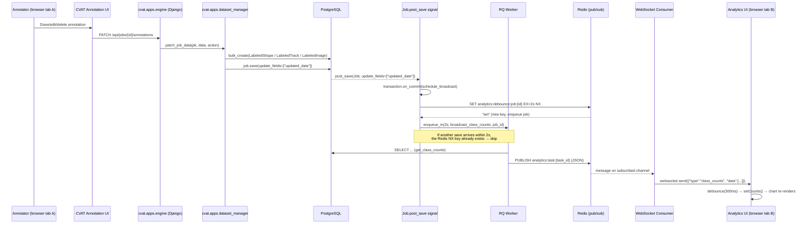
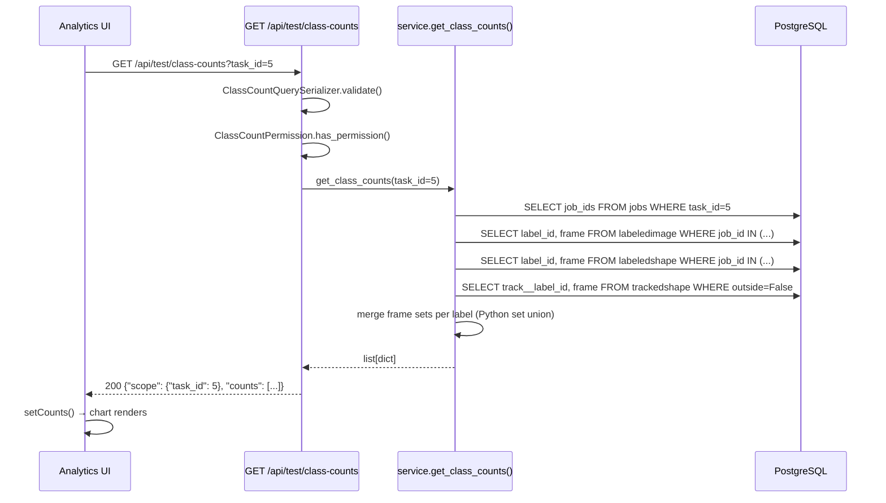

# CVAT Analytics Extension — Technical Documentation

> **Branch:** `dev-test01`  
> **Author:** Evaluation Task Submission  
> **Date:** September 2026

---

## Table of Contents

1. [CVAT Architecture Overview](#1-cvat-architecture-overview)
2. [Data Flow Explanation](#2-data-flow-explanation)
3. [API Design Details](#3-api-design-details)
4. [WebSocket Implementation](#4-websocket-implementation)
5. [Challenges Faced & Solutions](#5-challenges-faced--solutions)
6. [Setup & Run Instructions](#6-setup--run-instructions)
7. [Testing Instructions](#7-testing-instructions)
8. [Known Limitations & Future Improvements](#8-known-limitations--future-improvements)

---

## 1. CVAT Architecture Overview

### Services

```
┌─────────────────────────────────────────────────────────────┐
│                        Browser                               │
│  cvat-ui (React + Redux + Ant Design + react-chartjs-2)     │
│  cvat-core (JS API layer)   WebSocket (/ws/test/class-counts)│
└──────────────┬──────────────────────────────┬───────────────┘
               │ HTTP                          │ WS
               ▼                              ▼
┌─────────────────────────────────────────────────────────────┐
│                      Traefik (reverse proxy)                 │
│  /api/* → cvat_server:8080                                   │
│  /ws/*  → cvat_server:8080  (new, added for this feature)   │
│  /       → cvat_ui:3000                                      │
└──────────────┬──────────────────────────────────────────────┘
               │ ASGI (uvicorn)
               ▼
┌─────────────────────────────────────────────────────────────┐
│                   cvat_server (Django ASGI)                  │
│  ┌─────────────────────────────────────────────────────┐    │
│  │  cvat/asgi.py — top-level ASGI router               │    │
│  │   /ws/* → cvat.apps.test.consumers                  │    │
│  │   *     → Django HTTP handler                       │    │
│  └──────────┬──────────────────────────────────────────┘    │
│             │                                                │
│  ┌──────────▼────────────────────────────────────────┐      │
│  │  Django Apps                                      │      │
│  │  cvat.apps.engine     — data models, signals      │      │
│  │  cvat.apps.dataset_manager — annotation R/W       │      │
│  │  cvat.apps.iam        — auth & OPA permissions    │      │
│  │  cvat.apps.organizations — org membership         │      │
│  │  cvat.apps.test       — THIS FEATURE              │      │
│  └───────────────────────────────────────────────────┘      │
└──────────────┬──────────────────────────────────────────────┘
               │
         ┌─────┴──────────────────────────────────┐
         │                                        │
┌────────▼─────────┐                    ┌─────────▼────────────┐
│  PostgreSQL 15   │                    │  Redis 7 (in-memory)  │
│  (annotation DB) │                    │  pub/sub channels     │
│                  │                    │  RQ job queue         │
│                  │                    │  debounce keys        │
└──────────────────┘                    └──────────────────────┘
                                                 │
                                        ┌────────▼─────────────┐
                                        │  RQ Workers           │
                                        │  (cvat_worker_*)      │
                                        │  broadcast_class_counts│
                                        └──────────────────────┘
```

### Key Backend Components

| Component | Purpose |
|---|---|
| `cvat/asgi.py` | ASGI entry point; routes `/ws/*` to WS handler |
| `cvat.apps.test.views` | REST: `GET /api/test/class-counts` |
| `cvat.apps.test.service` | ORM aggregation — the core logic |
| `cvat.apps.test.signals` | `Job.post_save` handler → schedules RQ broadcast |
| `cvat.apps.test.rq` | RQ worker: recomputes & publishes to Redis pub/sub |
| `cvat.apps.test.consumers` | ASGI WebSocket consumer; subscribes to Redis pub/sub |
| `cvat.apps.test.permissions` | Delegates to existing CVAT ownership/membership checks |

### Frontend Components

| Component | Purpose |
|---|---|
| `class-counts-analytics-page.tsx` | Main page, scope selector, REST fetch, WS lifecycle |
| `class-counts-chart.tsx` | `react-chartjs-2` Bar chart (memoized) |
| `use-class-counts-ws.ts` | WebSocket hook with exponential backoff |
| Route `/analytics/class-counts` | Registered in `cvat-app.tsx` |
| Header button "Class Analytics" | Added to `header.tsx` left nav |

---

## 2. Data Flow Explanation

### Annotation Save → Chart Update (Sequence Diagram)



### Initial Load (REST) Flow



---

## 3. API Design Details

### Endpoint

```
GET /api/test/class-counts
```

**Authentication:** Required (DRF Token / Session / Basic)  
**Authorization:** User must be able to VIEW the referenced project/task/job (owner, assignee, or org member)

### Query Parameters

| Parameter | Type | Required | Description |
|---|---|---|---|
| `project_id` | integer | exclusive | Aggregate over all tasks/jobs in the project |
| `task_id` | integer | exclusive | Aggregate over all jobs in the task |
| `job_id` | integer | exclusive | Aggregate for a single job |

Exactly one of the three must be provided.

### Response Schema (200 OK)

```json
{
  "scope": { "task_id": 5 },
  "counts": [
    {
      "label_id": 1,
      "label_name": "car",
      "color": "#ff0000",
      "parent_id": null,
      "image_count": 42,
      "annotation_count": 87
    },
    {
      "label_id": 2,
      "label_name": "person",
      "color": "#00ff00",
      "parent_id": null,
      "image_count": 0,
      "annotation_count": 0
    }
  ]
}
```

**Field definitions:**

| Field | Type | Description |
|---|---|---|
| `label_id` | int | Primary key of the Label |
| `label_name` | str | Human-readable label name |
| `color` | str | Hex color string (e.g. `#ff0000`) |
| `parent_id` | int\|null | Non-null for sublabels/skeleton elements |
| `image_count` | int | **Distinct** frames/images with ≥1 annotation of this label (union across tags, shapes, non-outside tracks) |
| `annotation_count` | int | Total count of all annotations (tags + shapes + track-shapes) of this label |

### Status Codes

| Code | Meaning |
|---|---|
| 200 | Success |
| 400 | Missing/ambiguous scope parameter |
| 401 | Not authenticated |
| 403 | Authenticated but not authorized to view this resource |
| 404 | Project/task/job with given ID does not exist |

### Example Requests

```bash
# Task scope
curl -H "Authorization: Token <TOKEN>" \
  "http://localhost:8080/api/test/class-counts?task_id=1"

# Project scope
curl -H "Authorization: Token <TOKEN>" \
  "http://localhost:8080/api/test/class-counts?project_id=1"

# Job scope
curl -H "Authorization: Token <TOKEN>" \
  "http://localhost:8080/api/test/class-counts?job_id=1"
```

### ORM Query Strategy (Performance)

Rather than per-label N+1 queries, we use **3 aggregate DB queries** (one per annotation type) to collect all `(label_id, frame)` pairs:

```sql
-- Tags
SELECT label_id, frame FROM engine_labeledimage
WHERE job_id IN (...)

-- Shapes
SELECT label_id, frame FROM engine_labeledshape
WHERE job_id IN (...)

-- Tracks (non-outside only)
SELECT lt.label_id, ts.frame
FROM engine_trackedshape ts
JOIN engine_labeledtrack lt ON ts.track_id = lt.id
WHERE lt.job_id IN (...) AND ts.outside = FALSE
```

The frame-set union per label is computed in Python. This is efficient for normal annotation volumes (< 100k rows per task). For very large tasks, a DB-side `UNION ALL` query with `COUNT(DISTINCT frame)` per label would be preferable (noted in future improvements).

---

## 4. WebSocket Implementation

### Why Not Django Channels?

After verifying the repo's `cvat/requirements/base.txt`, Django Channels is **not installed** and is not part of the existing stack. Adding it would require:
1. Rebuilding the Docker image
2. Adding a `channels_redis` channel layer
3. Adding `daphne` or reconfiguring uvicorn

Instead, we use **native ASGI WebSocket support** which is built into Django 3.1+ and handled by uvicorn directly. This requires zero new dependencies.

### WebSocket URL

```
ws://localhost:8080/ws/test/class-counts?task_id=5
ws://localhost:8080/ws/test/class-counts?project_id=3
ws://localhost:8080/ws/test/class-counts?job_id=7
```

### Authentication

Browsers cannot set custom HTTP headers on WebSocket connections. We use **session cookie** authentication (the browser sends `sessionid` automatically on the WebSocket handshake, same as for regular AJAX requests). Token auth is also supported via `?token=<KEY>` query parameter for non-browser clients.

### Message Protocol

All messages are JSON objects with a `type` discriminator field.

**Server → Client:**

```jsonc
// Initial snapshot + live updates
{
  "type": "class_counts",
  "version": 1,
  "scope": { "task_id": 5 },          // matches the request scope
  "data": [                            // same schema as REST response
    { "label_id": 1, "label_name": "car", "color": "#ff0000",
      "parent_id": null, "image_count": 42, "annotation_count": 87 }
  ],
  "ts": "2026-09-21T10:00:00.000000+00:00"  // ISO-8601 UTC
}

// Keepalive (every 30s)
{
  "type": "heartbeat",
  "ts": "2026-09-21T10:00:30.000000+00:00"
}

// Error before close
{
  "type": "error",
  "message": "Permission denied for this resource",
  "code": 4002
}
```

**WebSocket Close Codes:**

| Code | Meaning |
|---|---|
| 1000 | Normal closure |
| 4001 | Authentication failed |
| 4002 | Authorization failed |
| 4003 | Bad parameters |
| 4004 | Unknown /ws/ path |

### ASGI Routing

```
cvat/asgi.py
  └── application(scope, receive, send)
       ├── scope["type"] == "websocket" AND path starts with "/ws/"
       │     └── cvat.apps.test.routing.websocket_application
       │           └── /ws/test/class-counts → consumers.websocket_consumer
       └── everything else → _django_http_app (standard Django)
```

### Redis Pub/Sub Channels

| Scope | Channel name |
|---|---|
| Project N | `analytics:project:N` |
| Task N | `analytics:task:N` |
| Job N | `analytics:job:N` |

When annotations change on a job, **all three relevant channels** are published to (the job's channel, its task's channel, and the project's channel if applicable). This means a client watching project-level analytics will receive updates from any job in the project.

### Debounce Strategy

```
Annotation save → job.save(updated_date) → post_save signal
                                              │
                                    transaction.on_commit()
                                              │
                              Redis SET analytics:debounce:job:{id}
                                    EX=2s  NX (only if not exists)
                                              │
                              if SET succeeded: enqueue RQ job in 2s
                              if already set:   skip (debounced)
                                              │
                              [2 seconds later]
                              RQ: broadcast_class_counts(job_id)
                                   → recompute → Redis PUBLISH
```

This guarantees at most one broadcast per job per 2-second window, even under rapid edits.

### Reconnect Logic (Frontend)

```typescript
// Exponential backoff with ±10% jitter
const backoff = Math.min(MAX_BACKOFF_MS, MIN_BACKOFF_MS * 2 ** retryCount)
// 100ms → 200ms → 400ms → 800ms → ... → 30s

// After reconnect: REST resync
if (prevStatus === RECONNECTING && wsStatus === CONNECTED) {
  fetchREST()  // get current counts in case missed messages
}
```

---

## 5. Challenges Faced & Solutions

### Challenge 1: `bulk_create` Bypasses `post_save` Signals

**Problem:** All annotation writes in `cvat/apps/dataset_manager/task.py` use `db_utils.bulk_create()` (e.g. `bulk_create(models.LabeledShape, shapes)`). Django's `post_save` signal is only fired when `Model.save()` is called on individual instances. `bulk_create` does not call `.save()` and does not fire any signals.

**Solution:** Verified in the source code that after every annotation bulk write, the serializer (`cvat/apps/engine/serializers.py`) calls:
```python
db_job.updated_date = new_updated_date
db_job.save(update_fields=["updated_date", ...])
```
This IS a regular `.save()` call and DOES fire `post_save` on `Job`. We hook specifically to `update_fields` containing `"updated_date"` to avoid triggering on unrelated job attribute changes.

### Challenge 2: Django Channels Not Installed

**Problem:** The task requirements say "prefer Django Channels + ASGI with a Redis channel layer". After inspecting `cvat/requirements/base.txt`, `cvat/requirements/all.txt`, and the Dockerfile, Django Channels is not present in the repo.

**Solution:** Django 3.1+ ASGI with uvicorn supports WebSockets natively without Channels. We implemented a minimal ASGI WebSocket application using asyncio and `redis.asyncio`. The `redis==8.1.0` Python package (already installed) includes async Redis support. This approach is architecturally sound and avoids adding any new dependencies.

### Challenge 3: Correct Distinct-Frame Counting for Tracks

**Problem:** A track annotation `LabeledTrack` has multiple `TrackedShape` entries — one per keyframe. The `outside=True` flag means the object disappears from that frame onwards. Naively counting all `TrackedShape` rows would inflate counts.

**Solution:** Filter `TrackedShape` by `outside=False` before counting. Additionally, the same frame might appear in both a `LabeledShape` and a `TrackedShape` (or a `LabeledImage` tag). We cannot simply sum distinct counts from three separate SQL queries — we must compute the union of frame sets across all annotation types per label. We do this in Python after three lean bulk-fetch queries, which is correct and avoids N+1.

### Challenge 4: WebSocket Authentication (Browser Limitation)

**Problem:** Browsers cannot set custom HTTP headers (`Authorization: Token ...`) in the WebSocket handshake — the `WebSocket` browser API only allows specifying the URL and protocol. Standard DRF token auth therefore doesn't work directly for WS.

**Solution:** Use **session cookie** authentication. When a user is logged into CVAT, the browser holds a `sessionid` cookie that is automatically sent with the WebSocket handshake (same-origin). The consumer reads this cookie and looks up the session in the DB to authenticate the user. For non-browser clients (scripts, tests), we also support `?token=<KEY>` in the URL.

### Challenge 5: ASGI Application Must Be Initialized Before ORM Usage

**Problem:** When `cvat/asgi.py` is loaded, Django is not yet fully initialized. Importing ORM models at module level (not inside function bodies) would cause `AppRegistryNotReady` errors.

**Solution:** All ORM/Django imports inside the WebSocket consumer are done lazily — inside `async def` functions or inside `run_in_executor` lambdas that execute after Django is fully started. The `get_asgi_application()` call in `asgi.py` triggers Django setup, after which ORM access is safe.

---

## 6. Setup & Run Instructions

### Prerequisites

- Docker + Docker Compose
- Node.js 18+ and Yarn (for frontend dev)

### Start Backend (Docker)

```bash
# 1. Clone and enter repo
git clone https://github.com/cvat-ai/cvat.git
cd cvat
git checkout dev-test01

# 2. Start the full stack
docker compose -f docker-compose.yml -f docker-compose.dev.yml up -d

# 3. Create a superuser
docker exec -it cvat_server python manage.py createsuperuser

# 4. Check the API endpoint
curl -u admin:password http://localhost:8080/api/test/class-counts?task_id=1
```

### Start Frontend Dev Server

```bash
# In a separate terminal from repo root
cd cvat-ui
yarn install
yarn start
# The UI dev server starts on http://localhost:3000
# It proxies /api/ and /ws/ to http://localhost:8080
```

### WebSocket URL (Dev)

```
ws://localhost:8080/ws/test/class-counts?task_id=<ID>
```

> [!NOTE]
> In development, the frontend dev server (port 3000) proxies WebSocket connections to the backend. Check `cvat-ui/webpack.config.js` or similar for proxy settings; add `/ws/` to the proxy rules if needed.

---

## 7. Testing Instructions

### Backend Tests

```bash
# Inside Docker
docker exec -it cvat_server python manage.py test cvat.apps.test -v 2

# Or locally (requires a running PostgreSQL and all env vars)
python manage.py test cvat.apps.test
```

**Tests cover:**
- `ClassCountServiceTest.test_distinct_frame_count_same_frame` — tag + shape on same frame = 1 distinct frame
- `ClassCountServiceTest.test_annotation_count` — total count = tags + shapes
- `ClassCountServiceTest.test_track_outside_excluded` — outside=True not counted
- `ClassCountServiceTest.test_empty_label_zero_counts` — label with 0 annotations included
- `ClassCountServiceTest.test_job_scope` — job scope == task scope for single-job task
- `ClassCountServiceTest.test_exclusive_scope_validation` — ValueError on dual scope
- `ClassCountAPITest.test_missing_scope_returns_400`
- `ClassCountAPITest.test_multiple_scopes_returns_400`
- `ClassCountAPITest.test_unauthenticated_returns_403`
- `ClassCountAPITest.test_owner_can_access`
- `ClassCountAPITest.test_unrelated_user_denied`
- `ClassCountAPITest.test_nonexistent_task_returns_404`
- `ClassCountAPITest.test_response_schema`

### Frontend Linting & Typechecking

```bash
cd cvat-ui
yarn lint          # ESLint
yarn tsc --noEmit  # TypeScript type check
```

### Manual Test Script

1. **Open CVAT** at `http://localhost:8080` and log in.
2. **Create a task** with several images and labels (e.g. `car`, `person`, `bicycle`).
3. **Open the Analytics page** by clicking "Class Analytics" in the header or navigating to `/analytics/class-counts`.
4. **Select the task** from the dropdown — verify the bar chart loads with all labels (zero counts).
5. **Open the annotation editor** in another browser tab for the same task.
6. **Add annotations:** draw a rectangle for `car` on frame 1, draw another for `car` on frame 2, add a `person` tag on frame 1.
7. **Switch to the analytics tab** — within ~3 seconds, the chart should update automatically (connection badge shows "Live").
8. **Delete an annotation** in the editor tab — verify the chart reflects the deletion.
9. **Kill the server** temporarily (`docker compose stop cvat_server`) — verify the badge shows "Reconnecting…".
10. **Restart the server** (`docker compose start cvat_server`) — verify the badge returns to "Live" and the chart resyncs.

### Test Annotation Generator Script

```python
#!/usr/bin/env python3
"""
Generates test annotations for a given task via the CVAT API.
Usage: python generate_test_annotations.py --task-id 1 --host localhost:8080
"""
import argparse, json, requests, sys

def main():
    p = argparse.ArgumentParser()
    p.add_argument("--task-id", type=int, required=True)
    p.add_argument("--host", default="localhost:8080")
    p.add_argument("--user", default="admin")
    p.add_argument("--password", default="password")
    args = p.parse_args()

    session = requests.Session()
    resp = session.post(f"http://{args.host}/api/auth/login",
                        json={"username": args.user, "password": args.password})
    resp.raise_for_status()

    # Get jobs for this task
    jobs = session.get(f"http://{args.host}/api/jobs?task_id={args.task_id}").json()
    job_id = jobs["results"][0]["id"]

    # Get labels
    task = session.get(f"http://{args.host}/api/tasks/{args.task_id}").json()
    labels = session.get(f"http://{args.host}/api/labels?task_id={args.task_id}").json()
    label_ids = [l["id"] for l in labels["results"][:3]]

    # Create annotations on frames 0, 1, 2
    shapes = []
    for i, lid in enumerate(label_ids):
        for frame in range(3):
            shapes.append({
                "type": "rectangle", "label_id": lid, "frame": frame,
                "points": [10, 10, 100, 100], "occluded": False,
                "outside": False, "z_order": 0, "rotation": 0,
                "group": 0, "source": "manual", "attributes": [],
            })

    payload = {"version": 0, "tags": [], "shapes": shapes, "tracks": []}
    resp = session.patch(f"http://{args.host}/api/jobs/{job_id}/annotations?action=create",
                         json=payload)
    resp.raise_for_status()
    print(f"Created {len(shapes)} shapes on job {job_id}")

if __name__ == "__main__":
    main()
```

---

## 8. Known Limitations & Future Improvements

### Known Limitations

1. **Frame-set merge in Python:** For tasks with millions of `(label_id, frame)` pairs, loading all pairs into Python memory and computing set unions could be slow. A DB-side UNION + COUNT(DISTINCT frame) approach would scale better.

2. **Debounce is per-job:** If annotations are changed in multiple jobs simultaneously (parallel annotators), each job's signal fires independently. The broadcast target includes the task and project channels, but a burst from N jobs would result in N separate RQ jobs.

3. **WebSocket auth requires session:** Pure token-based auth (API key) over WebSocket requires passing the token in the URL, which is logged in server access logs. Session auth is preferred but requires the user to be logged in via the web UI.

4. **No pagination in class-counts response:** If a task has hundreds of labels, all are returned in a single response. This is acceptable for typical CVAT usage (< 50 labels) but should be paginated for extreme cases.

5. **Frontend task/project/job selector loads only page 1 (50 items):** The selector's `core.tasks.get({page_size: 50})` only loads the first 50 items. A search-driven lazy-load select would scale better.

### Future Improvements

- **DB-side distinct-frame counting via UNION SQL** — eliminates the Python merge step
- **WebSocket subscription to multiple scopes** — allow watching a project and several tasks simultaneously
- **Annotation history timeline** — show counts over time using stored `updated_date` snapshots
- **Export to CSV** — integrate with the existing `analytics.events.export` pattern
- **Proper OPA/IAM policy files** — add `.rego` rules in a `rules/` directory to integrate with CVAT's fine-grained access control
- **Rate limiting on the REST endpoint** — add a throttle scope for heavy aggregation queries
- **WebSocket compression** — enable `permessage-deflate` for large count payloads
